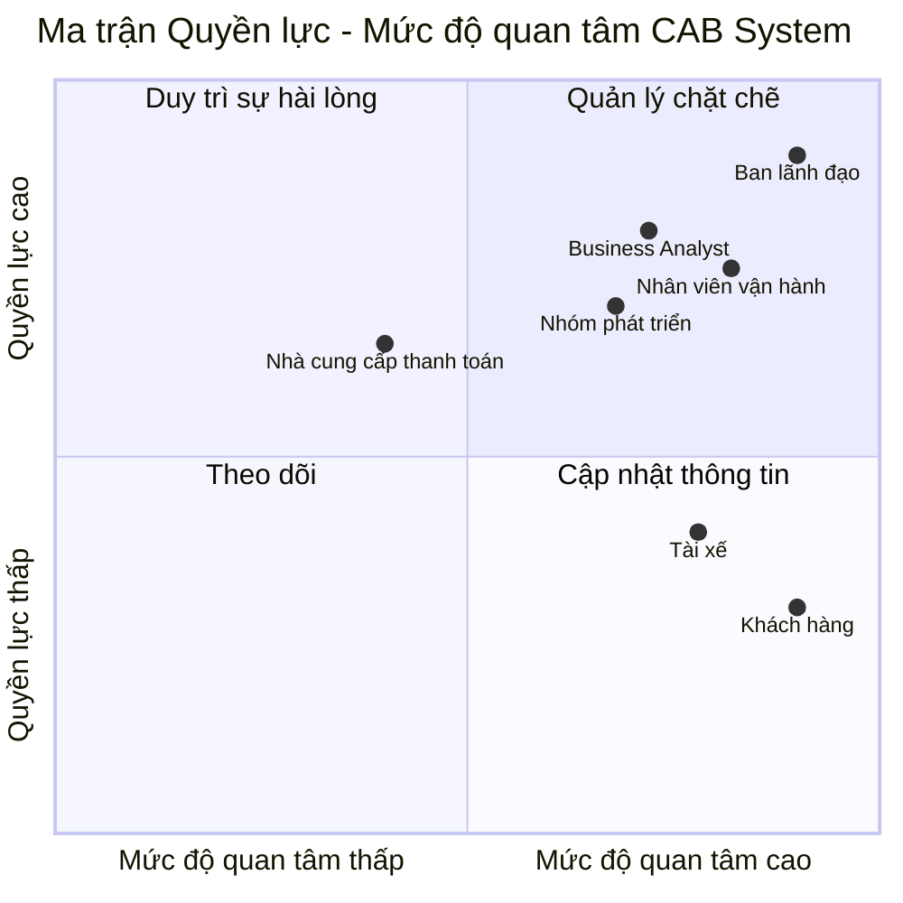
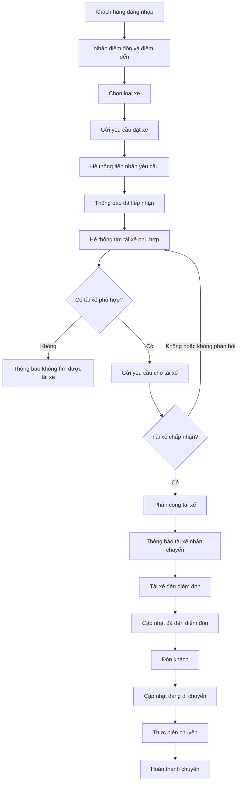
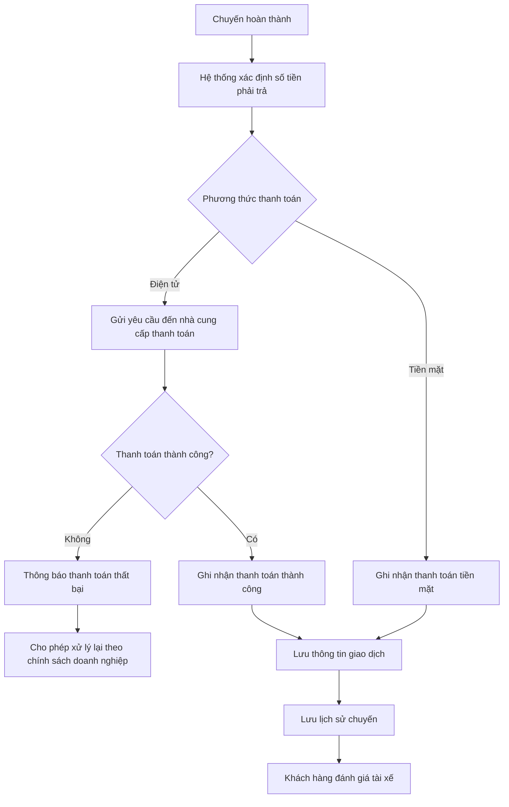
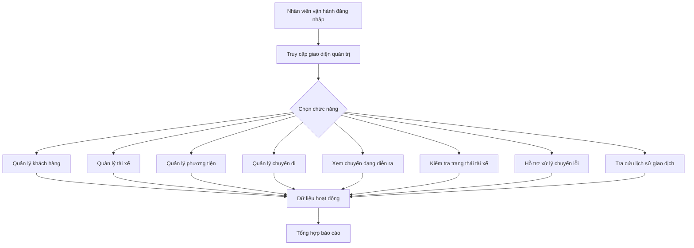
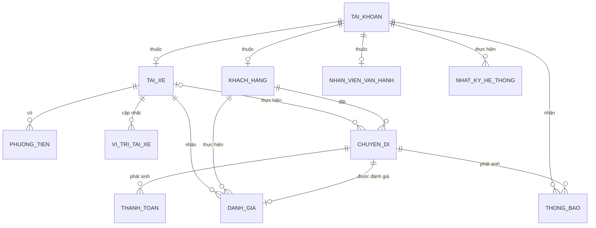
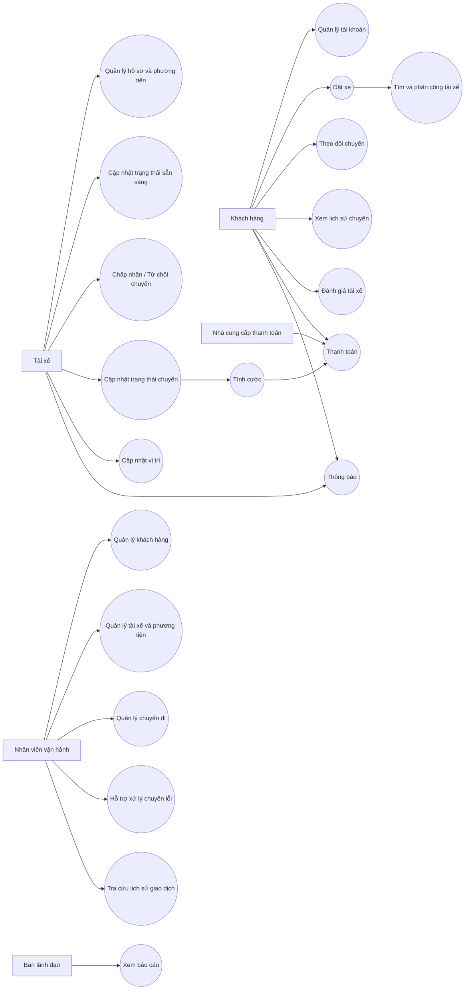

# ĐẶC TẢ YÊU CẦU PHẦN MỀM - HỆ THỐNG CAB

---

## 1. STAKEHOLDER LIST & ROLES
### Danh sách & Vai trò Bên liên quan

| STT | Bên liên quan | Vai trò |
|:---:|---|---|
| 1 | **Ban lãnh đạo** | Định hướng xây dựng nền tảng CAB, theo dõi hoạt động và sử dụng báo cáo để hỗ trợ ra quyết định. |
| 2 | **Khách hàng** | Đăng ký, đăng nhập, cập nhật thông tin, đặt xe, theo dõi chuyến, thanh toán, xem lịch sử chuyến và đánh giá tài xế. |
| 3 | **Tài xế** | Quản lý hồ sơ, phương tiện và trạng thái hoạt động; nhận hoặc từ chối chuyến; cập nhật vị trí và trạng thái chuyến đi. |
| 4 | **Nhân viên vận hành** | Quản lý khách hàng, tài xế, phương tiện, chuyến đi; theo dõi chuyến đang diễn ra, xử lý chuyến lỗi và tra cứu giao dịch. |
| 5 | **Nhà cung cấp thanh toán bên ngoài** | Xử lý giao dịch thanh toán điện tử được tích hợp với CAB System. |
| 6 | **Business Analyst (BA)** | Làm rõ phạm vi, tác nhân, quy trình, yêu cầu, quy tắc nghiệp vụ, trường hợp ngoại lệ và các vấn đề chưa được xác định. |
| 7 | **Nhóm phát triển** | Xây dựng giải pháp sau khi các yêu cầu và vấn đề chưa rõ được làm rõ. |

---

## 2. STAKEHOLDER MATRIX
### Ma trận Bên liên quan

| Nhóm | Bên liên quan |
|---|---|
| **Quản lý chặt chẽ** | Ban lãnh đạo, Nhân viên vận hành, Business Analyst, Nhóm phát triển |
| **Duy trì sự hài lòng** | Nhà cung cấp thanh toán bên ngoài |
| **Cập nhật thông tin** | Khách hàng, Tài xế |
| **Theo dõi** | Không xác định thêm bên liên quan cụ thể |

> Mức Power/Interest trong ma trận là kết quả phân tích từ vai trò của các bên liên quan trong đề bài.

---

## 3. BUSINESS GOALS
### Mục tiêu Kinh doanh

| Mã | Mục tiêu kinh doanh |
|:---:|---|
| **BG-01** | Tự động hóa quy trình đặt xe và phân công tài xế, giảm việc phân công tài xế thủ công. |
| **BG-02** | Giúp khách hàng dễ dàng theo dõi trạng thái chuyến đi từ lúc tạo yêu cầu đến khi hoàn thành. |
| **BG-03** | Quản lý tập trung chuyến đi, tính cước, thanh toán và lịch sử giao dịch. |
| **BG-04** | Nâng cao khả năng quản lý khách hàng, tài xế, phương tiện và chuyến đi của bộ phận vận hành. |
| **BG-05** | Cung cấp dữ liệu và báo cáo để theo dõi hoạt động và hỗ trợ ban lãnh đạo ra quyết định. |
| **BG-06** | Xây dựng nền tảng CAB ổn định, bảo mật, có khả năng mở rộng và phát triển thêm chức năng trong tương lai. |

---

## 4. MINIMUM VIABLE PRODUCT (MVP) MODULES

| STT | Module | Chức năng chính |
|:---:|---|---|
| 1 | **Quản lý tài khoản và xác thực** | Đăng ký, đăng nhập, cập nhật thông tin và xác thực người dùng. |
| 2 | **Quản lý tài xế và phương tiện** | Quản lý hồ sơ tài xế, phương tiện và trạng thái hoạt động. |
| 3 | **Đặt xe** | Nhập điểm đón, điểm đến, chọn loại xe và gửi yêu cầu đặt xe. |
| 4 | **Tìm kiếm và phân công tài xế** | Tìm tài xế phù hợp, ưu tiên tài xế phù hợp và gần khách hàng, xử lý từ chối hoặc không phản hồi. |
| 5 | **Quản lý chuyến đi và vị trí** | Theo dõi trạng thái chuyến, lưu vị trí tài xế, hỗ trợ dự kiến thời gian đến và lưu lịch sử chuyến. |
| 6 | **Tính cước và thanh toán** | Xác định số tiền phải trả, hỗ trợ tiền mặt và thanh toán điện tử. |
| 7 | **Thông báo** | Thông báo các sự kiện quan trọng cho khách hàng và tài xế. |
| 8 | **Quản lý vận hành và báo cáo** | Quản lý dữ liệu vận hành, xử lý sự cố, tra cứu giao dịch và cung cấp báo cáo. |

---

## 5. BUSINESS REQUIREMENTS – CAB SYSTEM MVP
### Yêu cầu Nghiệp vụ

| Mã | Yêu cầu nghiệp vụ |
|:---:|---|
| **BR-01** | Hệ thống phải hỗ trợ khách hàng đăng ký, đăng nhập, cập nhật thông tin cá nhân, đặt xe, theo dõi chuyến, xem lịch sử chuyến, số tiền phải trả và đánh giá tài xế. |
| **BR-02** | Hệ thống phải hỗ trợ tài xế đăng ký hoặc được nhân viên vận hành tạo tài khoản, cập nhật hồ sơ, phương tiện, trạng thái hoạt động, vị trí và trạng thái chuyến. |
| **BR-03** | Hệ thống phải tìm tài xế phù hợp dựa trên vị trí, trạng thái sẵn sàng và các tiêu chí vận hành; ưu tiên tài xế phù hợp và gần khách hàng. |
| **BR-04** | Nếu tài xế không phản hồi hoặc từ chối, hệ thống phải tiếp tục tìm tài xế khác mà khách hàng không cần tạo lại yêu cầu; nếu không tìm được tài xế phải thông báo cho khách hàng. |
| **BR-05** | Sau khi chuyến hoàn thành, hệ thống phải xác định số tiền phải trả và hỗ trợ thanh toán bằng tiền mặt hoặc thanh toán điện tử. |
| **BR-06** | Thanh toán điện tử phải được tích hợp với nhà cung cấp bên ngoài và CAB không được lưu trực tiếp thông tin nhạy cảm của thẻ hoặc tài khoản thanh toán. |
| **BR-07** | Hệ thống phải gửi thông báo cho khách hàng và tài xế tại các thời điểm liên quan đến chuyến đi và thanh toán. |
| **BR-08** | Hệ thống phải cung cấp giao diện cho nhân viên vận hành quản lý khách hàng, tài xế, phương tiện, chuyến đi và giao dịch. |
| **BR-09** | Hệ thống phải kiểm soát quyền đối với các chức năng quản trị nhạy cảm. |
| **BR-10** | Hệ thống phải cung cấp báo cáo về số lượng chuyến, doanh thu, tỷ lệ hoàn thành, tỷ lệ hủy và hiệu quả hoạt động của tài xế. |

### 5.1. Các vấn đề chưa được xác định

| Mã | Nội dung cần xác nhận |
|:---:|---|
| **TBD-01** | Cách tính cước cụ thể. |
| **TBD-02** | Tiêu chí ưu tiên tài xế cụ thể. |
| **TBD-03** | Thời gian tài xế phải phản hồi. |
| **TBD-04** | Chính sách hủy chuyến. |
| **TBD-05** | Cách xử lý khi mất kết nối mạng. |
| **TBD-06** | Thời gian lưu trữ dữ liệu. |

---

## 6. BUSINESS PROCESS MODELING
### Mô hình hóa Quy trình Nghiệp vụ

### 6.1. BPM-01 – Quy trình đặt xe và thực hiện chuyến

### 6.2. BPM-02 – Quy trình tính cước và thanh toán

### 6.3. BPM-03 – Quy trình quản lý vận hành và báo cáo

---

## 7. FUNCTIONAL REQUIREMENTS
### Yêu cầu Chức năng

| Mã | Yêu cầu chức năng |
|:---:|---|
| **FR-01** | Hệ thống cho phép khách hàng đăng ký tài khoản. |
| **FR-02** | Hệ thống cho phép khách hàng đăng nhập và cập nhật thông tin cá nhân. |
| **FR-03** | Hệ thống cho phép khách hàng nhập điểm đón, điểm đến, chọn loại xe và gửi yêu cầu đặt xe. |
| **FR-04** | Hệ thống cho phép khách hàng theo dõi quá trình tìm tài xế, tài xế nhận chuyến, thời gian dự kiến tài xế đến và trạng thái chuyến. |
| **FR-05** | Hệ thống cho phép khách hàng xem lịch sử chuyến, số tiền phải trả và đánh giá tài xế sau chuyến. |
| **FR-06** | Hệ thống cho phép tài xế đăng ký hoặc cho phép nhân viên vận hành tạo tài khoản tài xế. |
| **FR-07** | Tài xế có thể cập nhật hồ sơ, thông tin phương tiện và trạng thái hoạt động. |
| **FR-08** | Tài xế có thể chuyển sang trạng thái sẵn sàng nhận chuyến. |
| **FR-09** | Tài xế nhận thông báo chuyến mới và có thể chấp nhận hoặc từ chối chuyến. |
| **FR-10** | Tài xế có thể cập nhật trạng thái: đã đến điểm đón, đã đón khách, đang di chuyển và hoàn thành chuyến. |
| **FR-11** | Hệ thống lưu vị trí tài xế để hỗ trợ tìm tài xế gần khách hàng và dự kiến thời gian đến. |
| **FR-12** | Hệ thống tìm tài xế dựa trên vị trí, trạng thái sẵn sàng và các tiêu chí vận hành. |
| **FR-13** | Nếu tài xế từ chối hoặc không phản hồi, hệ thống tiếp tục tìm tài xế khác mà khách hàng không cần tạo lại yêu cầu. |
| **FR-14** | Nếu không tìm được tài xế, hệ thống thông báo cho khách hàng. |
| **FR-15** | Sau khi chuyến hoàn thành, hệ thống xác định số tiền phải trả dựa trên loại dịch vụ và thông tin chuyến đi. |
| **FR-16** | Hệ thống hỗ trợ thanh toán bằng tiền mặt. |
| **FR-17** | Hệ thống hỗ trợ thanh toán điện tử thông qua nhà cung cấp thanh toán bên ngoài. |
| **FR-18** | Nếu thanh toán điện tử thất bại, hệ thống thông báo cho khách hàng và cho phép xử lý lại theo chính sách doanh nghiệp. |
| **FR-19** | Hệ thống gửi thông báo cho khách hàng khi yêu cầu được tiếp nhận, tài xế nhận chuyến, tài xế đến điểm đón, chuyến hoàn thành và có kết quả thanh toán. |
| **FR-20** | Hệ thống gửi thông báo cho tài xế về chuyến mới hoặc thay đổi liên quan đến chuyến đang thực hiện. |
| **FR-21** | Hệ thống cung cấp giao diện quản trị cho nhân viên vận hành. |
| **FR-22** | Nhân viên vận hành có thể quản lý khách hàng, tài xế, phương tiện và chuyến đi. |
| **FR-23** | Nhân viên vận hành có thể xem chuyến đang diễn ra, kiểm tra trạng thái tài xế, hỗ trợ chuyến lỗi và tra cứu lịch sử giao dịch. |
| **FR-24** | Hệ thống kiểm soát quyền đối với các chức năng quản trị nhạy cảm. |
| **FR-25** | Hệ thống cung cấp báo cáo về số lượng chuyến, doanh thu, tỷ lệ hoàn thành, tỷ lệ hủy và hiệu quả hoạt động của tài xế. |

---

## 8. BUSINESS RULES
### Quy tắc Nghiệp vụ

| Mã | Quy tắc nghiệp vụ |
|:---:|---|
| **RULE-01** | Khách hàng và tài xế phải được xác thực trước khi sử dụng các chức năng yêu cầu tài khoản. |
| **RULE-02** | Tài xế phải ở trạng thái sẵn sàng để được xem xét nhận chuyến. |
| **RULE-03** | Việc tìm tài xế phải dựa trên vị trí, trạng thái sẵn sàng và các tiêu chí vận hành. |
| **RULE-04** | Hệ thống ưu tiên tài xế phù hợp và gần khách hàng. |
| **RULE-05** | Nếu tài xế từ chối hoặc không phản hồi, hệ thống tiếp tục tìm tài xế khác mà khách hàng không cần tạo lại yêu cầu. |
| **RULE-06** | Nếu không tìm được tài xế, khách hàng phải được thông báo rõ ràng. |
| **RULE-07** | Trong quá trình thực hiện chuyến, tài xế cập nhật các trạng thái của chuyến. |
| **RULE-08** | Số tiền phải trả được xác định sau khi chuyến hoàn thành dựa trên loại dịch vụ và thông tin chuyến đi. |
| **RULE-09** | Khách hàng có thể thanh toán bằng tiền mặt hoặc thanh toán điện tử. |
| **RULE-10** | CAB System không được lưu trực tiếp thông tin nhạy cảm của thẻ hoặc tài khoản thanh toán. |
| **RULE-11** | Nếu thanh toán điện tử thất bại, khách hàng phải được thông báo và được phép xử lý lại theo chính sách doanh nghiệp. |
| **RULE-12** | Các thao tác quản trị nhạy cảm chỉ được thực hiện bởi người dùng có quyền phù hợp. |
| **RULE-13** | Các thao tác quan trọng phải được lưu vết để phục vụ kiểm tra khi có sự cố. |

### 8.1. Trường hợp ngoại lệ đã xác định

| Mã | Trường hợp | Xử lý |
|:---:|---|---|
| **EX-01** | Tài xế từ chối chuyến | Tiếp tục tìm tài xế khác. |
| **EX-02** | Tài xế không phản hồi | Tiếp tục tìm tài xế khác. |
| **EX-03** | Không tìm được tài xế | Thông báo rõ ràng cho khách hàng. |
| **EX-04** | Thanh toán điện tử thất bại | Thông báo và cho phép xử lý lại theo chính sách doanh nghiệp. |
| **EX-05** | Chuyến xảy ra lỗi | Nhân viên vận hành hỗ trợ xử lý. |

---

## 9. NON-FUNCTIONAL REQUIREMENTS
### Yêu cầu Phi chức năng

| Mã | Nhóm | Yêu cầu |
|:---:|---|---|
| **NFR-01** | **Ổn định** | Hệ thống phải hoạt động ổn định tại các thời điểm nhu cầu đặt xe tăng cao. |
| **NFR-02** | **Khả năng mở rộng** | Các thành phần của hệ thống phải có khả năng mở rộng độc lập khi tải tăng. |
| **NFR-03** | **Khả năng chịu lỗi** | Lỗi ở chức năng thanh toán hoặc thông báo không được làm toàn bộ hệ thống đặt xe ngừng hoạt động. |
| **NFR-04** | **Khả năng triển khai** | Các chức năng mới phải có thể được triển khai từng phần và hạn chế ảnh hưởng đến các chức năng đang hoạt động. |
| **NFR-05** | **Xác thực** | Khách hàng và tài xế phải được xác thực trước khi sử dụng các chức năng yêu cầu tài khoản. |
| **NFR-06** | **Phân quyền** | Các thao tác quản trị phải được kiểm soát quyền truy cập. |
| **NFR-07** | **Bảo vệ dữ liệu** | Thông tin cá nhân, phương tiện, vị trí và giao dịch phải được bảo vệ. |
| **NFR-08** | **Audit** | Hệ thống phải lưu vết các thao tác quan trọng để phục vụ kiểm tra khi có sự cố. |
| **NFR-09** | **Khả năng mở rộng chức năng** | Kiến trúc phải cho phép bổ sung loại dịch vụ, phương thức thanh toán, nhà cung cấp thông báo hoặc thay đổi thành phần kỹ thuật mà không phải xây dựng lại toàn bộ ứng dụng. |

---

## 10. ENTITY RELATIONSHIP DIAGRAM
### Mô hình Dữ liệu ERD

### 10.1. Các thực thể chính

| STT | Thực thể | Cơ sở từ yêu cầu |
|:---:|---|---|
| 1 | **Tài khoản** | Phục vụ đăng ký, đăng nhập và xác thực. |
| 2 | **Khách hàng** | Người sử dụng chức năng đặt xe. |
| 3 | **Tài xế** | Người nhận và thực hiện chuyến. |
| 4 | **Nhân viên vận hành** | Người sử dụng giao diện quản trị. |
| 5 | **Phương tiện** | Thông tin phương tiện của tài xế. |
| 6 | **Chuyến đi** | Lưu yêu cầu và quá trình thực hiện chuyến. |
| 7 | **Vị trí tài xế** | Phục vụ tìm tài xế gần và dự kiến thời gian đến. |
| 8 | **Thanh toán** | Lưu thông tin kết quả thanh toán của chuyến. |
| 9 | **Thông báo** | Lưu thông báo liên quan đến chuyến. |
| 10 | **Đánh giá** | Lưu đánh giá của khách hàng sau chuyến. |
| 11 | **Nhật ký hệ thống** | Lưu vết thao tác quan trọng. |

### 10.2. ERD

> ERD ở mức phân tích chỉ thể hiện các thực thể và quan hệ có thể xác định từ yêu cầu khách hàng; chưa tự bổ sung thuộc tính kỹ thuật không được đề bài cung cấp.

---

## 11. USE CASE DIAGRAM
### Mô hình Use Case

### 11.1. Danh sách Use Case

| Mã | Use Case | Actor |
|:---:|---|---|
| **UC-01** | Quản lý tài khoản khách hàng | Khách hàng |
| **UC-02** | Đặt xe | Khách hàng |
| **UC-03** | Theo dõi chuyến đi | Khách hàng |
| **UC-04** | Xem lịch sử chuyến đi | Khách hàng |
| **UC-05** | Đánh giá tài xế | Khách hàng |
| **UC-06** | Quản lý hồ sơ tài xế và phương tiện | Tài xế |
| **UC-07** | Cập nhật trạng thái sẵn sàng | Tài xế |
| **UC-08** | Chấp nhận/Từ chối chuyến | Tài xế |
| **UC-09** | Cập nhật trạng thái chuyến | Tài xế |
| **UC-10** | Cập nhật vị trí | Tài xế |
| **UC-11** | Tìm và phân công tài xế | Hệ thống |
| **UC-12** | Tính cước | Hệ thống |
| **UC-13** | Thanh toán | Khách hàng, Nhà cung cấp thanh toán |
| **UC-14** | Gửi/Nhận thông báo | Khách hàng, Tài xế |
| **UC-15** | Quản lý khách hàng | Nhân viên vận hành |
| **UC-16** | Quản lý tài xế và phương tiện | Nhân viên vận hành |
| **UC-17** | Quản lý chuyến đi | Nhân viên vận hành |
| **UC-18** | Hỗ trợ xử lý chuyến lỗi | Nhân viên vận hành |
| **UC-19** | Tra cứu lịch sử giao dịch | Nhân viên vận hành |
| **UC-20** | Xem báo cáo hoạt động | Ban lãnh đạo |

### 11.2. Use Case Diagram

---

## 12. ACCEPTANCE CRITERIA
### Tiêu chí Chấp nhận

| Mã | FR liên quan | Tiêu chí chấp nhận |
|:---:|---|---|
| **AC-01** | FR-01, FR-02 | Khách hàng có thể đăng ký, đăng nhập và cập nhật thông tin cá nhân. |
| **AC-02** | FR-03 | Khách hàng có thể nhập điểm đón, điểm đến, chọn loại xe và gửi yêu cầu đặt xe. |
| **AC-03** | FR-04 | Khách hàng có thể theo dõi quá trình tìm tài xế, tài xế nhận chuyến, thời gian dự kiến đến và trạng thái chuyến. |
| **AC-04** | FR-05 | Khách hàng có thể xem lịch sử chuyến, số tiền phải trả và đánh giá tài xế sau chuyến. |
| **AC-05** | FR-06, FR-07 | Tài xế có tài khoản và có thể cập nhật hồ sơ, phương tiện và trạng thái hoạt động. |
| **AC-06** | FR-08, FR-09 | Tài xế ở trạng thái sẵn sàng có thể nhận thông báo và chấp nhận hoặc từ chối chuyến. |
| **AC-07** | FR-10 | Tài xế có thể cập nhật các trạng thái của chuyến theo yêu cầu. |
| **AC-08** | FR-11, FR-12 | Hệ thống lưu vị trí và sử dụng vị trí, trạng thái sẵn sàng và tiêu chí vận hành để tìm tài xế phù hợp. |
| **AC-09** | FR-13 | Khi tài xế từ chối hoặc không phản hồi, hệ thống tiếp tục tìm tài xế khác mà khách hàng không phải tạo lại yêu cầu. |
| **AC-10** | FR-14 | Nếu không tìm được tài xế, khách hàng nhận được thông báo rõ ràng. |
| **AC-11** | FR-15, FR-16, FR-17 | Sau khi chuyến hoàn thành, hệ thống xác định số tiền phải trả và hỗ trợ tiền mặt hoặc thanh toán điện tử. |
| **AC-12** | FR-18 | Nếu thanh toán điện tử thất bại, khách hàng được thông báo và có thể xử lý lại theo chính sách doanh nghiệp. |
| **AC-13** | FR-19, FR-20 | Khách hàng và tài xế nhận được các thông báo liên quan đến chuyến theo yêu cầu. |
| **AC-14** | FR-21, FR-22, FR-23 | Nhân viên vận hành có thể sử dụng giao diện quản trị để quản lý và theo dõi hoạt động được yêu cầu. |
| **AC-15** | FR-24 | Người không có quyền không thể thực hiện các thao tác quản trị nhạy cảm. |
| **AC-16** | FR-25 | Hệ thống cung cấp các báo cáo đã được yêu cầu. |
| **AC-17** | NFR-01, NFR-02, NFR-03 | Hệ thống hỗ trợ yêu cầu về ổn định, mở rộng và không để lỗi thanh toán/thông báo làm ngừng toàn bộ chức năng đặt xe. |
| **AC-18** | NFR-05, NFR-06, NFR-07, NFR-08 | Hệ thống thực hiện xác thực, phân quyền, bảo vệ dữ liệu và lưu vết các thao tác quan trọng. |
| **AC-19** | NFR-04, NFR-09 | Kiến trúc cho phép triển khai chức năng mới từng phần và hỗ trợ mở rộng các loại dịch vụ, phương thức thanh toán hoặc nhà cung cấp thông báo trong tương lai. |

---

## 13. TRACEABILITY MATRIX
### Bảng Truy vết Nghiệp vụ & Kỹ thuật

| BG | BR | BPM | FR / NFR | UC | AC |
|---|---|---|---|---|---|
| **BG-01** | **BR-01** | **BPM-01** | FR-01 → FR-05 | UC-01 → UC-05 | AC-01 → AC-04 |
| **BG-01** | **BR-02** | **BPM-01** | FR-06 → FR-11 | UC-06 → UC-10 | AC-05 → AC-08 |
| **BG-01** | **BR-03, BR-04** | **BPM-01** | FR-12, FR-13, FR-14 | UC-11 | AC-08, AC-09, AC-10 |
| **BG-03** | **BR-05, BR-06** | **BPM-02** | FR-15 → FR-18 | UC-12, UC-13 | AC-11, AC-12 |
| **BG-02, BG-03** | **BR-07** | **BPM-01, BPM-02** | FR-19, FR-20 | UC-14 | AC-13 |
| **BG-04** | **BR-08** | **BPM-03** | FR-21, FR-22, FR-23 | UC-15 → UC-19 | AC-14 |
| **BG-04, BG-06** | **BR-09** | **BPM-03** | FR-24, NFR-05, NFR-06 | UC-15 → UC-19 | AC-15, AC-18 |
| **BG-05** | **BR-10** | **BPM-03** | FR-25 | UC-20 | AC-16 |
| **BG-06** | Các BR liên quan | Áp dụng xuyên suốt | NFR-01 → NFR-09 | Các UC liên quan | AC-17 → AC-19 |
