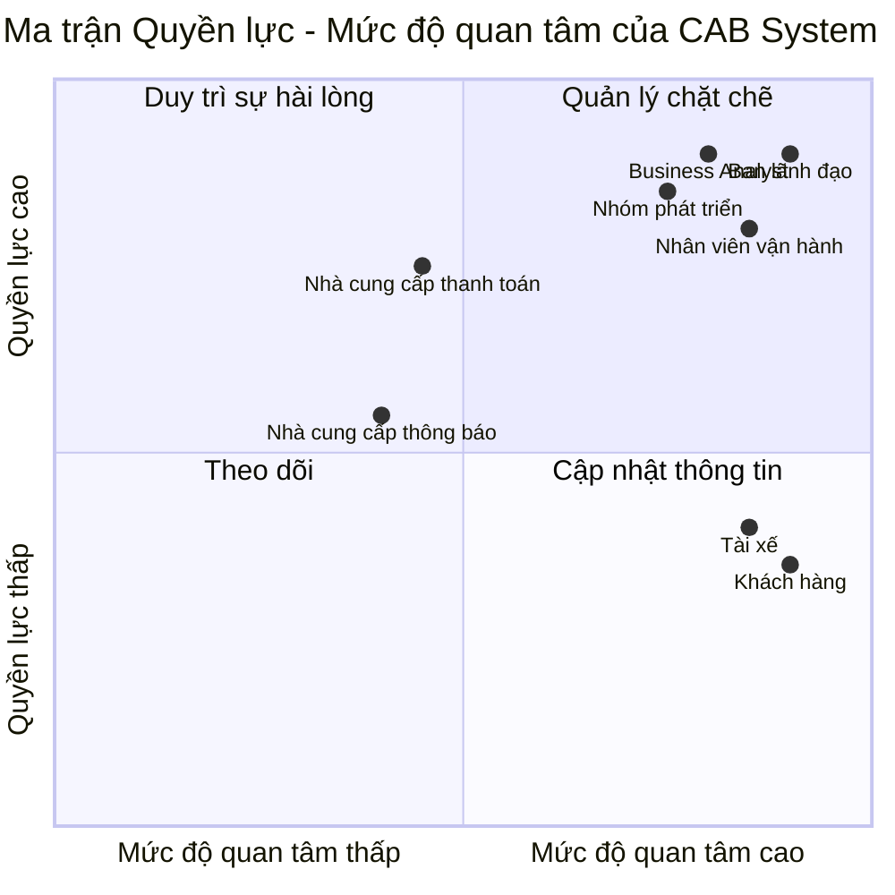

# ĐẶC TẢ YÊU CẦU PHẦN MỀM - HỆ THỐNG CAB

## 1. PHÂN TÍCH CÁC BÊN LIÊN QUAN

### 1.1. Xác định các bên liên quan và vai trò

| STT | Bên liên quan | Vai trò |
|:---:|---|---|
| 1 | **Ban lãnh đạo** | Định hướng phát triển hệ thống, theo dõi hiệu quả hoạt động và sử dụng các báo cáo để hỗ trợ ra quyết định. |
| 2 | **Khách hàng** | Đăng ký tài khoản, đặt xe, theo dõi chuyến đi, thanh toán, xem lịch sử chuyến và đánh giá tài xế. |
| 3 | **Tài xế** | Quản lý hồ sơ và phương tiện, nhận hoặc từ chối chuyến, thực hiện chuyến và cập nhật trạng thái, vị trí. |
| 4 | **Nhân viên vận hành** | Quản lý khách hàng, tài xế, phương tiện và chuyến đi; theo dõi các chuyến đang diễn ra và hỗ trợ xử lý sự cố. |
| 5 | **Chuyên viên phân tích nghiệp vụ (BA)** | Phân tích và làm rõ các yêu cầu chưa xác định như cách tính cước, tiêu chí ưu tiên tài xế, thời gian phản hồi, chính sách hủy chuyến, xử lý mất kết nối và thời gian lưu trữ dữ liệu. |
| 6 | **Nhóm phát triển** | Thiết kế, phát triển, kiểm thử và triển khai hệ thống CAB dựa trên các yêu cầu đã được xác nhận. |
| 7 | **Nhà cung cấp thanh toán** | Xử lý các giao dịch thanh toán điện tử được tích hợp với hệ thống CAB. |
| 8 | **Nhà cung cấp thông báo** | Hỗ trợ gửi thông báo đến khách hàng và tài xế và có thể được mở rộng thêm trong tương lai. |

### 1.2. Ma trận các bên liên quan

## Mục tiêu kinh doanh

- **BG-01:** Tự động hóa toàn bộ quy trình đặt xe và quản lý chuyến đi từ khi khách hàng tạo yêu cầu đến khi hoàn thành chuyến.

- **BG-02:** Nâng cao trải nghiệm khách hàng thông qua việc đặt xe, theo dõi trạng thái chuyến đi, thanh toán và đánh giá tài xế trên cùng một hệ thống.

- **BG-03:** Nâng cao hiệu quả tìm kiếm và phân công tài xế, giảm phụ thuộc vào việc điều phối thủ công.

- **BG-04:** Quản lý tập trung việc tính cước, thanh toán và lịch sử giao dịch của khách hàng.

- **BG-05:** Nâng cao hiệu quả quản lý và giám sát hoạt động vận hành của doanh nghiệp.

- **BG-06:** Cung cấp dữ liệu và báo cáo phục vụ việc theo dõi hoạt động và hỗ trợ ban lãnh đạo ra quyết định.

- **BG-07:** Xây dựng hệ thống có khả năng mở rộng, hoạt động ổn định khi nhu cầu tăng cao và hạn chế ảnh hưởng đến toàn hệ thống khi một thành phần gặp lỗi.

- **BG-08:** Đảm bảo an toàn thông tin, kiểm soát quyền truy cập và lưu vết các thao tác quan trọng trong hệ thống.

- **BG-09:** Xây dựng nền tảng CAB có kiến trúc linh hoạt, cho phép bổ sung loại dịch vụ, phương thức thanh toán, nhà cung cấp thông báo hoặc thay đổi thành phần kỹ thuật trong tương lai mà không phải xây dựng lại toàn bộ hệ thống.
