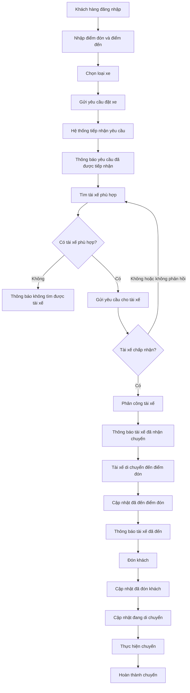
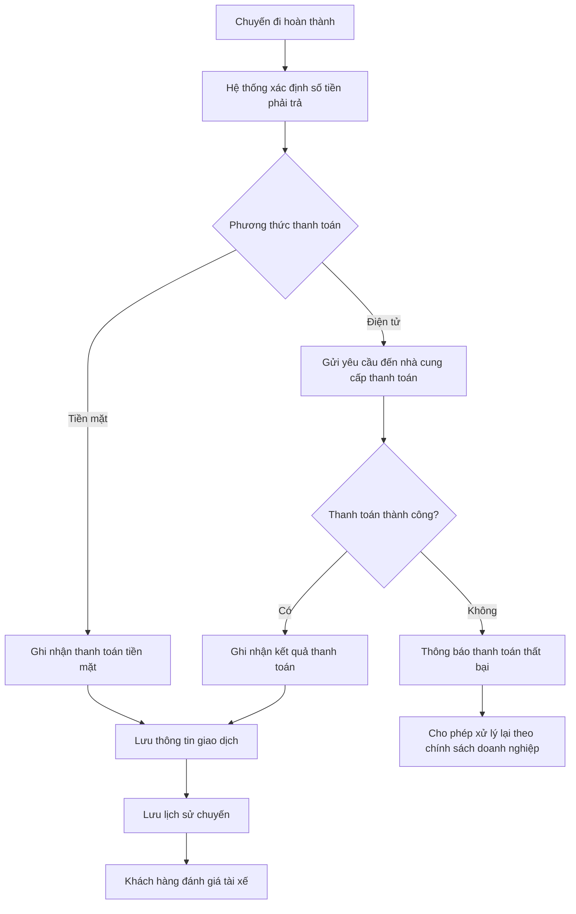
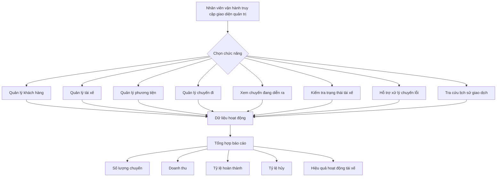
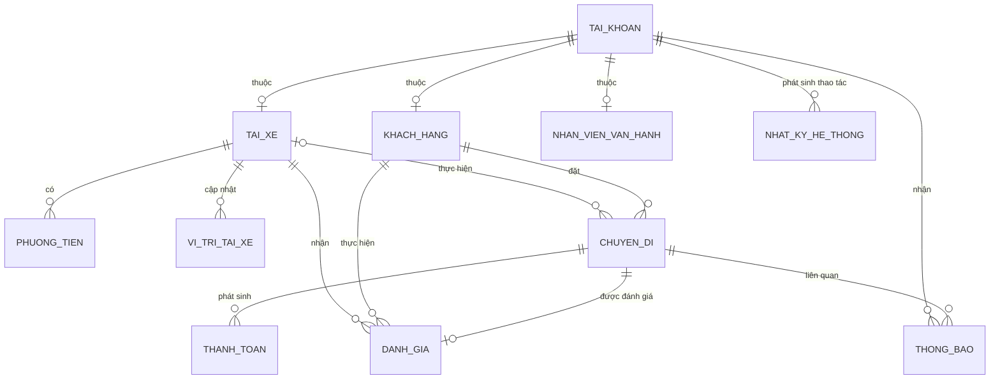
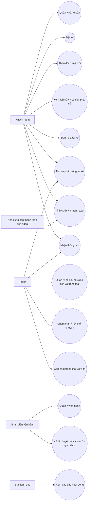

# ĐẶC TẢ YÊU CẦU PHẦN MỀM - CAB SYSTEM

---

# 1. STAKEHOLDER LIST & ROLES
## Danh sách & Vai trò Bên liên quan

| STT | Bên liên quan | Vai trò |
|:---:|---|---|
| 1 | **Ban lãnh đạo / Ban giám đốc** | Định hướng xây dựng nền tảng CAB, theo dõi hiệu quả hoạt động và sử dụng các báo cáo để hỗ trợ quản lý. |
| 2 | **Khách hàng** | Đăng ký, đăng nhập, cập nhật thông tin cá nhân, đặt xe, theo dõi chuyến, thanh toán, xem lịch sử và đánh giá tài xế sau chuyến. |
| 3 | **Tài xế** | Cập nhật hồ sơ, thông tin phương tiện, trạng thái hoạt động; nhận hoặc từ chối chuyến; cập nhật vị trí và trạng thái chuyến đi. |
| 4 | **Nhân viên vận hành** | Quản lý khách hàng, tài xế, phương tiện, chuyến đi; theo dõi chuyến đang diễn ra, kiểm tra trạng thái tài xế, hỗ trợ xử lý chuyến lỗi và tra cứu lịch sử giao dịch. |
| 5 | **Nhà cung cấp thanh toán bên ngoài** | Xử lý giao dịch thanh toán điện tử được tích hợp với CAB System. |
| 6 | **Business Analyst (BA)** | Làm rõ phạm vi, tác nhân, quy trình nghiệp vụ, yêu cầu chức năng, yêu cầu phi chức năng, các quy tắc nghiệp vụ, trường hợp ngoại lệ và các vấn đề chưa được xác định. |

---

# 2. STAKEHOLDER MATRIX
## Ma trận Bên liên quan

> Ma trận dưới đây được phân tích dựa trên vai trò và mức độ tham gia của các bên trong yêu cầu khách hàng.

| Nhóm | Bên liên quan |
|---|---|
| **Manage Closely – Quản lý chặt chẽ** | Ban lãnh đạo, Nhân viên vận hành, Business Analyst, Nhóm phát triển |
| **Keep Satisfied – Duy trì sự hài lòng** | Nhà cung cấp thanh toán bên ngoài |
| **Keep Informed – Cập nhật thông tin** | Khách hàng, Tài xế |
| **Monitor – Theo dõi** | Không xác định thêm bên liên quan cụ thể trong đề |

---

# 3. BUSINESS GOALS
## Mục tiêu Kinh doanh

| Mã | Mục tiêu kinh doanh |
|:---:|---|
| **BG-01** | Tự động hóa quy trình đặt xe và phân công tài xế, giảm việc phân công tài xế thủ công. |
| **BG-02** | Nâng cao khả năng theo dõi chuyến đi của khách hàng từ khi gửi yêu cầu đến khi hoàn thành chuyến. |
| **BG-03** | Quản lý tập trung chuyến đi, tính cước, thanh toán và lịch sử giao dịch. |
| **BG-04** | Nâng cao hiệu quả quản lý khách hàng, tài xế, phương tiện và chuyến đi của bộ phận vận hành. |
| **BG-05** | Cung cấp dữ liệu và báo cáo để theo dõi hoạt động và hỗ trợ ban lãnh đạo. |
| **BG-06** | Xây dựng nền tảng CAB ổn định, bảo mật, có khả năng mở rộng và hỗ trợ phát triển thêm chức năng trong tương lai. |

---

# 4. MINIMUM VIABLE PRODUCT (MVP) MODULES

| STT | Module | Chức năng chính |
|:---:|---|---|
| 1 | **Quản lý tài khoản và xác thực** | Đăng ký, đăng nhập, cập nhật thông tin cá nhân và xác thực người dùng. |
| 2 | **Quản lý tài xế và phương tiện** | Quản lý hồ sơ tài xế, thông tin phương tiện và trạng thái hoạt động. |
| 3 | **Đặt xe** | Nhập điểm đón, điểm đến, chọn loại xe và gửi yêu cầu đặt xe. |
| 4 | **Tìm kiếm và phân công tài xế** | Tìm tài xế phù hợp dựa trên vị trí, trạng thái sẵn sàng và tiêu chí vận hành; tiếp tục tìm khi tài xế từ chối hoặc không phản hồi. |
| 5 | **Quản lý chuyến đi và vị trí** | Theo dõi trạng thái chuyến, vị trí tài xế, thời gian dự kiến đến, lịch sử chuyến và đánh giá sau chuyến. |
| 6 | **Tính cước và thanh toán** | Xác định số tiền phải trả sau khi chuyến hoàn thành và hỗ trợ thanh toán tiền mặt hoặc điện tử. |
| 7 | **Thông báo** | Gửi thông báo cho khách hàng và tài xế tại các thời điểm liên quan đến chuyến đi và thanh toán. |
| 8 | **Quản lý vận hành và báo cáo** | Quản lý khách hàng, tài xế, phương tiện, chuyến đi, xử lý chuyến lỗi, tra cứu giao dịch và cung cấp báo cáo. |

---

# 5. BUSINESS REQUIREMENTS – CAB SYSTEM MVP
## Yêu cầu Nghiệp vụ

| Mã | Yêu cầu nghiệp vụ |
|:---:|---|
| **BR-01** | Hệ thống phải hỗ trợ khách hàng đăng ký, đăng nhập, cập nhật thông tin cá nhân, đặt xe, theo dõi chuyến, xem lịch sử, số tiền phải trả và đánh giá tài xế sau chuyến. |
| **BR-02** | Hệ thống phải hỗ trợ tài xế đăng ký hoặc được nhân viên vận hành tạo tài khoản; cập nhật hồ sơ, phương tiện, trạng thái hoạt động, vị trí và trạng thái chuyến. |
| **BR-03** | Hệ thống phải tìm tài xế phù hợp dựa trên vị trí, trạng thái sẵn sàng và các tiêu chí vận hành; ưu tiên tài xế phù hợp và gần khách hàng. |
| **BR-04** | Nếu tài xế từ chối hoặc không phản hồi, hệ thống phải tiếp tục tìm tài xế khác mà không yêu cầu khách hàng tạo lại yêu cầu; nếu không tìm được tài xế phải thông báo cho khách hàng. |
| **BR-05** | Sau khi chuyến hoàn thành, hệ thống phải xác định số tiền khách hàng phải trả dựa trên loại dịch vụ và thông tin chuyến đi; hỗ trợ tiền mặt và thanh toán điện tử. |
| **BR-06** | Thanh toán điện tử phải được tích hợp với nhà cung cấp bên ngoài; thông tin nhạy cảm của thẻ hoặc tài khoản thanh toán không được lưu trực tiếp trong CAB System. |
| **BR-07** | Hệ thống phải gửi thông báo cho khách hàng và tài xế tại các thời điểm liên quan đến chuyến đi và thanh toán. |
| **BR-08** | Hệ thống phải cung cấp giao diện cho nhân viên vận hành để quản lý khách hàng, tài xế, phương tiện và chuyến đi; hỗ trợ xử lý chuyến lỗi và tra cứu lịch sử giao dịch. |
| **BR-09** | Các chức năng quản trị nhạy cảm phải được kiểm soát quyền truy cập. |
| **BR-10** | Hệ thống phải cung cấp báo cáo về số lượng chuyến, doanh thu, tỷ lệ chuyến hoàn thành, tỷ lệ hủy và hiệu quả hoạt động của tài xế. |

---

# 6. BUSINESS PROCESS MODELING
## Mô hình hóa Quy trình Nghiệp vụ

## 6.1. BPM-01 – Quy trình đặt xe và thực hiện chuyến

## 6.2. BPM-02 – Quy trình tính cước và thanh toán

## 6.3. BPM-03 – Quy trình quản lý vận hành và báo cáo

---

# 7. FUNCTIONAL REQUIREMENTS
## Yêu cầu Chức năng

| Mã | Yêu cầu chức năng |
|:---:|---|
| **FR-01** | Hệ thống cho phép khách hàng đăng ký tài khoản, đăng nhập và cập nhật thông tin cá nhân. |
| **FR-02** | Hệ thống cho phép khách hàng nhập điểm đón, điểm đến, lựa chọn loại xe và gửi yêu cầu đặt xe. |
| **FR-03** | Hệ thống cho phép khách hàng theo dõi quá trình tìm tài xế, tài xế đã nhận chuyến, thời gian dự kiến tài xế đến và trạng thái hiện tại của chuyến. |
| **FR-04** | Hệ thống cho phép khách hàng xem lịch sử chuyến đi, số tiền phải trả và đánh giá tài xế sau khi hoàn thành chuyến. |
| **FR-05** | Hệ thống cho phép tài xế đăng ký hoặc cho phép nhân viên vận hành tạo tài khoản tài xế; tài xế có thể cập nhật hồ sơ, thông tin phương tiện và trạng thái hoạt động. |
| **FR-06** | Hệ thống cho phép tài xế chuyển sang trạng thái sẵn sàng, nhận thông báo chuyến mới và chấp nhận hoặc từ chối chuyến. |
| **FR-07** | Hệ thống cho phép tài xế cập nhật các trạng thái: đã đến điểm đón, đã đón khách, đang di chuyển và hoàn thành chuyến. |
| **FR-08** | Hệ thống lưu thông tin vị trí tài xế để hỗ trợ tìm tài xế gần khách hàng và dự kiến thời gian đến. |
| **FR-09** | Hệ thống sử dụng vị trí, trạng thái sẵn sàng và các tiêu chí vận hành để tìm tài xế phù hợp. |
| **FR-10** | Nếu tài xế từ chối hoặc không phản hồi, hệ thống tiếp tục tìm tài xế khác mà không yêu cầu khách hàng tạo lại yêu cầu; nếu không tìm được tài xế, hệ thống thông báo cho khách hàng. |
| **FR-11** | Sau khi chuyến hoàn thành, hệ thống xác định số tiền phải trả dựa trên loại dịch vụ và thông tin chuyến đi. |
| **FR-12** | Hệ thống hỗ trợ thanh toán bằng tiền mặt và thanh toán điện tử thông qua nhà cung cấp thanh toán bên ngoài; khi thanh toán điện tử thất bại phải thông báo và cho phép xử lý lại theo chính sách doanh nghiệp. |
| **FR-13** | Hệ thống gửi thông báo cho khách hàng khi yêu cầu được tiếp nhận, tài xế nhận chuyến, tài xế đến điểm đón, chuyến hoàn thành và thanh toán có kết quả; đồng thời gửi thông báo liên quan đến chuyến cho tài xế. |
| **FR-14** | Hệ thống cung cấp giao diện cho nhân viên vận hành để quản lý khách hàng, tài xế, phương tiện, chuyến đi; theo dõi chuyến đang diễn ra, kiểm tra trạng thái tài xế, xử lý chuyến lỗi và tra cứu lịch sử giao dịch. |
| **FR-15** | Hệ thống cung cấp báo cáo về số lượng chuyến, doanh thu, tỷ lệ hoàn thành, tỷ lệ hủy và hiệu quả hoạt động của tài xế. |

---

# 8. BUSINESS RULES
## Quy tắc Nghiệp vụ

| Mã | Quy tắc nghiệp vụ |
|:---:|---|
| **RULE-01** | Khách hàng và tài xế phải được xác thực trước khi sử dụng các chức năng yêu cầu tài khoản. |
| **RULE-02** | Tài xế phải ở trạng thái sẵn sàng để được xem xét nhận chuyến. |
| **RULE-03** | Việc tìm tài xế phải dựa trên vị trí, trạng thái sẵn sàng và các tiêu chí vận hành. |
| **RULE-04** | Hệ thống ưu tiên tài xế phù hợp và gần khách hàng. |
| **RULE-05** | Nếu tài xế từ chối hoặc không phản hồi, hệ thống tiếp tục tìm tài xế khác mà khách hàng không phải tạo lại yêu cầu. |
| **RULE-06** | Nếu không tìm được tài xế phù hợp, hệ thống phải thông báo rõ ràng cho khách hàng. |
| **RULE-07** | Tài xế phải cập nhật trạng thái chuyến trong quá trình thực hiện chuyến. |
| **RULE-08** | Số tiền phải trả được xác định sau khi chuyến hoàn thành dựa trên loại dịch vụ và thông tin chuyến đi. |
| **RULE-09** | Khách hàng có thể thanh toán bằng tiền mặt hoặc thanh toán điện tử. |
| **RULE-10** | CAB System không được lưu trực tiếp thông tin nhạy cảm của thẻ hoặc tài khoản thanh toán. |
| **RULE-11** | Khi thanh toán điện tử thất bại, hệ thống phải thông báo cho khách hàng và cho phép xử lý lại theo chính sách doanh nghiệp. |
| **RULE-12** | Các thao tác quản trị nhạy cảm chỉ được thực hiện bởi người dùng có quyền phù hợp. |
| **RULE-13** | Các thao tác quan trọng phải được lưu vết để phục vụ kiểm tra khi có sự cố. |

## 8.1. Exception Cases – Trường hợp ngoại lệ

| Mã | Trường hợp ngoại lệ | Xử lý |
|:---:|---|---|
| **EX-01** | Tài xế từ chối chuyến | Tiếp tục tìm tài xế khác mà khách hàng không cần tạo lại yêu cầu. |
| **EX-02** | Tài xế không phản hồi | Tiếp tục tìm tài xế khác mà khách hàng không cần tạo lại yêu cầu. |
| **EX-03** | Không tìm được tài xế | Thông báo rõ ràng cho khách hàng. |
| **EX-04** | Thanh toán điện tử thất bại | Thông báo cho khách hàng và cho phép xử lý lại theo chính sách doanh nghiệp. |
| **EX-05** | Chuyến đi xảy ra lỗi | Nhân viên vận hành hỗ trợ xử lý. |

---

# 9. NON-FUNCTIONAL REQUIREMENTS
## Yêu cầu Phi chức năng

| Mã | Nhóm yêu cầu | Yêu cầu phi chức năng |
|:---:|---|---|
| **NFR-01** | **Ổn định** | Hệ thống phải hoạt động ổn định tại các thời điểm nhu cầu tăng cao. |
| **NFR-02** | **Khả năng mở rộng** | Các thành phần của hệ thống phải có khả năng mở rộng độc lập khi tải tăng. |
| **NFR-03** | **Khả năng chịu lỗi** | Lỗi ở chức năng thanh toán hoặc thông báo không được làm toàn bộ hệ thống đặt xe ngừng hoạt động. |
| **NFR-04** | **Khả năng triển khai** | Chức năng mới phải có thể được triển khai từng phần và hạn chế ảnh hưởng đến các chức năng đang hoạt động. |
| **NFR-05** | **Xác thực và phân quyền** | Khách hàng và tài xế phải được xác thực; các thao tác quản trị phải được kiểm soát quyền truy cập. |
| **NFR-06** | **Bảo vệ dữ liệu** | Thông tin cá nhân, thông tin phương tiện, dữ liệu vị trí và dữ liệu giao dịch phải được bảo vệ. |
| **NFR-07** | **Audit / Truy vết** | Hệ thống phải lưu vết các thao tác quan trọng để phục vụ kiểm tra khi có sự cố. |
| **NFR-08** | **Khả năng mở rộng chức năng** | Kiến trúc phải đủ linh hoạt để bổ sung loại dịch vụ, phương thức thanh toán, nhà cung cấp thông báo hoặc thay đổi thành phần kỹ thuật mà không phải xây dựng lại toàn bộ ứng dụng. |

---

# 10. ENTITY RELATIONSHIP DIAGRAM
## Mô hình Dữ liệu ERD

## 10.1. Các thực thể chính

| STT | Thực thể | Mô tả |
|:---:|---|---|
| 1 | **Tài khoản** | Phục vụ đăng ký, đăng nhập, xác thực và phân quyền. |
| 2 | **Khách hàng** | Lưu thông tin khách hàng sử dụng dịch vụ đặt xe. |
| 3 | **Tài xế** | Lưu hồ sơ và trạng thái hoạt động của tài xế. |
| 4 | **Nhân viên vận hành** | Người sử dụng giao diện quản trị. |
| 5 | **Phương tiện** | Thông tin phương tiện của tài xế. |
| 6 | **Chuyến đi** | Thông tin điểm đón, điểm đến, loại xe/dịch vụ, trạng thái chuyến và số tiền phải trả. |
| 7 | **Vị trí tài xế** | Thông tin vị trí tài xế phục vụ tìm tài xế gần và dự kiến thời gian đến. |
| 8 | **Thanh toán** | Thông tin phương thức, số tiền và kết quả thanh toán. |
| 9 | **Thông báo** | Thông tin các thông báo gửi cho khách hàng hoặc tài xế. |
| 10 | **Đánh giá** | Đánh giá của khách hàng dành cho tài xế sau chuyến. |
| 11 | **Nhật ký hệ thống** | Lưu vết các thao tác quan trọng. |

## 10.2. ERD

> ERD chỉ mô hình hóa các thực thể và quan hệ có thể xác định từ đề, không tự thêm các thuộc tính cơ sở dữ liệu mà khách hàng chưa cung cấp.

---

# 11. USE CASE DIAGRAM
## Mô hình Use Case

## 11.1. Danh sách Use Case

| Mã | Use Case | Actor |
|:---:|---|---|
| **UC-01** | Quản lý tài khoản khách hàng | Khách hàng |
| **UC-02** | Đặt xe | Khách hàng |
| **UC-03** | Theo dõi chuyến đi | Khách hàng |
| **UC-04** | Xem lịch sử chuyến và số tiền phải trả | Khách hàng |
| **UC-05** | Đánh giá tài xế | Khách hàng |
| **UC-06** | Quản lý hồ sơ, phương tiện và trạng thái hoạt động | Tài xế |
| **UC-07** | Chấp nhận / Từ chối chuyến | Tài xế |
| **UC-08** | Cập nhật trạng thái chuyến và vị trí | Tài xế |
| **UC-09** | Tìm và phân công tài xế | Khách hàng, Tài xế |
| **UC-10** | Tính cước và thanh toán | Khách hàng, Nhà cung cấp thanh toán bên ngoài |
| **UC-11** | Nhận thông báo | Khách hàng, Tài xế |
| **UC-12** | Quản lý vận hành | Nhân viên vận hành |
| **UC-13** | Hỗ trợ xử lý chuyến lỗi và tra cứu giao dịch | Nhân viên vận hành |
| **UC-14** | Xem báo cáo hoạt động | Ban lãnh đạo |

## 11.2. Use Case Diagram

---

# 12. ACCEPTANCE CRITERIA
## Tiêu chí Chấp nhận

| Mã | Yêu cầu liên quan | Tiêu chí chấp nhận |
|:---:|---|---|
| **AC-01** | FR-01 | Khách hàng có thể đăng ký, đăng nhập và cập nhật thông tin cá nhân. |
| **AC-02** | FR-02 | Khách hàng có thể nhập điểm đón, điểm đến, chọn loại xe và gửi yêu cầu đặt xe. |
| **AC-03** | FR-03 | Khách hàng có thể biết hệ thống đang tìm tài xế, tài xế đã nhận chuyến, thời gian dự kiến tài xế đến và trạng thái chuyến. |
| **AC-04** | FR-04 | Sau khi chuyến hoàn thành, khách hàng có thể xem lịch sử, số tiền phải trả và đánh giá tài xế. |
| **AC-05** | FR-05 | Tài xế có thể đăng ký hoặc được nhân viên vận hành tạo tài khoản và có thể cập nhật hồ sơ, phương tiện, trạng thái hoạt động. |
| **AC-06** | FR-06 | Tài xế ở trạng thái sẵn sàng có thể nhận thông báo chuyến mới và chấp nhận hoặc từ chối chuyến. |
| **AC-07** | FR-07 | Tài xế có thể cập nhật các trạng thái đã đến điểm đón, đã đón khách, đang di chuyển và hoàn thành chuyến. |
| **AC-08** | FR-08, FR-09 | Hệ thống có thể sử dụng vị trí, trạng thái sẵn sàng và tiêu chí vận hành để hỗ trợ tìm tài xế phù hợp và gần khách hàng. |
| **AC-09** | FR-10 | Khi tài xế từ chối hoặc không phản hồi, hệ thống tiếp tục tìm tài xế khác mà khách hàng không cần tạo lại yêu cầu. |
| **AC-10** | FR-10 | Khi không tìm được tài xế phù hợp, hệ thống thông báo rõ ràng cho khách hàng. |
| **AC-11** | FR-11, FR-12 | Sau khi chuyến hoàn thành, hệ thống xác định số tiền phải trả và hỗ trợ tiền mặt hoặc thanh toán điện tử. |
| **AC-12** | FR-12 | Khi thanh toán điện tử thất bại, khách hàng được thông báo và có thể xử lý lại theo chính sách doanh nghiệp. |
| **AC-13** | FR-13 | Khách hàng và tài xế nhận được các thông báo liên quan đến chuyến theo yêu cầu. |
| **AC-14** | FR-14 | Nhân viên vận hành có thể quản lý dữ liệu vận hành, theo dõi chuyến, kiểm tra tài xế, hỗ trợ chuyến lỗi và tra cứu lịch sử giao dịch. |
| **AC-15** | FR-15 | Hệ thống cung cấp báo cáo về số lượng chuyến, doanh thu, tỷ lệ hoàn thành, tỷ lệ hủy và hiệu quả hoạt động tài xế. |
| **AC-16** | NFR-01 → NFR-08 | Hệ thống đáp ứng các yêu cầu về ổn định, mở rộng, chịu lỗi, bảo mật, bảo vệ dữ liệu, truy vết và khả năng mở rộng chức năng đã nêu. |

---

# 13. TRACEABILITY MATRIX
## Bảng Truy vết Nghiệp vụ & Kỹ thuật

| BG | BR | BPM | FR / NFR | UC | AC |
|---|---|---|---|---|---|
| **BG-01** | **BR-01** | **BPM-01** | FR-01, FR-02 | UC-01, UC-02 | AC-01, AC-02 |
| **BG-02** | **BR-01** | **BPM-01** | FR-03, FR-04 | UC-03, UC-04, UC-05 | AC-03, AC-04 |
| **BG-01** | **BR-02** | **BPM-01** | FR-05, FR-06, FR-07, FR-08 | UC-06, UC-07, UC-08 | AC-05, AC-06, AC-07, AC-08 |
| **BG-01** | **BR-03, BR-04** | **BPM-01** | FR-09, FR-10 | UC-09 | AC-08, AC-09, AC-10 |
| **BG-03** | **BR-05, BR-06** | **BPM-02** | FR-11, FR-12 | UC-10 | AC-11, AC-12 |
| **BG-02, BG-03** | **BR-07** | **BPM-01, BPM-02** | FR-13 | UC-11 | AC-13 |
| **BG-04** | **BR-08, BR-09** | **BPM-03** | FR-14, NFR-05 | UC-12, UC-13 | AC-14, AC-16 |
| **BG-05** | **BR-10** | **BPM-03** | FR-15 | UC-14 | AC-15 |
| **BG-06** | Các BR liên quan | Áp dụng xuyên suốt | NFR-01 → NFR-08 | Các UC liên quan | AC-16 |
