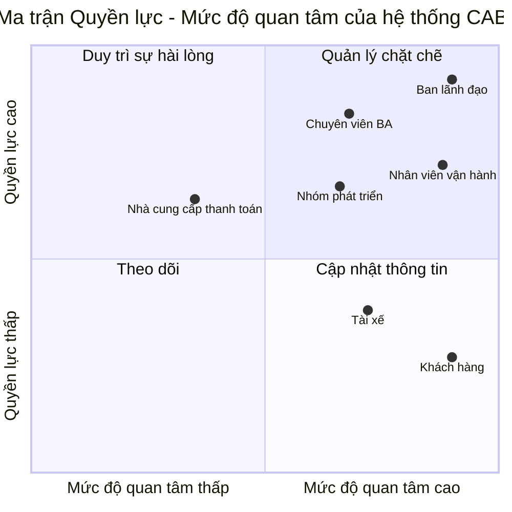
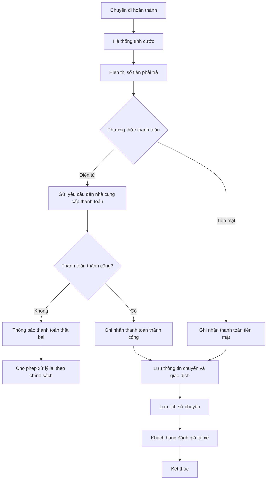
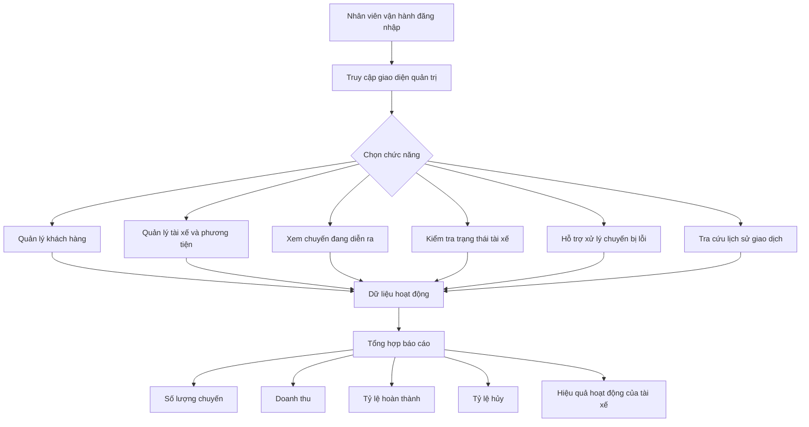

# ĐẶC TẢ YÊU CẦU PHẦN MỀM - HỆ THỐNG CAB

## 1. STAKEHOLDERS

| STT | Bên liên quan | Vai trò |
|:---:|---|---|
| 1 | **Ban lãnh đạo** | Định hướng phát triển hệ thống, theo dõi hiệu quả hoạt động và sử dụng các báo cáo để hỗ trợ ra quyết định. |
| 2 | **Khách hàng** | Đăng ký, đăng nhập, cập nhật thông tin cá nhân, đặt xe, theo dõi chuyến đi, thanh toán, xem lịch sử chuyến và đánh giá tài xế. |
| 3 | **Tài xế** | Quản lý hồ sơ, phương tiện và trạng thái hoạt động; nhận hoặc từ chối chuyến; cập nhật vị trí và trạng thái chuyến đi. |
| 4 | **Nhân viên vận hành** | Quản lý khách hàng, tài xế, phương tiện và chuyến đi; theo dõi chuyến đang diễn ra, hỗ trợ xử lý sự cố và tra cứu lịch sử giao dịch. |
| 5 | **Nhà cung cấp thanh toán bên ngoài** | Xử lý các giao dịch thanh toán điện tử được tích hợp với hệ thống CAB. |
| 6 | **Chuyên viên phân tích nghiệp vụ (BA)** | Xác định phạm vi, quy trình nghiệp vụ, yêu cầu, quy tắc nghiệp vụ, trường hợp ngoại lệ và làm rõ các vấn đề chưa được xác định. |
| 7 | **Nhóm phát triển** | Xây dựng giải pháp dựa trên các yêu cầu đã được làm rõ và xác nhận. |

---

## 2. STAKEHOLDER MATRIX

| Nhóm | Bên liên quan |
|---|---|
| **Quản lý chặt chẽ** | Ban lãnh đạo, Nhân viên vận hành, Chuyên viên BA, Nhóm phát triển |
| **Duy trì sự hài lòng** | Nhà cung cấp thanh toán bên ngoài |
| **Cập nhật thông tin** | Khách hàng, Tài xế |
| **Theo dõi** | Không xác định thêm bên liên quan cụ thể |

---

## 3. BUSINESS GOALS

- **BG-01:** Tự động hóa quy trình đặt xe và phân công tài xế, giảm việc phân công tài xế thủ công.
- **BG-02:** Nâng cao khả năng theo dõi chuyến đi của khách hàng từ khi gửi yêu cầu đến khi hoàn thành chuyến.
- **BG-03:** Quản lý tập trung chuyến đi, tính cước, thanh toán và lịch sử giao dịch.
- **BG-04:** Nâng cao hiệu quả quản lý hoạt động của khách hàng, tài xế, phương tiện và chuyến đi.
- **BG-05:** Cung cấp dữ liệu và báo cáo phục vụ việc theo dõi hoạt động và hỗ trợ ban lãnh đạo ra quyết định.
- **BG-06:** Xây dựng nền tảng CAB có khả năng mở rộng, hoạt động ổn định, bảo mật và linh hoạt để phát triển thêm chức năng trong tương lai.

---

## 4. MVP MODULES

| STT | Module | Chức năng chính |
|:---:|---|---|
| 1 | **Quản lý tài khoản và xác thực** | Đăng ký, đăng nhập, cập nhật thông tin cá nhân và xác thực người dùng. |
| 2 | **Quản lý tài xế và phương tiện** | Quản lý hồ sơ tài xế, thông tin phương tiện và trạng thái hoạt động. |
| 3 | **Đặt xe** | Nhập điểm đón, điểm đến, lựa chọn loại xe và gửi yêu cầu đặt xe. |
| 4 | **Tìm kiếm và phân công tài xế** | Tìm tài xế phù hợp, gửi yêu cầu nhận chuyến và tiếp tục tìm tài xế khác khi tài xế từ chối hoặc không phản hồi. |
| 5 | **Quản lý chuyến đi và vị trí** | Theo dõi trạng thái chuyến đi, cập nhật vị trí tài xế, hỗ trợ dự kiến thời gian đến, lưu lịch sử chuyến và hỗ trợ đánh giá tài xế sau chuyến. |
| 6 | **Tính cước và thanh toán** | Tính số tiền phải trả và hỗ trợ thanh toán bằng tiền mặt hoặc thanh toán điện tử. |
| 7 | **Thông báo** | Gửi thông báo về yêu cầu đặt xe, tài xế nhận chuyến, tài xế đến điểm đón, hoàn thành chuyến và kết quả thanh toán. |
| 8 | **Quản lý vận hành và báo cáo** | Quản lý khách hàng, tài xế, phương tiện, chuyến đi; hỗ trợ xử lý sự cố, tra cứu giao dịch và cung cấp báo cáo. |

---

## 5. BUSINESS REQUIREMENTS

| Mã | Yêu cầu nghiệp vụ |
|:---:|---|
| **BR-01** | Hệ thống phải hỗ trợ khách hàng đăng ký, đăng nhập, cập nhật thông tin, đặt xe, theo dõi chuyến, xem lịch sử, số tiền phải trả và đánh giá tài xế sau chuyến. |
| **BR-02** | Hệ thống phải hỗ trợ tài xế quản lý hồ sơ, phương tiện, trạng thái hoạt động, nhận hoặc từ chối chuyến, cập nhật vị trí và trạng thái chuyến đi. |
| **BR-03** | Hệ thống phải tự động tìm tài xế phù hợp dựa trên vị trí, trạng thái sẵn sàng và các tiêu chí vận hành; ưu tiên tài xế phù hợp và gần khách hàng. Nếu tài xế không phản hồi hoặc từ chối, hệ thống phải tiếp tục tìm tài xế khác mà không yêu cầu khách hàng tạo lại yêu cầu. Nếu không tìm được tài xế, hệ thống phải thông báo rõ ràng cho khách hàng. |
| **BR-04** | Sau khi chuyến hoàn thành, hệ thống phải tính cước và hỗ trợ thanh toán bằng tiền mặt hoặc thanh toán điện tử thông qua nhà cung cấp bên ngoài. Hệ thống không được lưu trực tiếp thông tin nhạy cảm của thẻ hoặc tài khoản thanh toán. Nếu thanh toán điện tử thất bại, hệ thống phải thông báo cho khách hàng và cho phép xử lý lại theo chính sách của doanh nghiệp. |
| **BR-05** | Hệ thống phải thông báo cho khách hàng khi yêu cầu đặt xe được tiếp nhận, khi có tài xế nhận chuyến, khi tài xế đến điểm đón, khi chuyến hoàn thành và khi có kết quả thanh toán; đồng thời thông báo cho tài xế về chuyến mới hoặc các thay đổi liên quan đến chuyến đang thực hiện. |
| **BR-06** | Hệ thống phải cung cấp giao diện cho nhân viên vận hành để quản lý khách hàng, tài xế, phương tiện, chuyến đi, hỗ trợ xử lý sự cố và tra cứu lịch sử giao dịch. |
| **BR-07** | Hệ thống phải cung cấp báo cáo về số lượng chuyến, doanh thu, tỷ lệ hoàn thành, tỷ lệ hủy và hiệu quả hoạt động của tài xế. |
| **BR-08** | Hệ thống phải đảm bảo xác thực, phân quyền, bảo vệ dữ liệu, lưu vết thao tác, khả năng mở rộng và hạn chế ảnh hưởng toàn hệ thống khi thanh toán hoặc thông báo gặp lỗi. |

### Các vấn đề cần làm rõ

- Cách tính cước.
- Tiêu chí ưu tiên tài xế.
- Thời gian tài xế phải phản hồi.
- Chính sách hủy chuyến.
- Cách xử lý khi mất kết nối mạng.
- Thời gian lưu trữ dữ liệu.

---

## 6. BUSINESS PROCESS MODELING

### 6.1. Quy trình đặt xe và thực hiện chuyến

**Business Requirements liên quan:** BR-01, BR-02, BR-03, BR-05.

### 6.2. Quy trình tính cước và thanh toán

**Business Requirements liên quan:** BR-04, BR-05.

### 6.3. Quy trình quản lý vận hành và báo cáo

**Business Requirements liên quan:** BR-06, BR-07.

### 6.4. Yêu cầu áp dụng xuyên suốt

**BR-08** được áp dụng cho toàn bộ hệ thống:

- Xác thực khách hàng và tài xế.
- Kiểm soát quyền đối với các thao tác quản trị.
- Bảo vệ thông tin cá nhân, phương tiện, vị trí và giao dịch.
- Lưu vết các thao tác quan trọng.
- Đảm bảo khả năng mở rộng khi tải tăng.
- Lỗi ở chức năng thanh toán hoặc thông báo không được làm toàn bộ hệ thống đặt xe ngừng hoạt động.
