# CAB SYSTEM MVP – SOFTWARE REQUIREMENTS SPECIFICATION
# ĐẶC TẢ YÊU CẦU PHẦN MỀM – CAB SYSTEM MVP

**Project / Dự án:** CAB System – Ride Booking Platform / Nền tảng đặt xe  
**Company / Công ty:** ABC  
**Development Time / Thời gian xây dựng và triển khai:** 7 weeks / 7 tuần  
**MVP Scope / Phạm vi MVP:** Customer Management and Driver Management / Quản lý Khách hàng và Quản lý Tài xế  

---

## 1. Stakeholder List & Roles
## Danh sách & Vai trò Bên liên quan

| Stakeholder | Role – English | Vai trò – Tiếng Việt |
|---|---|---|
| Board of Directors / Ban lãnh đạo | Defines expectations for the new CAB platform and its long-term development. | Đưa ra kỳ vọng đối với nền tảng CAB mới và khả năng phát triển lâu dài. |
| Customer / Khách hàng | Creates and manages an account, creates ride requests, selects vehicle type, tracks rides, views ride history and rates drivers. | Tạo và quản lý tài khoản, tạo yêu cầu đặt xe, chọn loại xe, theo dõi chuyến đi, xem lịch sử và đánh giá tài xế. |
| Driver / Tài xế | Manages profile and vehicle information, updates working status and location, receives ride requests and updates ride status. | Quản lý hồ sơ và phương tiện, cập nhật trạng thái hoạt động và vị trí, nhận yêu cầu chuyến và cập nhật trạng thái chuyến. |
| Operations Staff / Nhân viên vận hành | Manages customers, drivers, vehicles and rides and supports ride-related problems. | Quản lý khách hàng, tài xế, phương tiện, chuyến đi và hỗ trợ xử lý các trường hợp chuyến gặp lỗi. |
| Payment Provider / Nhà cung cấp thanh toán | Provides external electronic payment services for the CAB System. | Cung cấp dịch vụ thanh toán điện tử bên ngoài cho CAB System. |
| Notification Provider / Nhà cung cấp thông báo | Supports notification delivery for customers and drivers. | Hỗ trợ gửi thông báo cho khách hàng và tài xế. |
| Business Analyst / Chuyên viên Phân tích Nghiệp vụ | Clarifies scope, actors, business processes, requirements, business rules, exceptions and unclear business issues. | Làm rõ phạm vi, tác nhân, quy trình nghiệp vụ, yêu cầu, quy tắc nghiệp vụ, ngoại lệ và các vấn đề chưa rõ. |

---

## 2. Stakeholder Matrix
## Ma trận Bên liên quan

### 2.1. Power – Interest Matrix
### Ma trận Quyền lực – Mức độ Quan tâm

| Stakeholder | Power / Quyền lực | Interest / Mức quan tâm | Strategy / Chiến lược |
|---|---|---|---|
| Board of Directors | High | High | Manage Closely / Quản lý chặt chẽ |
| Operations Staff | High | High | Manage Closely / Quản lý chặt chẽ |
| Customer | Medium | High | Keep Informed / Cập nhật thường xuyên |
| Driver | Medium | High | Keep Informed / Cập nhật thường xuyên |
| Business Analyst | High | High | Manage Closely / Quản lý chặt chẽ |
| Payment Provider | Medium | Medium | Keep Satisfied / Duy trì phối hợp |
| Notification Provider | Medium | Medium | Keep Satisfied / Duy trì phối hợp |

### 2.2. Stakeholder Matrix Diagram
### Sơ đồ Ma trận Bên liên quan

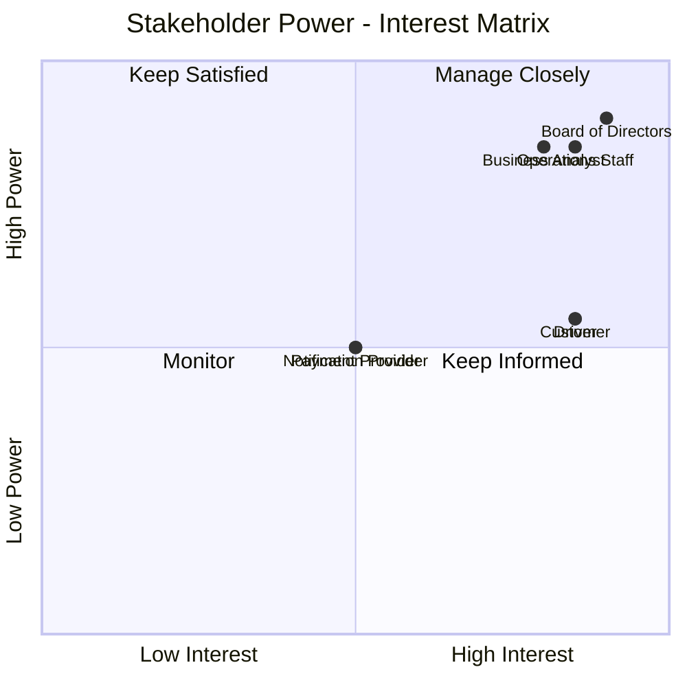

---

## 3. Business Goals
## Mục tiêu Kinh doanh

| ID | Business Goal – English | Mục tiêu Kinh doanh – Tiếng Việt |
|---|---|---|
| BG-01 | Replace the limitations of the current ride-booking process with a new CAB platform. | Khắc phục các hạn chế của quy trình đặt xe hiện tại bằng một nền tảng CAB mới. |
| BG-02 | Reduce manual driver assignment. | Giảm việc phân công tài xế thủ công. |
| BG-03 | Allow customers to clearly track ride status. | Cho phép khách hàng theo dõi rõ trạng thái chuyến đi. |
| BG-04 | Support management of customer, driver, vehicle and ride information through the system. | Hỗ trợ quản lý thông tin khách hàng, tài xế, phương tiện và chuyến đi trên hệ thống. |
| BG-05 | Support a large number of customers and drivers. | Hỗ trợ số lượng lớn khách hàng và tài xế. |
| BG-06 | Build a CAB platform that can be extended with additional features in the future. | Xây dựng nền tảng CAB có thể mở rộng thêm tính năng trong tương lai. |

---

## 4. Minimum Viable Product (MVP) Modules
## Các Module thuộc Phạm vi MVP

For the current phase, the MVP is limited to two main modules:

Trong giai đoạn hiện tại, MVP được giới hạn trong hai module chính:

### 4.1. Customer Management
### Quản lý Khách hàng

Functions included in this module:

Các chức năng thuộc module:

- Register account / Đăng ký tài khoản
- Login / Đăng nhập
- Update personal information / Cập nhật thông tin cá nhân
- Enter pickup location / Nhập điểm đón
- Enter destination / Nhập điểm đến
- Select vehicle type / Lựa chọn loại xe
- Submit ride request / Gửi yêu cầu đặt xe
- Track driver-searching status / Theo dõi trạng thái tìm tài xế
- View assigned driver / Xem tài xế đã nhận chuyến
- Track current ride status / Theo dõi trạng thái chuyến đi
- View ride history / Xem lịch sử chuyến đi
- View fare / Xem số tiền phải trả
- Rate driver after trip completion / Đánh giá tài xế sau khi hoàn thành chuyến

### 4.2. Driver Management
### Quản lý Tài xế

Functions included in this module:

Các chức năng thuộc module:

- Register a driver account or allow Operations Staff to create an account / Đăng ký tài khoản hoặc để Nhân viên vận hành tạo tài khoản
- Update driver profile / Cập nhật hồ sơ tài xế
- Update vehicle information / Cập nhật thông tin phương tiện
- Update working status / Cập nhật trạng thái hoạt động
- Set availability status / Chuyển sang trạng thái sẵn sàng nhận chuyến
- Update driver location / Cập nhật vị trí tài xế
- Receive ride notification / Nhận thông báo chuyến mới
- Accept ride / Chấp nhận chuyến
- Reject ride / Từ chối chuyến
- Update ride status / Cập nhật trạng thái chuyến đi

---

## 5. Business Requirements – CAB System MVP
## Yêu cầu Nghiệp vụ – CAB System MVP

| ID | Business Requirement – English | Yêu cầu Nghiệp vụ – Tiếng Việt |
|---|---|---|
| BR-01 | The business needs customers to be able to create, access and update their CAB accounts. | Doanh nghiệp cần khách hàng có thể tạo, truy cập và cập nhật tài khoản CAB. |
| BR-02 | The business needs customers to be able to create a ride request by entering pickup location, destination and selecting a vehicle type. | Doanh nghiệp cần khách hàng có thể tạo yêu cầu đặt xe bằng cách nhập điểm đón, điểm đến và lựa chọn loại xe. |
| BR-03 | The business needs customers to be able to track the current status of a ride from driver search until trip completion. | Doanh nghiệp cần khách hàng có thể theo dõi trạng thái chuyến từ khi tìm tài xế đến khi hoàn thành chuyến. |
| BR-04 | The business needs driver profiles and vehicle information to be managed in the CAB System. | Doanh nghiệp cần hồ sơ tài xế và thông tin phương tiện được quản lý trên CAB System. |
| BR-05 | The business needs drivers to be able to update their working status, availability and location. | Doanh nghiệp cần tài xế có thể cập nhật trạng thái hoạt động, trạng thái sẵn sàng và vị trí. |
| BR-06 | The business needs the system to identify suitable drivers and allow drivers to accept or reject ride requests. | Doanh nghiệp cần hệ thống xác định tài xế phù hợp và cho phép tài xế chấp nhận hoặc từ chối yêu cầu chuyến. |
| BR-07 | The business needs the system to continue searching for another driver when a proposed driver rejects or does not respond. | Doanh nghiệp cần hệ thống tiếp tục tìm tài xế khác khi tài xế được đề xuất từ chối hoặc không phản hồi. |
| BR-08 | The business needs drivers to update ride status during trip execution. | Doanh nghiệp cần tài xế cập nhật trạng thái chuyến trong quá trình thực hiện chuyến. |
| BR-09 | The business needs completed ride information to be available for ride history, fare viewing and driver rating. | Doanh nghiệp cần thông tin chuyến đã hoàn thành để khách hàng xem lịch sử, số tiền phải trả và đánh giá tài xế. |

---

## 6. Business Process Modeling
## Mô hình hóa Quy trình Nghiệp vụ

### BP-01 – Customer Account Management
### Quản lý Tài khoản Khách hàng

**Related BR / BR liên quan:** BR-01

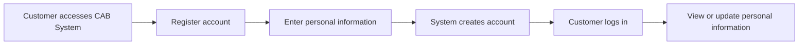

**Vietnamese Flow / Luồng Tiếng Việt**

Khách hàng truy cập CAB System  
→ Đăng ký tài khoản  
→ Nhập thông tin cá nhân  
→ Hệ thống tạo tài khoản  
→ Khách hàng đăng nhập  
→ Xem hoặc cập nhật thông tin cá nhân.

---

### BP-02 – Create Ride Request
### Tạo Yêu cầu Đặt xe

**Related BR:** BR-02

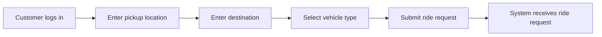

**Vietnamese Flow**

Khách hàng đăng nhập  
→ Nhập điểm đón  
→ Nhập điểm đến  
→ Chọn loại xe  
→ Gửi yêu cầu đặt xe  
→ Hệ thống tiếp nhận yêu cầu.

---

### BP-03 – Track Ride Status
### Theo dõi Trạng thái Chuyến đi

**Related BR:** BR-03

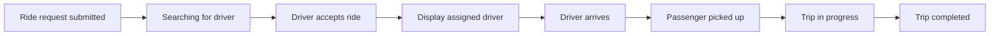

**Vietnamese Flow**

Khách hàng gửi yêu cầu  
→ Hệ thống đang tìm tài xế  
→ Tài xế nhận chuyến  
→ Hiển thị tài xế đã nhận  
→ Tài xế đến điểm đón  
→ Đã đón khách  
→ Đang di chuyển  
→ Hoàn thành chuyến.

---

### BP-04 – Driver Profile and Vehicle Management
### Quản lý Hồ sơ Tài xế và Phương tiện

**Related BR:** BR-04

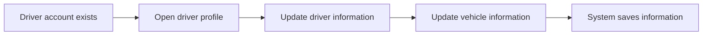

**Vietnamese Flow**

Có tài khoản tài xế  
→ Mở hồ sơ tài xế  
→ Cập nhật thông tin tài xế  
→ Cập nhật thông tin phương tiện  
→ Hệ thống lưu thông tin.

---

### BP-05 – Driver Working Status and Location
### Cập nhật Trạng thái Hoạt động và Vị trí Tài xế

**Related BR:** BR-05

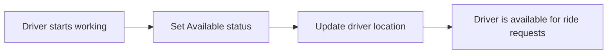

**Vietnamese Flow**

Tài xế bắt đầu làm việc  
→ Chuyển sang trạng thái sẵn sàng  
→ Cập nhật vị trí  
→ Tài xế có thể nhận yêu cầu chuyến.

---

### BP-06 – Driver Matching and Response
### Tìm Tài xế và Phản hồi Yêu cầu Chuyến

**Related BR:** BR-06

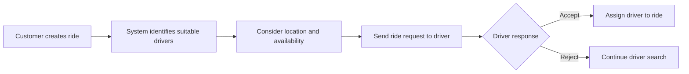

**Vietnamese Flow**

Khách hàng tạo chuyến  
→ Hệ thống xác định tài xế phù hợp  
→ Xem xét vị trí và trạng thái sẵn sàng  
→ Gửi yêu cầu chuyến cho tài xế  
→ Tài xế chấp nhận hoặc từ chối  
→ Nếu chấp nhận thì phân công tài xế.

---

### BP-07 – Search for Another Driver
### Tìm Tài xế Khác

**Related BR:** BR-07

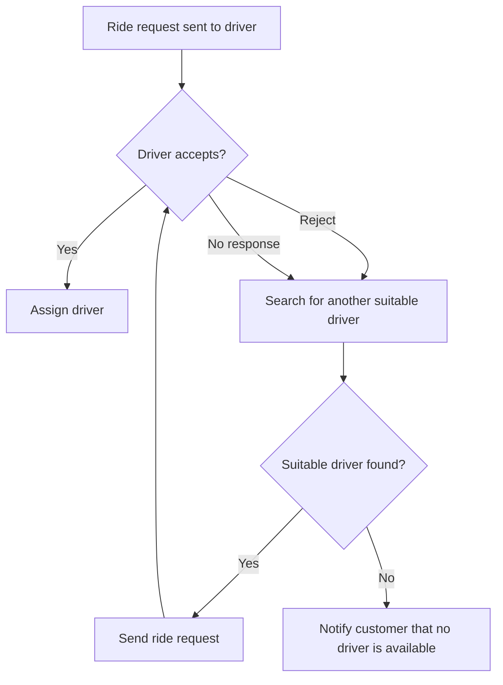

**Vietnamese Flow**

Gửi yêu cầu cho tài xế  
→ Nếu tài xế chấp nhận thì phân công  
→ Nếu từ chối hoặc không phản hồi thì tìm tài xế khác  
→ Nếu tìm được thì gửi yêu cầu mới  
→ Nếu không tìm được thì thông báo cho khách hàng.

---

### BP-08 – Ride Execution
### Thực hiện Chuyến đi

**Related BR:** BR-08

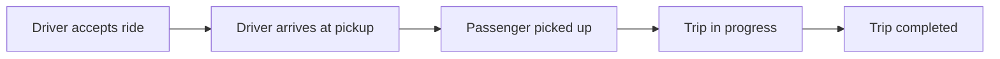

**Vietnamese Flow**

Tài xế nhận chuyến  
→ Tài xế đến điểm đón  
→ Đón khách  
→ Đang di chuyển  
→ Hoàn thành chuyến.

---

### BP-09 – Ride History, Fare and Rating
### Lịch sử Chuyến, Số tiền và Đánh giá

**Related BR:** BR-09

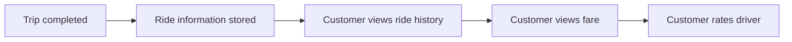

**Vietnamese Flow**

Chuyến hoàn thành  
→ Lưu thông tin chuyến  
→ Khách hàng xem lịch sử  
→ Xem số tiền phải trả  
→ Đánh giá tài xế.

---

## 7. Functional Requirements
## Yêu cầu Chức năng

### 7.1. Customer Management
### Quản lý Khách hàng

| ID | Functional Requirement – English | Yêu cầu Chức năng – Tiếng Việt |
|---|---|---|
| FR-01 | The system shall allow customers to register an account. | Hệ thống phải cho phép khách hàng đăng ký tài khoản. |
| FR-02 | The system shall allow customers to log in. | Hệ thống phải cho phép khách hàng đăng nhập. |
| FR-03 | The system shall allow customers to update personal information. | Hệ thống phải cho phép khách hàng cập nhật thông tin cá nhân. |
| FR-04 | The system shall allow customers to enter a pickup location. | Hệ thống phải cho phép khách hàng nhập điểm đón. |
| FR-05 | The system shall allow customers to enter a destination. | Hệ thống phải cho phép khách hàng nhập điểm đến. |
| FR-06 | The system shall allow customers to select a vehicle type. | Hệ thống phải cho phép khách hàng lựa chọn loại xe. |
| FR-07 | The system shall allow customers to submit a ride request. | Hệ thống phải cho phép khách hàng gửi yêu cầu đặt xe. |
| FR-08 | The system shall show the customer that it is searching for a driver. | Hệ thống phải hiển thị cho khách hàng trạng thái đang tìm tài xế. |
| FR-09 | The system shall show the customer which driver has accepted the ride. | Hệ thống phải hiển thị cho khách hàng tài xế đã nhận chuyến. |
| FR-10 | The system shall show the estimated driver arrival time. | Hệ thống phải hiển thị thời gian dự kiến tài xế đến. |
| FR-11 | The system shall show the current ride status. | Hệ thống phải hiển thị trạng thái hiện tại của chuyến. |
| FR-12 | The system shall allow customers to view ride history. | Hệ thống phải cho phép khách hàng xem lịch sử chuyến đi. |
| FR-13 | The system shall allow customers to view the amount to be paid. | Hệ thống phải cho phép khách hàng xem số tiền phải trả. |
| FR-14 | The system shall allow customers to rate drivers after trip completion. | Hệ thống phải cho phép khách hàng đánh giá tài xế sau khi hoàn thành chuyến. |

### 7.2. Driver Management
### Quản lý Tài xế

| ID | Functional Requirement – English | Yêu cầu Chức năng – Tiếng Việt |
|---|---|---|
| FR-15 | The system shall allow drivers to register or allow Operations Staff to create driver accounts. | Hệ thống phải cho phép tài xế đăng ký hoặc cho phép Nhân viên vận hành tạo tài khoản tài xế. |
| FR-16 | The system shall allow drivers to update their profiles. | Hệ thống phải cho phép tài xế cập nhật hồ sơ. |
| FR-17 | The system shall allow drivers to update vehicle information. | Hệ thống phải cho phép tài xế cập nhật thông tin phương tiện. |
| FR-18 | The system shall allow drivers to update their working status. | Hệ thống phải cho phép tài xế cập nhật trạng thái hoạt động. |
| FR-19 | The system shall allow drivers to change to Available status when working. | Hệ thống phải cho phép tài xế chuyển sang trạng thái sẵn sàng nhận chuyến khi làm việc. |
| FR-20 | The system shall maintain driver location information. | Hệ thống phải lưu thông tin vị trí tài xế. |
| FR-21 | The system shall identify suitable drivers based on location, availability and other operational criteria. | Hệ thống phải xác định tài xế phù hợp dựa trên vị trí, trạng thái sẵn sàng và các tiêu chí vận hành khác. |
| FR-22 | The system shall notify drivers about suitable new ride requests. | Hệ thống phải thông báo cho tài xế về yêu cầu chuyến mới phù hợp. |
| FR-23 | The system shall allow drivers to accept ride requests. | Hệ thống phải cho phép tài xế chấp nhận yêu cầu chuyến. |
| FR-24 | The system shall allow drivers to reject ride requests. | Hệ thống phải cho phép tài xế từ chối yêu cầu chuyến. |
| FR-25 | The system shall continue searching for another driver when a driver rejects or does not respond. | Hệ thống phải tiếp tục tìm tài xế khác khi tài xế từ chối hoặc không phản hồi. |
| FR-26 | The system shall notify the customer when no suitable driver can be found. | Hệ thống phải thông báo cho khách hàng khi không tìm được tài xế phù hợp. |
| FR-27 | The system shall allow the driver to update the ride status to Arrived at Pickup. | Hệ thống phải cho phép tài xế cập nhật trạng thái Đã đến điểm đón. |
| FR-28 | The system shall allow the driver to update the ride status to Passenger Picked Up. | Hệ thống phải cho phép tài xế cập nhật trạng thái Đã đón khách. |
| FR-29 | The system shall allow the driver to update the ride status to Trip in Progress. | Hệ thống phải cho phép tài xế cập nhật trạng thái Đang di chuyển. |
| FR-30 | The system shall allow the driver to update the ride status to Trip Completed. | Hệ thống phải cho phép tài xế cập nhật trạng thái Hoàn thành chuyến. |

---

## 8. Business Rules
## Quy tắc Nghiệp vụ

| ID | Business Rule – English | Quy tắc Nghiệp vụ – Tiếng Việt |
|---|---|---|
| RULE-01 | Customers and drivers must be authenticated before using functions that require an account. | Khách hàng và tài xế phải được xác thực trước khi sử dụng các chức năng yêu cầu tài khoản. |
| RULE-02 | A ride request must contain a pickup location, destination and selected vehicle type. | Yêu cầu đặt xe phải có điểm đón, điểm đến và loại xe đã chọn. |
| RULE-03 | Drivers must be in Available status to receive ride requests while working. | Tài xế phải ở trạng thái Available để nhận yêu cầu chuyến khi đang làm việc. |
| RULE-04 | Driver matching must consider driver location and availability. | Việc tìm tài xế phải xem xét vị trí và trạng thái sẵn sàng của tài xế. |
| RULE-05 | If a proposed driver rejects or does not respond, the system must continue searching without requiring the customer to create a new ride request. | Nếu tài xế được đề xuất từ chối hoặc không phản hồi, hệ thống phải tiếp tục tìm tài xế khác mà không yêu cầu khách hàng tạo lại yêu cầu. |
| RULE-06 | If no driver can be found, the customer must be clearly notified. | Nếu không tìm được tài xế, khách hàng phải được thông báo rõ ràng. |
| RULE-07 | Sensitive card or payment-account information must not be stored directly in the CAB System. | Thông tin nhạy cảm của thẻ hoặc tài khoản thanh toán không được lưu trực tiếp trong CAB System. |

### 8.1. Business Rules Requiring Confirmation
### Các Quy tắc Cần Xác nhận

The following rules are not finalized in the customer requirements.

Các quy tắc sau chưa được khách hàng chốt chi tiết.

| ID | English | Tiếng Việt |
|---|---|---|
| TBD-01 | Fare calculation method | Cách tính cước |
| TBD-02 | Driver priority criteria | Tiêu chí ưu tiên tài xế |
| TBD-03 | Driver response time | Thời gian tài xế phải phản hồi |
| TBD-04 | Ride cancellation policy | Chính sách hủy chuyến |
| TBD-05 | Handling network connection loss | Cách xử lý khi mất kết nối mạng |
| TBD-06 | Data retention period | Thời gian lưu trữ dữ liệu |

---

## 9. Non-Functional Requirements
## Yêu cầu Phi chức năng

| ID | Category | Non-Functional Requirement – English | Yêu cầu Phi chức năng – Tiếng Việt |
|---|---|---|---|
| NFR-01 | Availability | The system must operate stably during periods of high demand. | Hệ thống phải hoạt động ổn định vào thời điểm nhu cầu tăng cao. |
| NFR-02 | Reliability | A failure in payment or notification functions must not stop the entire ride-booking system. | Lỗi ở chức năng thanh toán hoặc thông báo không được làm toàn bộ hệ thống đặt xe ngừng hoạt động. |
| NFR-03 | Scalability | System components must be able to scale independently when load increases. | Các thành phần của hệ thống phải có khả năng mở rộng độc lập khi tải tăng. |
| NFR-04 | Deployability | New functions must be deployable in parts with limited impact on currently operating functions. | Chức năng mới phải có thể triển khai từng phần và hạn chế ảnh hưởng đến chức năng đang hoạt động. |
| NFR-05 | Authentication | Customers and drivers must be authenticated before using protected functions. | Khách hàng và tài xế phải được xác thực trước khi sử dụng chức năng yêu cầu tài khoản. |
| NFR-06 | Authorization | Administrative operations must be controlled by access permissions. | Các thao tác quản trị phải được kiểm soát quyền truy cập. |
| NFR-07 | Security | Personal information, vehicle information, location data and transaction data must be protected. | Thông tin cá nhân, phương tiện, vị trí và giao dịch phải được bảo vệ. |
| NFR-08 | Auditability | Important operations must be logged for incident investigation. | Các thao tác quan trọng phải được lưu vết để phục vụ kiểm tra khi có sự cố. |
| NFR-09 | Extensibility | The architecture must support future service types, payment methods, notification providers and technical changes without rebuilding the entire application. | Kiến trúc phải hỗ trợ thêm loại dịch vụ, phương thức thanh toán, nhà cung cấp thông báo và thay đổi thành phần kỹ thuật mà không phải xây dựng lại toàn bộ ứng dụng. |

---

## 10. Entity Relationship Diagram
## Mô hình Dữ liệu ERD

### 10.1. Main Entities
### Các Thực thể Chính

| Entity | Description – English | Mô tả – Tiếng Việt |
|---|---|---|
| Customer | Stores customer account and personal information. | Lưu tài khoản và thông tin cá nhân của khách hàng. |
| Driver | Stores driver account, profile and working status. | Lưu tài khoản, hồ sơ và trạng thái hoạt động của tài xế. |
| Vehicle | Stores driver vehicle information. | Lưu thông tin phương tiện của tài xế. |
| Ride | Stores ride request and ride status information. | Lưu yêu cầu chuyến và trạng thái chuyến đi. |
| DriverLocation | Stores driver location information. | Lưu thông tin vị trí tài xế. |
| Rating | Stores customer ratings for completed rides. | Lưu đánh giá của khách hàng sau chuyến hoàn thành. |

### 10.2. ERD – Mermaid

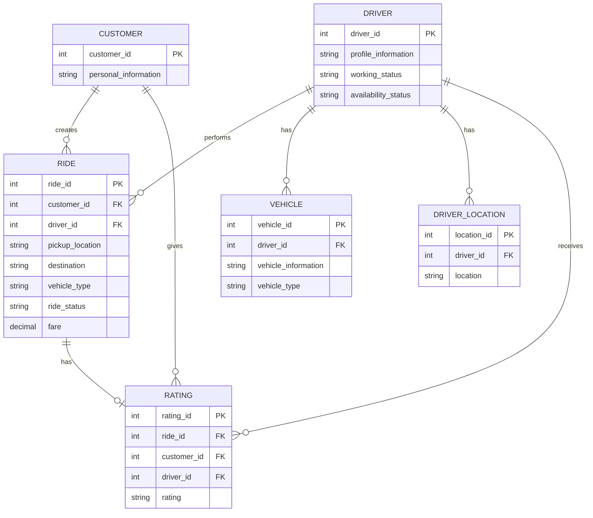

---

## 11. Use Case Diagram
## Mô hình Use Case

### 11.1. Actors
### Các Tác nhân

- Customer / Khách hàng
- Driver / Tài xế
- Operations Staff / Nhân viên vận hành

### 11.2. Use Case Diagram – Mermaid

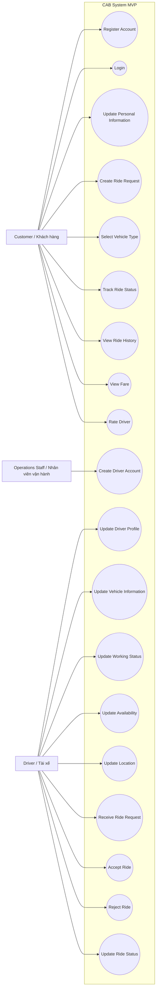

---

## 12. Acceptance Criteria
## Tiêu chí Chấp nhận

### AC-01 – Customer Account
### Tài khoản Khách hàng

**Related / Liên quan:** BR-01

**English**
- Customer can register an account.
- Customer can log in.
- Customer can update personal information.

**Tiếng Việt**
- Khách hàng có thể đăng ký tài khoản.
- Khách hàng có thể đăng nhập.
- Khách hàng có thể cập nhật thông tin cá nhân.

---

### AC-02 – Ride Request
### Yêu cầu Đặt xe

**Related / Liên quan:** BR-02

**English**
- Customer can enter pickup location.
- Customer can enter destination.
- Customer can select vehicle type.
- Customer can submit the ride request.

**Tiếng Việt**
- Khách hàng có thể nhập điểm đón.
- Khách hàng có thể nhập điểm đến.
- Khách hàng có thể lựa chọn loại xe.
- Khách hàng có thể gửi yêu cầu đặt xe.

---

### AC-03 – Ride Tracking
### Theo dõi Chuyến đi

**Related / Liên quan:** BR-03

**English**
- Customer can see when the system is searching for a driver.
- Customer can see which driver has accepted the ride.
- Customer can see the estimated driver arrival time.
- Customer can see the current ride status.

**Tiếng Việt**
- Khách hàng có thể thấy trạng thái đang tìm tài xế.
- Khách hàng có thể thấy tài xế đã nhận chuyến.
- Khách hàng có thể thấy thời gian dự kiến tài xế đến.
- Khách hàng có thể thấy trạng thái hiện tại của chuyến.

---

### AC-04 – Driver Profile and Vehicle
### Hồ sơ Tài xế và Phương tiện

**Related / Liên quan:** BR-04

**English**
- Driver can register or Operations Staff can create a driver account.
- Driver can update profile information.
- Driver can update vehicle information.

**Tiếng Việt**
- Tài xế có thể đăng ký hoặc Nhân viên vận hành có thể tạo tài khoản tài xế.
- Tài xế có thể cập nhật hồ sơ.
- Tài xế có thể cập nhật thông tin phương tiện.

---

### AC-05 – Driver Status and Location
### Trạng thái và Vị trí Tài xế

**Related / Liên quan:** BR-05

**English**
- Driver can update working status.
- Driver can change to Available status.
- Driver location can be stored by the system.

**Tiếng Việt**
- Tài xế có thể cập nhật trạng thái hoạt động.
- Tài xế có thể chuyển sang trạng thái Available.
- Vị trí tài xế có thể được hệ thống lưu lại.

---

### AC-06 – Driver Matching
### Tìm và Phân công Tài xế

**Related / Liên quan:** BR-06

**English**
- The system identifies suitable drivers based on location and availability.
- Driver receives a suitable ride request.
- Driver can accept or reject the ride.
- When the driver accepts, the ride is assigned to that driver.

**Tiếng Việt**
- Hệ thống xác định tài xế phù hợp dựa trên vị trí và trạng thái sẵn sàng.
- Tài xế nhận được yêu cầu chuyến phù hợp.
- Tài xế có thể chấp nhận hoặc từ chối chuyến.
- Khi tài xế chấp nhận, chuyến được phân công cho tài xế đó.

---

### AC-07 – Search Another Driver
### Tìm Tài xế Khác

**Related / Liên quan:** BR-07

**English**
- If a driver rejects the ride, the system continues searching.
- If a driver does not respond, the system continues searching.
- Customer does not need to recreate the ride request.
- If no driver is found, the customer is clearly notified.

**Tiếng Việt**
- Nếu tài xế từ chối, hệ thống tiếp tục tìm tài xế khác.
- Nếu tài xế không phản hồi, hệ thống tiếp tục tìm tài xế khác.
- Khách hàng không cần tạo lại yêu cầu đặt xe.
- Nếu không tìm được tài xế, khách hàng được thông báo rõ ràng.

---

### AC-08 – Ride Execution
### Thực hiện Chuyến đi

**Related / Liên quan:** BR-08

**English**
- Driver can update the ride as Arrived at Pickup.
- Driver can update the ride as Passenger Picked Up.
- Driver can update the ride as Trip in Progress.
- Driver can update the ride as Trip Completed.

**Tiếng Việt**
- Tài xế có thể cập nhật Đã đến điểm đón.
- Tài xế có thể cập nhật Đã đón khách.
- Tài xế có thể cập nhật Đang di chuyển.
- Tài xế có thể cập nhật Hoàn thành chuyến.

---

### AC-09 – Ride History and Rating
### Lịch sử Chuyến và Đánh giá

**Related / Liên quan:** BR-09

**English**
- Customer can view ride history.
- Customer can view the amount to be paid.
- Customer can rate the driver after trip completion.

**Tiếng Việt**
- Khách hàng có thể xem lịch sử chuyến đi.
- Khách hàng có thể xem số tiền phải trả.
- Khách hàng có thể đánh giá tài xế sau khi chuyến hoàn thành.

---

## 13. Traceability Matrix
## Bảng Truy vết Nghiệp vụ & Kỹ thuật

| Business Goal | Business Requirement | Business Process | Functional Requirements | Business Rules | Acceptance Criteria |
|---|---|---|---|---|---|
| BG-01, BG-04 | BR-01 | BP-01 | FR-01, FR-02, FR-03 | RULE-01 | AC-01 |
| BG-01, BG-03 | BR-02 | BP-02 | FR-04, FR-05, FR-06, FR-07 | RULE-01, RULE-02 | AC-02 |
| BG-03 | BR-03 | BP-03 | FR-08, FR-09, FR-10, FR-11 | - | AC-03 |
| BG-04 | BR-04 | BP-04 | FR-15, FR-16, FR-17 | - | AC-04 |
| BG-02, BG-04 | BR-05 | BP-05 | FR-18, FR-19, FR-20 | RULE-03 | AC-05 |
| BG-02, BG-03 | BR-06 | BP-06 | FR-21, FR-22, FR-23, FR-24 | RULE-03, RULE-04 | AC-06 |
| BG-02, BG-03 | BR-07 | BP-07 | FR-25, FR-26 | RULE-05, RULE-06 | AC-07 |
| BG-03, BG-04 | BR-08 | BP-08 | FR-27, FR-28, FR-29, FR-30 | - | AC-08 |
| BG-03, BG-04 | BR-09 | BP-09 | FR-12, FR-13, FR-14 | - | AC-09 |

---

### Items Requiring Stakeholder Confirmation
### Các Nội dung Cần Xác nhận với Stakeholder

- Fare calculation method / Cách tính cước
- Driver priority criteria / Tiêu chí ưu tiên tài xế
- Driver response time / Thời gian tài xế phải phản hồi
- Ride cancellation policy / Chính sách hủy chuyến
- Handling network connection loss / Cách xử lý khi mất kết nối mạng
- Data retention period / Thời gian lưu trữ dữ liệu
