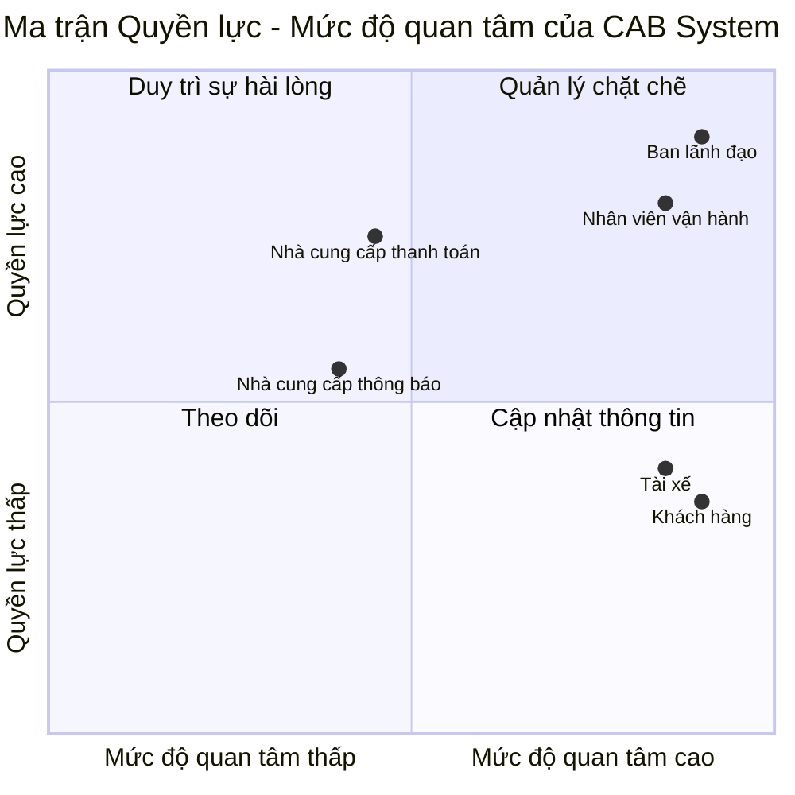

## 2. Stakeholder Analysis
# Software Requirements Specification - CAB System

## 1. Stakeholder Analysis

## Stakeholder Matrix

## Ma trận các bên liên quan

## Mục tiêu kinh doanh

- **BG-01:** Tự động hóa toàn bộ quy trình đặt xe và quản lý chuyến đi từ khi khách hàng tạo yêu cầu đến khi hoàn thành chuyến.

- **BG-02:** Nâng cao trải nghiệm khách hàng thông qua việc đặt xe, theo dõi trạng thái chuyến đi, thanh toán và đánh giá tài xế trên cùng một hệ thống.

- **BG-03:** Nâng cao hiệu quả tìm kiếm và phân công tài xế, giảm phụ thuộc vào việc điều phối thủ công.

- **BG-04:** Quản lý tập trung việc tính cước, thanh toán và lịch sử giao dịch của khách hàng.

- **BG-05:** Nâng cao hiệu quả quản lý và giám sát hoạt động vận hành của doanh nghiệp.

- **BG-06:** Cung cấp dữ liệu và báo cáo phục vụ việc theo dõi hoạt động và hỗ trợ ban lãnh đạo ra quyết định.

- **BG-07:** Xây dựng hệ thống có khả năng mở rộng, hoạt động ổn định khi nhu cầu tăng cao và hạn chế ảnh hưởng đến toàn hệ thống khi một thành phần gặp lỗi.

- **BG-08:** Đảm bảo an toàn thông tin, kiểm soát quyền truy cập và lưu vết các thao tác quan trọng trong hệ thống.

- **BG-09:** Xây dựng nền tảng CAB có kiến trúc linh hoạt, cho phép bổ sung loại dịch vụ, phương thức thanh toán, nhà cung cấp thông báo hoặc thay đổi thành phần kỹ thuật trong tương lai mà không phải xây dựng lại toàn bộ hệ thống.
