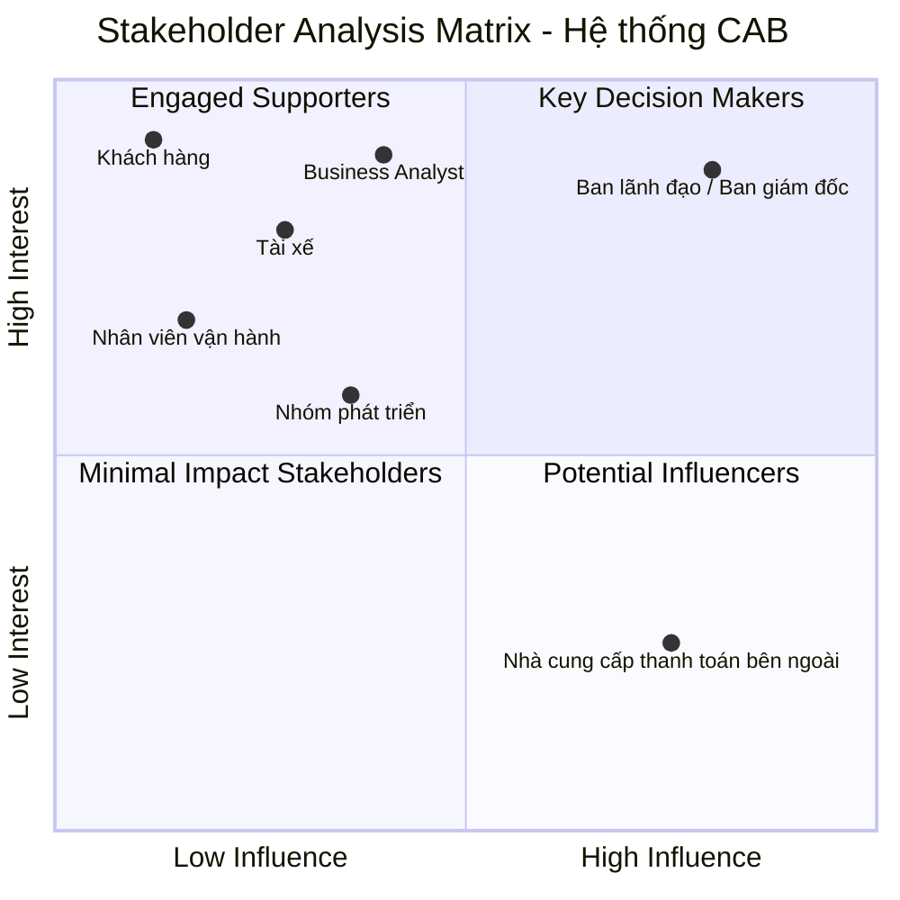

## B1: Xác định Stakeholder

| STT | Tên Stakeholder | Vai trò |
|---|---|---|
| 1 | Ban lãnh đạo / Ban giám đốc | Mong muốn xây dựng nền tảng CAB mới có khả năng phục vụ số lượng lớn khách hàng và tài xế, có thể phát triển thêm tính năng trong tương lai. Kỳ vọng hệ thống hỗ trợ ít nhất ba nhóm người dùng chính gồm khách hàng, tài xế và nhân viên vận hành. Mong muốn có báo cáo về số lượng chuyến, doanh thu, tỷ lệ chuyến hoàn thành, tỷ lệ hủy và hiệu quả hoạt động của tài xế |
| 2 | Khách hàng | Đăng ký tài khoản, đăng nhập, cập nhật thông tin cá nhân. Nhập điểm đón và điểm đến, lựa chọn loại xe, gửi yêu cầu đặt xe và theo dõi chuyến đi. Muốn biết hệ thống đang tìm tài xế, tài xế nào đã nhận chuyến, thời gian dự kiến tài xế đến và trạng thái hiện tại của chuyến đi. Thanh toán bằng tiền mặt hoặc phương thức thanh toán điện tử. Xem lịch sử chuyến đi, số tiền phải trả và đánh giá tài xế sau khi hoàn thành chuyến. |
| 3 | Tài xế | Đăng ký hoặc được nhân viên vận hành tạo tài khoản. Cập nhật hồ sơ, thông tin phương tiện và trạng thái hoạt động; chuyển sang trạng thái sẵn sàng nhận chuyến khi đang làm việc. Nhận thông báo, chấp nhận hoặc từ chối chuyến. Cập nhật trạng thái: đã đến điểm đón, đã đón khách, đang di chuyển và hoàn thành chuyến. |
| 4 | Nhân viên vận hành | Sử dụng giao diện quản trị để quản lý khách hàng, tài xế, phương tiện và chuyến đi. Tạo tài khoản cho tài xế. Xem các chuyến đang diễn ra, kiểm tra trạng thái tài xế, hỗ trợ xử lý các trường hợp chuyến bị lỗi và tra cứu lịch sử giao dịch. Một số chức năng quản trị được phân quyền để nhân viên thông thường không thể thực hiện các thao tác nhạy cảm. |
| 5 | Nhà cung cấp thanh toán bên ngoài | Doanh nghiệp muốn tích hợp với nhà cung cấp thanh toán bên ngoài, nhưng không muốn thông tin nhạy cảm của thẻ hoặc tài khoản thanh toán được lưu trực tiếp trong hệ thống CAB. |
| 6 | Business Analyst | Làm rõ với các bên liên quan về cách tính cước, tiêu chí ưu tiên tài xế, thời gian tài xế phải phản hồi, chính sách hủy chuyến, cách xử lý khi mất kết nối mạng và thời gian lưu trữ dữ liệu. Xác định phạm vi, tác nhân, quy trình nghiệp vụ, yêu cầu chức năng, yêu cầu phi chức năng, quy tắc nghiệp vụ, các trường hợp ngoại lệ và những điểm còn chưa rõ cần xác nhận với khách hàng. |
| 7 | Nhóm phát triển | Xây dựng giải pháp sau khi Business Analyst làm rõ các vấn đề chưa chốt. |

## B2: Stakeholder Matrix

| STT | Stakeholder | Ảnh hưởng (Influence) | Quan tâm (Interest) | Nhóm | Căn cứ trong đề |
|---|---|---|---|---|---|
| 1 | Ban lãnh đạo / Ban giám đốc | Cao | Cao | Key Decision Makers | "Ban lãnh đạo mong muốn xây dựng một nền tảng CAB mới…"; "Ban giám đốc kỳ vọng hệ thống mới hỗ trợ ít nhất ba nhóm người dùng chính"; "Ban lãnh đạo cũng mong muốn có báo cáo về số lượng chuyến, doanh thu…" |
| 2 | Khách hàng | Thấp | Cao | Engaged Supporters | Sử dụng trực tiếp hệ thống để đặt xe, theo dõi chuyến, thanh toán; "khách hàng muốn biết hệ thống đang tìm tài xế, tài xế nào đã nhận chuyến…"; không tham gia quyết định yêu cầu |
| 3 | Tài xế | Thấp | Cao | Engaged Supporters | Sử dụng trực tiếp hệ thống để nhận thông báo, chấp nhận hoặc từ chối chuyến, cập nhật trạng thái chuyến; không tham gia quyết định yêu cầu |
| 4 | Nhân viên vận hành | Thấp | Cao | Engaged Supporters | Sử dụng giao diện quản trị để quản lý khách hàng, tài xế, phương tiện, chuyến đi; "bộ phận vận hành gặp khó khăn khi muốn mở rộng hệ thống"; nhân viên thông thường không thể thực hiện thao tác nhạy cảm |
| 5 | Business Analyst | Thấp | Cao | Engaged Supporters | "Khách hàng mong muốn Business Analyst làm rõ các vấn đề này với các bên liên quan", tức BA làm rõ, không phải người chốt yêu cầu; chịu trách nhiệm xác định phạm vi, tác nhân, quy trình, yêu cầu… |
| 6 | Nhóm phát triển | Thấp | Cao | Engaged Supporters | Xây dựng giải pháp sau khi Business Analyst làm rõ các vấn đề chưa chốt; không tham gia quyết định yêu cầu |
| 7 | Nhà cung cấp thanh toán bên ngoài | Cao | Thấp | Potential Influencers | "Doanh nghiệp muốn tích hợp với một nhà cung cấp thanh toán bên ngoài"; thanh toán điện tử phụ thuộc vào nhà cung cấp; "không muốn một lỗi xảy ra ở chức năng thanh toán… làm cho toàn bộ hệ thống đặt xe ngừng hoạt động"; đề không nêu mong muốn nào của nhà cung cấp đối với dự án |

> **Minimal Impact Stakeholders:** không có stakeholder nào trong đề thuộc nhóm này.

### Sơ đồ Stakeholder Matrix

