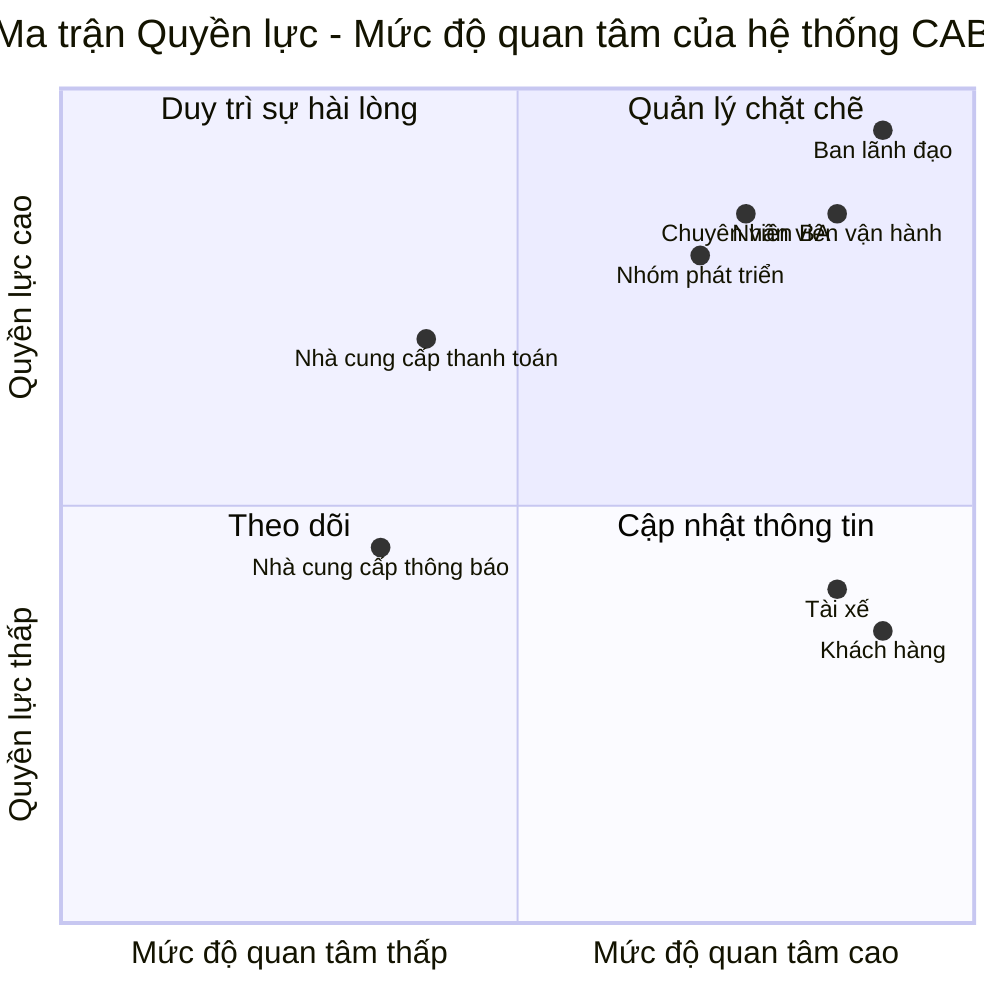

# ĐẶC TẢ YÊU CẦU PHẦN MỀM - HỆ THỐNG CAB

## 1. XÁC ĐỊNH CÁC BÊN LIÊN QUAN

| STT | Bên liên quan | Vai trò |
|:---:|---|---|
| 1 | **Ban lãnh đạo** | Định hướng phát triển hệ thống, theo dõi hiệu quả hoạt động và sử dụng các báo cáo để hỗ trợ ra quyết định. |
| 2 | **Khách hàng** | Đăng ký tài khoản, đặt xe, theo dõi trạng thái chuyến đi, thanh toán, xem lịch sử chuyến và đánh giá tài xế. |
| 3 | **Tài xế** | Quản lý hồ sơ và phương tiện, cập nhật trạng thái hoạt động và vị trí, nhận hoặc từ chối chuyến, thực hiện và cập nhật trạng thái chuyến đi. |
| 4 | **Nhân viên vận hành** | Quản lý khách hàng, tài xế, phương tiện và chuyến đi; theo dõi các chuyến đang diễn ra, kiểm tra trạng thái tài xế, hỗ trợ xử lý sự cố và tra cứu lịch sử giao dịch. |
| 5 | **Nhà cung cấp thanh toán** | Xử lý các giao dịch thanh toán điện tử được tích hợp với hệ thống CAB. |
| 6 | **Nhà cung cấp thông báo** | Hỗ trợ cung cấp các kênh gửi thông báo đến khách hàng và tài xế; có thể được thay đổi hoặc bổ sung trong tương lai. |
| 7 | **Chuyên viên phân tích nghiệp vụ (BA)** | Phân tích yêu cầu, xác định phạm vi và làm rõ các vấn đề chưa được chốt với các bên liên quan trước khi phát triển hệ thống. |
| 8 | **Nhóm phát triển** | Thiết kế, phát triển, kiểm thử và triển khai hệ thống dựa trên các yêu cầu đã được xác nhận. |

---

## 2. MA TRẬN CÁC BÊN LIÊN QUAN

Ma trận được xây dựng dựa trên hai tiêu chí:

- **Quyền lực:** Mức độ ảnh hưởng của bên liên quan đến dự án và hệ thống.
- **Mức độ quan tâm:** Mức độ quan tâm và mức độ bị ảnh hưởng bởi hệ thống CAB.

### Phân loại các bên liên quan

| Nhóm | Bên liên quan | Cách quản lý |
|---|---|---|
| **Quản lý chặt chẽ** | Ban lãnh đạo, Nhân viên vận hành, Chuyên viên BA, Nhóm phát triển | Thường xuyên trao đổi, tham gia vào các quyết định quan trọng và theo dõi sát tiến độ dự án. |
| **Duy trì sự hài lòng** | Nhà cung cấp thanh toán | Đảm bảo yêu cầu tích hợp và phối hợp được đáp ứng đầy đủ. |
| **Cập nhật thông tin** | Khách hàng, Tài xế | Thường xuyên thu thập phản hồi và cung cấp thông tin về các thay đổi ảnh hưởng đến việc sử dụng hệ thống. |
| **Theo dõi** | Nhà cung cấp thông báo | Theo dõi và phối hợp khi có yêu cầu tích hợp hoặc thay đổi kênh thông báo. |

---

## 3. MỤC TIÊU KINH DOANH

- **BG-01:** Tự động hóa quy trình đặt xe và phân công tài xế, giảm sự phụ thuộc vào việc điều phối tài xế thủ công.

- **BG-02:** Nâng cao trải nghiệm khách hàng bằng cách cho phép khách hàng đặt xe và theo dõi rõ ràng trạng thái chuyến đi từ khi gửi yêu cầu đến khi hoàn thành chuyến.

- **BG-03:** Nâng cao hiệu quả tìm kiếm và phân công tài xế dựa trên vị trí, trạng thái sẵn sàng và các tiêu chí vận hành phù hợp.

- **BG-04:** Quản lý tập trung quy trình thực hiện chuyến đi, tính cước, thanh toán và lịch sử giao dịch.

- **BG-05:** Nâng cao hiệu quả quản lý và giám sát hoạt động của khách hàng, tài xế, phương tiện và chuyến đi.

- **BG-06:** Cung cấp dữ liệu và báo cáo về số lượng chuyến, doanh thu, tỷ lệ hoàn thành, tỷ lệ hủy và hiệu quả hoạt động của tài xế để hỗ trợ ban lãnh đạo ra quyết định.

- **BG-07:** Xây dựng hệ thống có khả năng hoạt động ổn định và mở rộng khi số lượng khách hàng, tài xế và nhu cầu đặt xe tăng cao.

- **BG-08:** Hạn chế ảnh hưởng dây chuyền khi một chức năng như thanh toán hoặc thông báo gặp sự cố, đảm bảo các chức năng chính của hệ thống vẫn có thể hoạt động.

- **BG-09:** Đảm bảo an toàn thông tin thông qua xác thực người dùng, kiểm soát quyền truy cập, bảo vệ dữ liệu và lưu vết các thao tác quan trọng.

- **BG-10:** Xây dựng nền tảng CAB có kiến trúc linh hoạt để có thể bổ sung loại dịch vụ, phương thức thanh toán, nhà cung cấp thông báo hoặc thay đổi thành phần kỹ thuật trong tương lai mà không phải xây dựng lại toàn bộ hệ thống.

---

## 4. XÁC ĐỊNH CÁC MODULE MVP

Do thời gian xây dựng và triển khai sản phẩm là **7 tuần**, phiên bản MVP cần ưu tiên các module bảo đảm thực hiện được quy trình nghiệp vụ chính:

**Khách hàng đặt xe → Hệ thống tìm tài xế → Tài xế nhận chuyến → Thực hiện chuyến → Tính cước → Thanh toán → Hoàn thành chuyến.**

| STT | Module MVP | Chức năng chính |
|:---:|---|---|
| 1 | **Quản lý tài khoản và xác thực** | Đăng ký, đăng nhập, cập nhật thông tin cá nhân và xác thực khách hàng, tài xế; hỗ trợ kiểm soát quyền truy cập đối với nhân viên vận hành. |
| 2 | **Quản lý tài xế và phương tiện** | Quản lý hồ sơ tài xế, thông tin phương tiện, trạng thái hoạt động và trạng thái sẵn sàng nhận chuyến. |
| 3 | **Đặt xe** | Cho phép khách hàng nhập điểm đón, điểm đến, lựa chọn loại xe và gửi yêu cầu đặt chuyến. |
| 4 | **Tìm kiếm và phân công tài xế** | Tìm tài xế phù hợp dựa trên vị trí và trạng thái sẵn sàng; gửi yêu cầu nhận chuyến và tiếp tục tìm tài xế khác khi tài xế từ chối hoặc không phản hồi. |
| 5 | **Quản lý chuyến đi và vị trí** | Quản lý trạng thái chuyến từ khi tìm tài xế, tài xế nhận chuyến, đến điểm đón, đón khách, đang di chuyển đến khi hoàn thành; lưu và cập nhật vị trí tài xế. |
| 6 | **Tính cước và thanh toán** | Tính số tiền phải trả sau khi hoàn thành chuyến; hỗ trợ tiền mặt và thanh toán điện tử thông qua nhà cung cấp thanh toán bên ngoài; xử lý trường hợp thanh toán thất bại. |
| 7 | **Thông báo** | Thông báo cho khách hàng khi yêu cầu được tiếp nhận, có tài xế nhận chuyến, tài xế đến điểm đón, chuyến hoàn thành và có kết quả thanh toán; thông báo chuyến mới cho tài xế. |
| 8 | **Lịch sử chuyến đi và đánh giá** | Cho phép khách hàng xem lịch sử chuyến, số tiền đã thanh toán và đánh giá tài xế sau khi chuyến hoàn thành. |
| 9 | **Quản lý vận hành** | Cho phép nhân viên vận hành quản lý khách hàng, tài xế, phương tiện và chuyến đi; theo dõi chuyến đang diễn ra, kiểm tra trạng thái tài xế và hỗ trợ xử lý chuyến gặp sự cố. |
| 10 | **Báo cáo và thống kê cơ bản** | Cung cấp các báo cáo cơ bản về số lượng chuyến, doanh thu, tỷ lệ hoàn thành, tỷ lệ hủy và hiệu quả hoạt động của tài xế. |

### Các yêu cầu xuyên suốt MVP

Các yêu cầu sau không nhất thiết được xây dựng thành một module nghiệp vụ riêng nhưng phải được áp dụng xuyên suốt các module:

- **Bảo mật và xác thực:** Người dùng phải được xác thực trước khi sử dụng các chức năng yêu cầu tài khoản.
- **Phân quyền:** Các chức năng quản trị nhạy cảm phải được giới hạn theo quyền của người dùng.
- **Bảo vệ dữ liệu:** Bảo vệ thông tin cá nhân, phương tiện, vị trí và giao dịch.
- **Lưu vết:** Ghi nhận các thao tác quan trọng để phục vụ kiểm tra khi xảy ra sự cố.
- **Khả năng mở rộng:** Các thành phần quan trọng phải có khả năng mở rộng khi tải tăng.
- **Khả năng chịu lỗi:** Lỗi của chức năng thanh toán hoặc thông báo không được làm toàn bộ quy trình đặt xe ngừng hoạt động.

## 5. YÊU CẦU NGHIỆP VỤ

| Mã | Yêu cầu nghiệp vụ |
|:---:|---|
| **BR-01** | Hệ thống phải hỗ trợ toàn bộ quy trình đặt xe từ khi khách hàng tạo yêu cầu, tìm tài xế, thực hiện chuyến, tính cước, thanh toán đến đánh giá sau chuyến. |
| **BR-02** | Hệ thống phải tự động tìm và phân công tài xế phù hợp dựa trên vị trí, trạng thái sẵn sàng và tiêu chí vận hành; nếu tài xế từ chối hoặc không phản hồi thì tiếp tục tìm tài xế khác. |
| **BR-03** | Khách hàng phải có khả năng theo dõi trạng thái chuyến đi, thông tin tài xế, thời gian dự kiến đến và lịch sử chuyến đi. |
| **BR-04** | Hệ thống phải hỗ trợ tính cước và thanh toán bằng tiền mặt hoặc thanh toán điện tử thông qua nhà cung cấp bên ngoài. |
| **BR-05** | Hệ thống phải gửi thông báo cho khách hàng và tài xế tại các thời điểm quan trọng của chuyến đi và có khả năng mở rộng thêm kênh thông báo trong tương lai. |
| **BR-06** | Nhân viên vận hành phải có khả năng quản lý khách hàng, tài xế, phương tiện, chuyến đi, hỗ trợ xử lý sự cố và tra cứu lịch sử giao dịch. |
| **BR-07** | Hệ thống phải cung cấp báo cáo về số lượng chuyến, doanh thu, tỷ lệ hoàn thành, tỷ lệ hủy và hiệu quả hoạt động của tài xế. |
| **BR-08** | Hệ thống phải đảm bảo khả năng mở rộng, bảo mật, phân quyền, bảo vệ dữ liệu và hạn chế ảnh hưởng toàn hệ thống khi một chức năng như thanh toán hoặc thông báo gặp lỗi. |
