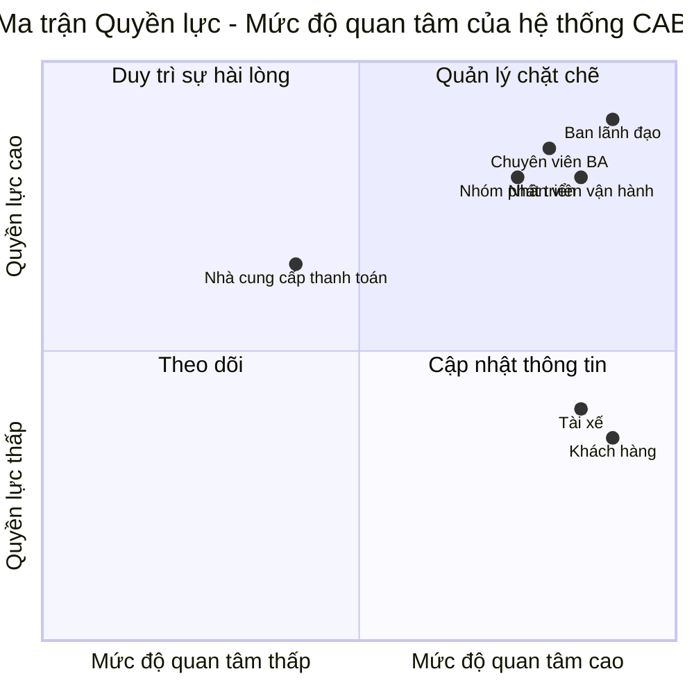
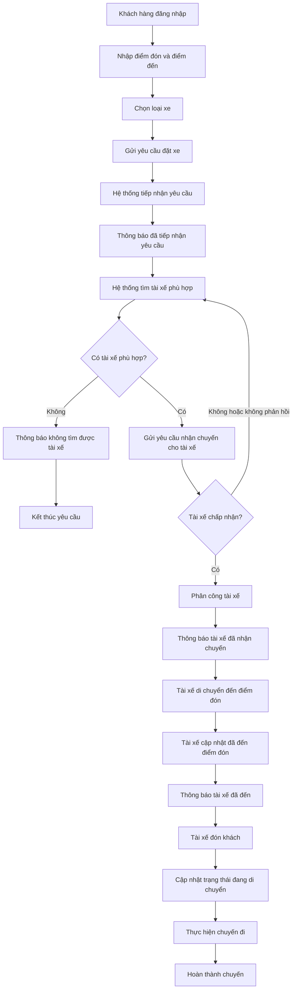
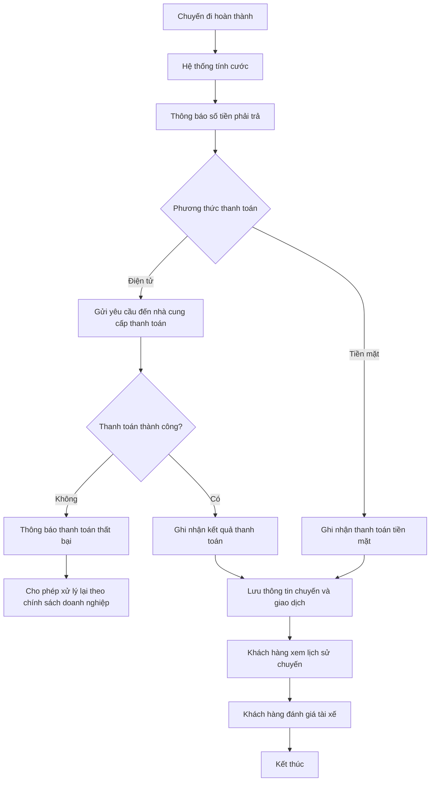
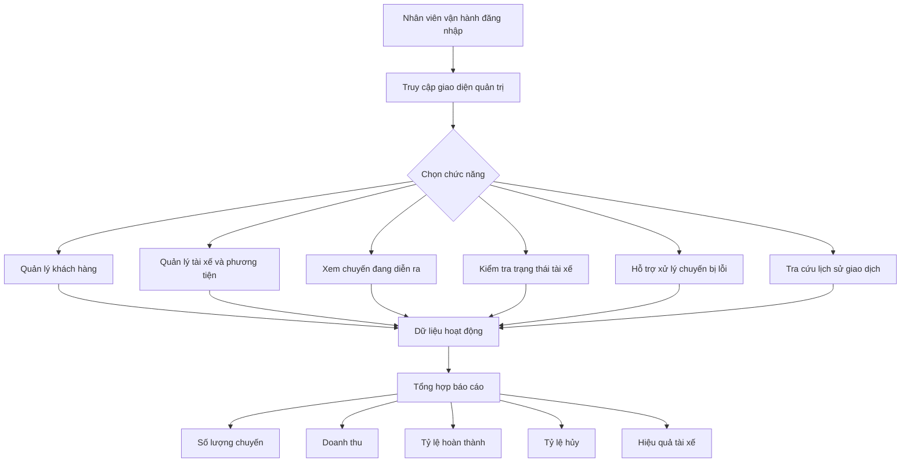

# ĐẶC TẢ YÊU CẦU PHẦN MỀM - HỆ THỐNG CAB

## 1. STAKEHOLDERS

| STT | Bên liên quan | Vai trò |
|:---:|---|---|
| 1 | **Ban lãnh đạo** | Định hướng phát triển hệ thống và theo dõi hiệu quả hoạt động thông qua các báo cáo về chuyến đi, doanh thu, tỷ lệ hoàn thành, tỷ lệ hủy và hiệu quả tài xế. |
| 2 | **Khách hàng** | Đăng ký, đăng nhập, cập nhật thông tin cá nhân, đặt xe, theo dõi chuyến đi, thanh toán, xem lịch sử chuyến và đánh giá tài xế. |
| 3 | **Tài xế** | Quản lý hồ sơ, phương tiện và trạng thái hoạt động; nhận hoặc từ chối chuyến; cập nhật vị trí và trạng thái trong quá trình thực hiện chuyến. |
| 4 | **Nhân viên vận hành** | Quản lý khách hàng, tài xế, phương tiện và chuyến đi; theo dõi các chuyến đang diễn ra, kiểm tra trạng thái tài xế, xử lý các chuyến gặp lỗi và tra cứu lịch sử giao dịch. |
| 5 | **Nhà cung cấp thanh toán bên ngoài** | Xử lý các giao dịch thanh toán điện tử được tích hợp với hệ thống CAB. |
| 6 | **Chuyên viên phân tích nghiệp vụ (BA)** | Làm rõ phạm vi, quy trình nghiệp vụ, yêu cầu, quy tắc, ngoại lệ và các vấn đề chưa được khách hàng xác định đầy đủ. |
| 7 | **Nhóm phát triển** | Xây dựng giải pháp dựa trên các yêu cầu đã được BA và các bên liên quan xác nhận. |

---

## 2. STAKEHOLDER MATRIX

Ma trận được phân tích theo hai yếu tố:

- **Quyền lực:** Mức độ ảnh hưởng đến dự án và hệ thống.
- **Mức độ quan tâm:** Mức độ quan tâm hoặc bị ảnh hưởng bởi hệ thống.

> Vị trí trong ma trận là kết quả phân tích từ vai trò của các bên liên quan trong đề bài.

| Nhóm | Bên liên quan |
|---|---|
| **Quản lý chặt chẽ** | Ban lãnh đạo, Nhân viên vận hành, Chuyên viên BA, Nhóm phát triển |
| **Duy trì sự hài lòng** | Nhà cung cấp thanh toán bên ngoài |
| **Cập nhật thông tin** | Khách hàng, Tài xế |
| **Theo dõi** | Không xác định thêm bên liên quan cụ thể trong đề |

---

## 3. BUSINESS GOALS

- **BG-01:** Tự động hóa quy trình đặt xe và phân công tài xế, giảm việc phân công tài xế thủ công.

- **BG-02:** Nâng cao khả năng theo dõi chuyến đi của khách hàng từ khi gửi yêu cầu đặt xe đến khi hoàn thành chuyến.

- **BG-03:** Quản lý tập trung quá trình thực hiện chuyến, tính cước, thanh toán và lịch sử giao dịch.

- **BG-04:** Nâng cao hiệu quả quản lý vận hành thông qua việc quản lý khách hàng, tài xế, phương tiện, chuyến đi và cung cấp dữ liệu báo cáo.

- **BG-05:** Xây dựng hệ thống có khả năng phục vụ số lượng lớn khách hàng và tài xế, hoạt động ổn định khi tải tăng và hạn chế ảnh hưởng dây chuyền khi một thành phần gặp lỗi.

- **BG-06:** Xây dựng nền tảng CAB an toàn và linh hoạt, có thể bổ sung loại dịch vụ, phương thức thanh toán, kênh thông báo hoặc thay đổi thành phần kỹ thuật trong tương lai mà không phải xây dựng lại toàn bộ hệ thống.

---

## 4. MVP MODULES

Do thời gian xây dựng và triển khai sản phẩm là **7 tuần**, các module MVP được xác định nhằm bảo đảm thực hiện được quy trình chính của hệ thống CAB.

| STT | Module | Chức năng chính |
|:---:|---|---|
| 1 | **Quản lý tài khoản và xác thực** | Đăng ký, đăng nhập, cập nhật thông tin người dùng và xác thực khách hàng, tài xế. |
| 2 | **Quản lý tài xế và phương tiện** | Quản lý hồ sơ tài xế, thông tin phương tiện, trạng thái hoạt động và trạng thái sẵn sàng nhận chuyến. |
| 3 | **Đặt xe** | Cho phép khách hàng nhập điểm đón, điểm đến, chọn loại xe và gửi yêu cầu đặt xe. |
| 4 | **Tìm kiếm và phân công tài xế** | Tìm tài xế phù hợp dựa trên vị trí, trạng thái sẵn sàng và tiêu chí vận hành; tiếp tục tìm tài xế khác khi tài xế từ chối hoặc không phản hồi. |
| 5 | **Quản lý chuyến đi và vị trí** | Theo dõi trạng thái chuyến đi và lưu vị trí tài xế để hỗ trợ tìm tài xế gần khách hàng và dự kiến thời gian đến. |
| 6 | **Tính cước và thanh toán** | Tính số tiền phải trả sau chuyến; hỗ trợ tiền mặt và thanh toán điện tử thông qua nhà cung cấp bên ngoài. |
| 7 | **Thông báo** | Gửi thông báo cho khách hàng và tài xế tại các thời điểm quan trọng của chuyến đi. |
| 8 | **Quản lý vận hành và báo cáo** | Quản lý khách hàng, tài xế, phương tiện, chuyến đi; hỗ trợ xử lý sự cố, tra cứu giao dịch và cung cấp các báo cáo hoạt động. |

---

## 5. BUSINESS REQUIREMENTS

| Mã | Yêu cầu nghiệp vụ |
|:---:|---|
| **BR-01** | Hệ thống phải hỗ trợ khách hàng đăng ký, đăng nhập, cập nhật thông tin, tạo yêu cầu đặt xe, theo dõi chuyến, xem lịch sử, số tiền phải trả và đánh giá tài xế sau chuyến. |
| **BR-02** | Hệ thống phải hỗ trợ tài xế quản lý hồ sơ, phương tiện, trạng thái hoạt động, nhận hoặc từ chối chuyến, cập nhật vị trí và trạng thái trong quá trình thực hiện chuyến. |
| **BR-03** | Hệ thống phải tự động tìm tài xế phù hợp dựa trên vị trí, trạng thái sẵn sàng và tiêu chí vận hành; nếu tài xế không phản hồi hoặc từ chối thì phải tiếp tục tìm tài xế khác mà khách hàng không cần tạo lại yêu cầu. |
| **BR-04** | Sau khi chuyến hoàn thành, hệ thống phải tính cước và hỗ trợ thanh toán bằng tiền mặt hoặc thanh toán điện tử thông qua nhà cung cấp bên ngoài. |
| **BR-05** | Hệ thống phải gửi thông báo cho khách hàng và tài xế tại các thời điểm quan trọng như tiếp nhận yêu cầu, tài xế nhận chuyến, tài xế đến điểm đón, hoàn thành chuyến và có kết quả thanh toán. |
| **BR-06** | Hệ thống phải cung cấp giao diện cho nhân viên vận hành để quản lý khách hàng, tài xế, phương tiện, chuyến đi, theo dõi chuyến đang diễn ra, hỗ trợ xử lý sự cố và tra cứu giao dịch. |
| **BR-07** | Hệ thống phải cung cấp báo cáo về số lượng chuyến, doanh thu, tỷ lệ chuyến hoàn thành, tỷ lệ hủy và hiệu quả hoạt động của tài xế. |
| **BR-08** | Hệ thống phải đảm bảo xác thực, kiểm soát quyền truy cập, bảo vệ dữ liệu, lưu vết thao tác quan trọng, hoạt động ổn định khi tải tăng và hạn chế ảnh hưởng toàn hệ thống khi thanh toán hoặc thông báo gặp lỗi. |

### Các vấn đề cần tiếp tục làm rõ

Các nội dung sau chưa được khách hàng chốt và cần BA xác nhận:

- Cách tính cước.
- Tiêu chí ưu tiên tài xế.
- Thời gian tài xế phải phản hồi yêu cầu nhận chuyến.
- Chính sách hủy chuyến.
- Cách xử lý khi mất kết nối mạng.
- Thời gian lưu trữ dữ liệu.

---

## 6. BUSINESS PROCESS MODELING

Business Process Modeling được xây dựng dựa trên các Business Requirements ở Mục 5.

### 6.1. Quy trình đặt xe và thực hiện chuyến

Liên quan đến **BR-01, BR-02, BR-03 và BR-05**.

### 6.2. Quy trình tính cước và thanh toán

Liên quan đến **BR-04 và BR-05**.

### 6.3. Quy trình quản lý vận hành và báo cáo

Liên quan đến **BR-06 và BR-07**.

### 6.4. Yêu cầu áp dụng xuyên suốt

**BR-08** không phải là một quy trình tuần tự riêng mà được áp dụng cho toàn bộ hệ thống:

- Xác thực khách hàng và tài xế.
- Kiểm soát quyền đối với thao tác quản trị.
- Bảo vệ thông tin cá nhân, phương tiện, vị trí và giao dịch.
- Lưu vết các thao tác quan trọng.
- Đảm bảo khả năng mở rộng khi tải tăng.
- Lỗi thanh toán hoặc thông báo không được làm toàn bộ hệ thống đặt xe ngừng hoạt động.
