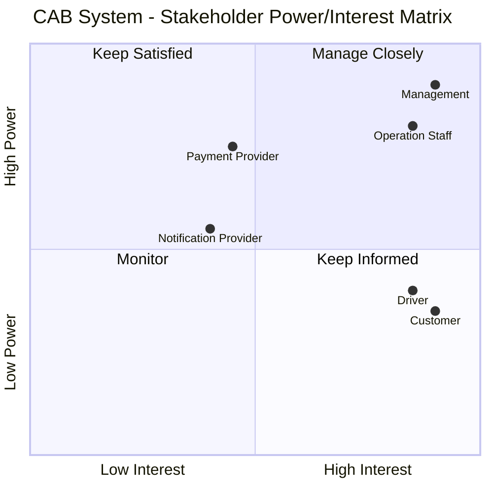

## 2. Stakeholder Analysis
# Software Requirements Specification - CAB System

## 1. Stakeholder Analysis

## Stakeholder Matrix

```mermaid
quadrantChart
    title CAB System - Stakeholder Power/Interest Matrix
    x-axis Low Interest --> High Interest
    y-axis Low Power --> High Power

    quadrant-1 Manage Closely
    quadrant-2 Keep Satisfied
    quadrant-3 Monitor
    quadrant-4 Keep Informed

    Management: [0.90, 0.90]
    Operation Staff: [0.85, 0.80]
    Payment Provider: [0.45, 0.75]
    Notification Provider: [0.40, 0.55]
    Customer: [0.90, 0.35]
    Driver: [0.85, 0.40]
```
