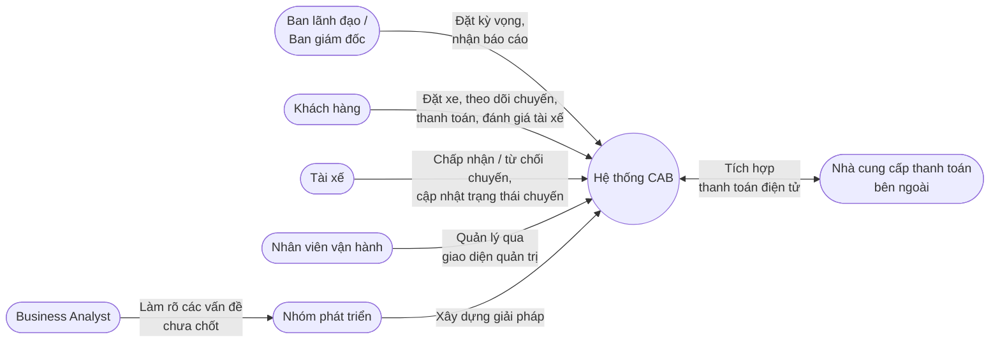

## B1: Xác định Stakeholder

| STT | Tên Stakeholder | Vai trò |
|---|---|---|
| 1 | Ban lãnh đạo / Ban giám đốc | Mong muốn xây dựng nền tảng CAB mới có khả năng phục vụ số lượng lớn khách hàng và tài xế, có thể phát triển thêm tính năng trong tương lai. Kỳ vọng hệ thống hỗ trợ ít nhất ba nhóm người dùng chính gồm khách hàng, tài xế và nhân viên vận hành. Mong muốn có báo cáo về số lượng chuyến, doanh thu, tỷ lệ chuyến hoàn thành, tỷ lệ hủy và hiệu quả hoạt động của tài xế |
| 2 | Khách hàng | Đăng ký tài khoản, đăng nhập, cập nhật thông tin cá nhân. Nhập điểm đón và điểm đến, lựa chọn loại xe, gửi yêu cầu đặt xe và theo dõi chuyến đi. Muốn biết hệ thống đang tìm tài xế, tài xế nào đã nhận chuyến, thời gian dự kiến tài xế đến và trạng thái hiện tại của chuyến đi. Thanh toán bằng tiền mặt hoặc phương thức thanh toán điện tử. Xem lịch sử chuyến đi, số tiền phải trả và đánh giá tài xế sau khi hoàn thành chuyến. |
| 3 | Tài xế | Đăng ký hoặc được nhân viên vận hành tạo tài khoản. Cập nhật hồ sơ, thông tin phương tiện và trạng thái hoạt động; chuyển sang trạng thái sẵn sàng nhận chuyến khi đang làm việc. Nhận thông báo, chấp nhận hoặc từ chối chuyến. Cập nhật trạng thái: đã đến điểm đón, đã đón khách, đang di chuyển và hoàn thành chuyến. |
| 4 | Nhân viên vận hành | Sử dụng giao diện quản trị để quản lý khách hàng, tài xế, phương tiện và chuyến đi. Tạo tài khoản cho tài xế. Xem các chuyến đang diễn ra, kiểm tra trạng thái tài xế, hỗ trợ xử lý các trường hợp chuyến bị lỗi và tra cứu lịch sử giao dịch. Một số chức năng quản trị được phân quyền để nhân viên thông thường không thể thực hiện các thao tác nhạy cảm. |
| 5 | Nhà cung cấp thanh toán bên ngoài | Doanh nghiệp muốn tích hợp với nhà cung cấp thanh toán bên ngoài, nhưng không muốn thông tin nhạy cảm của thẻ hoặc tài khoản thanh toán được lưu trực tiếp trong hệ thống CAB. |
| 6 | Business Analyst | Làm rõ với các bên liên quan về cách tính cước, tiêu chí ưu tiên tài xế, thời gian tài xế phải phản hồi, chính sách hủy chuyến, cách xử lý khi mất kết nối mạng và thời gian lưu trữ dữ liệu. Xác định phạm vi, tác nhân, quy trình nghiệp vụ, yêu cầu chức năng, yêu cầu phi chức năng, quy tắc nghiệp vụ, các trường hợp ngoại lệ và những điểm còn chưa rõ cần xác nhận với khách hàng. |
| 7 | Nhóm phát triển | Xây dựng giải pháp sau khi Business Analyst làm rõ các vấn đề chưa chốt. |

## B2: Stakeholder Matrix

| STT | Stakeholder | Lợi ích chính từ sản phẩm | Mối quan tâm chính | Ràng buộc |
|---|---|---|---|---|
| 1 | Ban lãnh đạo / Ban giám đốc | Nền tảng CAB mới có khả năng phục vụ số lượng lớn khách hàng và tài xế, có thể phát triển thêm tính năng trong tương lai. | Hệ thống hỗ trợ ít nhất ba nhóm người dùng chính. Báo cáo về số lượng chuyến, doanh thu, tỷ lệ chuyến hoàn thành, tỷ lệ hủy và hiệu quả hoạt động của tài xế. | — |
| 2 | Khách hàng | Đặt xe và theo dõi chuyến đi. Biết hệ thống đang tìm tài xế, tài xế nào đã nhận chuyến, thời gian dự kiến tài xế đến và trạng thái hiện tại của chuyến đi. Xem lịch sử chuyến đi, số tiền phải trả và đánh giá tài xế. | Nhận thông báo khi yêu cầu đặt xe được tiếp nhận, khi có tài xế nhận chuyến, khi tài xế đến điểm đón, khi chuyến hoàn thành và khi thanh toán có kết quả. Không phải tạo lại yêu cầu khi tài xế đầu tiên không nhận chuyến. Được thông báo rõ ràng khi không tìm được tài xế. | Phải được xác thực trước khi sử dụng các chức năng yêu cầu tài khoản. |
| 3 | Tài xế | Nhận thông báo khi có yêu cầu phù hợp; chấp nhận hoặc từ chối chuyến. | Nhận thông báo về các chuyến mới hoặc những thay đổi liên quan đến chuyến đang thực hiện. | Phải được xác thực trước khi sử dụng các chức năng yêu cầu tài khoản. Thông tin vị trí được lưu để hỗ trợ tìm tài xế gần khách hàng. |
| 4 | Nhân viên vận hành | Giao diện quản trị để quản lý khách hàng, tài xế, phương tiện và chuyến đi. | Xem các chuyến đang diễn ra, kiểm tra trạng thái tài xế, hỗ trợ xử lý các trường hợp chuyến bị lỗi và tra cứu lịch sử giao dịch. | Nhân viên thông thường không thể thực hiện các thao tác nhạy cảm. Các thao tác quản trị phải được kiểm soát quyền truy cập. |
| 5 | Nhà cung cấp thanh toán bên ngoài | — | — | Thông tin nhạy cảm của thẻ hoặc tài khoản thanh toán không được lưu trực tiếp trong hệ thống CAB. |
| 6 | Business Analyst | — | Làm rõ cách tính cước, tiêu chí ưu tiên tài xế, thời gian tài xế phải phản hồi, chính sách hủy chuyến, cách xử lý khi mất kết nối mạng và thời gian lưu trữ dữ liệu. | Làm rõ các vấn đề với các bên liên quan trước khi nhóm phát triển xây dựng giải pháp. |
| 7 | Nhóm phát triển | — | — | Xây dựng giải pháp sau khi Business Analyst làm rõ các vấn đề chưa chốt. |

## Sơ đồ Stakeholder

