# PHÂN TÍCH NGHIỆP VỤ HỆ THỐNG CAB – MVP

## 1. Stakeholder List & Roles
Danh sách và vai trò các bên liên quan

| Mã | Stakeholder | Loại | Vai trò trong dự án | Nhu cầu / Mối quan tâm chính |
|---|---|---|---|---|
| SH-01 | Ban lãnh đạo / Ban giám đốc Công ty ABC | Internal | Người phê duyệt, ra quyết định chiến lược | Mở rộng quy mô hệ thống, tăng doanh thu, có báo cáo vận hành (số chuyến, doanh thu, tỷ lệ hoàn thành/hủy, hiệu quả tài xế) |
| SH-02 | Khách hàng (Customer) | External | Người dùng cuối - đặt xe | Đặt xe nhanh, theo dõi chuyến real-time, thanh toán tiện lợi, minh bạch cước phí |
| SH-03 | Tài xế (Driver) | External | Người dùng cuối - cung cấp dịch vụ | Nhận chuyến phù hợp, cập nhật trạng thái dễ dàng, được thông báo kịp thời |
| SH-04 | Nhân viên vận hành (Operations Staff) | Internal | Người vận hành hệ thống hàng ngày | Giao diện quản trị để quản lý KH/tài xế/phương tiện/chuyến đi, xử lý sự cố chuyến |
| SH-05 | Quản trị viên hệ thống (Admin) | Internal | Phân quyền, quản lý chức năng nhạy cảm | Kiểm soát quyền truy cập, đảm bảo an toàn dữ liệu |
| SH-06 | Business Analyst (BA) | Internal | Phân tích & làm rõ yêu cầu | Làm rõ các điểm nghiệp vụ chưa chốt (tính cước, ưu tiên tài xế, chính sách hủy...) trước khi bàn giao cho dev |
| SH-07 | Đội ngũ phát triển (Development Team) | Internal | Xây dựng hệ thống theo yêu cầu | Yêu cầu rõ ràng, đầy đủ FR/NFR/BR để phát triển đúng phạm vi MVP trong 7 tuần |
| SH-08 | Nhà cung cấp thanh toán bên ngoài (Payment Gateway Provider) | External | Đối tác tích hợp thanh toán điện tử | Tích hợp an toàn, không lưu thông tin nhạy cảm thẻ/tài khoản trong hệ thống CAB |
| SH-09 | Nhà cung cấp dịch vụ thông báo (Notification Provider) | External | Đối tác gửi thông báo (SMS/Email/Push...) | Kiến trúc cho phép mở rộng thêm kênh thông báo trong tương lai |

## 2. Stakeholder Matrix
Ma trận các bên liên quan (Power – Interest Grid)

| Stakeholder | Quyền lực (Power) | Mức quan tâm (Interest) | Chiến lược quản lý |
|---|---|---|---|
| Ban lãnh đạo (SH-01) | Cao | Cao | Quản lý chặt chẽ (Manage Closely) |
| Khách hàng (SH-02) | Thấp | Cao | Giữ thông tin đầy đủ (Keep Informed) |
| Tài xế (SH-03) | Thấp | Cao | Giữ thông tin đầy đủ (Keep Informed) |
| Nhân viên vận hành (SH-04) | Trung bình | Cao | Quản lý chặt chẽ (Manage Closely) |
| Admin/Quản trị hệ thống (SH-05) | Trung bình | Trung bình | Giữ hài lòng (Keep Satisfied) |
| Business Analyst (SH-06) | Trung bình | Cao | Quản lý chặt chẽ (Manage Closely) |
| Đội phát triển (SH-07) | Trung bình | Cao | Quản lý chặt chẽ (Manage Closely) |
| Nhà cung cấp thanh toán (SH-08) | Thấp | Trung bình | Theo dõi (Monitor) |
| Nhà cung cấp thông báo (SH-09) | Thấp | Thấp | Theo dõi (Monitor) |

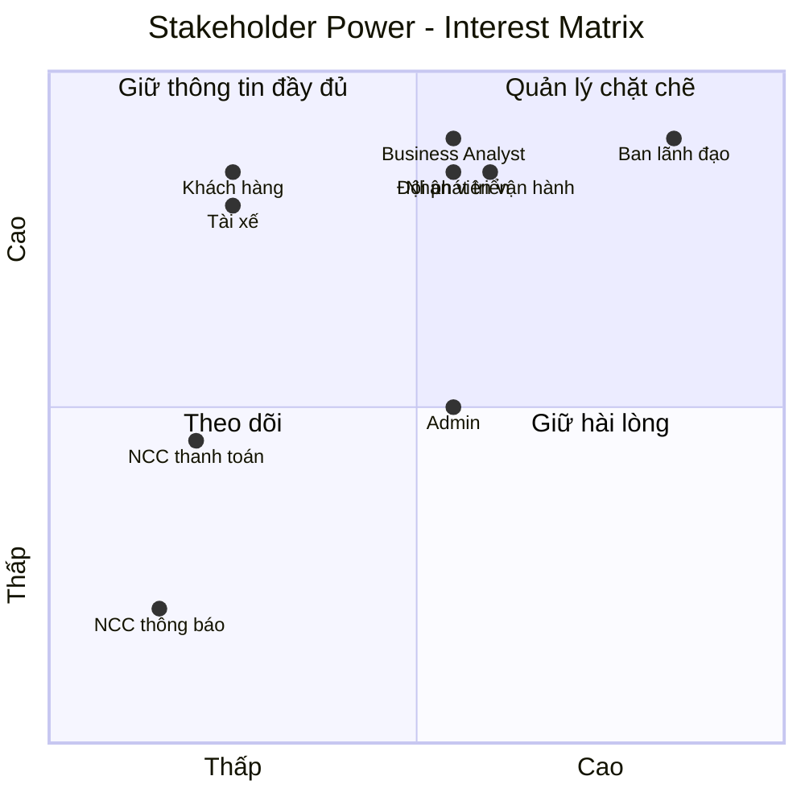

## 3. Business Goals (BG)
Mục tiêu kinh doanh

| Mã | Mục tiêu | Trích dẫn / căn cứ từ đề |
|---|---|---|
| BG-01 | Tự động hóa việc phân công tài xế, giảm thao tác thủ công | "việc phân công tài xế chủ yếu được thực hiện thủ công" |
| BG-02 | Cho phép khách hàng theo dõi trạng thái chuyến đi rõ ràng, theo thời gian thực | "khách hàng khó theo dõi trạng thái chuyến đi" |
| BG-03 | Quản lý tập trung thông tin thanh toán | "thông tin thanh toán chưa được quản lý tập trung" |
| BG-04 | Xây dựng hệ thống có khả năng mở rộng, dễ bổ sung tính năng trong tương lai | "bộ phận vận hành gặp khó khăn khi muốn mở rộng hệ thống" |
| BG-05 | Phục vụ được số lượng lớn khách hàng và tài xế | "phục vụ số lượng lớn khách hàng và tài xế" |
| BG-06 | Đảm bảo hệ thống hoạt động ổn định, một lỗi cục bộ không làm ngưng toàn hệ thống | "không muốn một lỗi... làm cho toàn bộ hệ thống đặt xe ngừng hoạt động" |
| BG-07 | Bảo vệ dữ liệu người dùng, dữ liệu giao dịch và có khả năng truy vết sự cố | "cần lưu vết các thao tác quan trọng để phục vụ kiểm tra khi có sự cố" |

**Ghi chú phạm vi MVP:** Giai đoạn MVP tập trung giải quyết **BG-01, BG-02, BG-05** thông qua 2 module Quản lý khách hàng và Quản lý tài xế. BG-03, BG-04, BG-06, BG-07 sẽ được hiện thực đầy đủ ở các giai đoạn sau (payment, notification, kiến trúc mở rộng).

## 4. Minimum Viable Product (MVP) Modules
Các module thuộc phạm vi MVP

### 4.1. Quản lý khách hàng
Trong phạm vi MVP:
- Đăng ký / đăng nhập tài khoản
- Cập nhật thông tin cá nhân
- Nhập điểm đón, điểm đến, chọn loại xe, gửi yêu cầu đặt xe
- Theo dõi trạng thái chuyến đi (đang tìm tài xế / đã có tài xế nhận / đang di chuyển / hoàn thành)
- Xem lịch sử chuyến đi
- Đánh giá tài xế sau chuyến

Ngoài phạm vi MVP (chuyển sang giai đoạn sau): thanh toán điện tử, tích hợp cổng thanh toán, đa kênh thông báo.

### 4.2. Quản lý tài xế
> Giai đoạn này không cần tài xế "tốt" (chưa cần thuật toán tối ưu), chỉ cần **hệ thống hoạt động được**.

Trong phạm vi MVP:
- Đăng ký tài khoản tài xế, hoặc được nhân viên vận hành tạo tài khoản
- Cập nhật hồ sơ cá nhân và thông tin phương tiện
- Chuyển đổi trạng thái sẵn sàng / không sẵn sàng
- Nhận thông báo chuyến phù hợp, chấp nhận hoặc từ chối
- Cập nhật trạng thái chuyến: đến điểm đón → đã đón khách → đang di chuyển → hoàn thành
- Cơ chế phân công tài xế đơn giản: ưu tiên tài xế sẵn sàng và gần khách hàng; nếu tài xế không phản hồi/từ chối thì tự động chuyển sang tài xế kế tiếp

Ngoài phạm vi MVP: thuật toán tối ưu ưu tiên tài xế phức tạp, chấm điểm hiệu suất tài xế, dự đoán ETA nâng cao.

## 5. Business Requirements (BR)
Yêu cầu nghiệp vụ của hệ thống CAB MVP

| Mã | Tên | Mô tả | BG liên quan | Module |
|---|---|---|---|---|
| BR-01 | Quản lý tài khoản khách hàng | Cho phép khách hàng đăng ký, đăng nhập, cập nhật thông tin cá nhân | BG-01, BG-05 | Quản lý khách hàng |
| BR-02 | Tạo yêu cầu đặt xe | Khách hàng nhập điểm đón, điểm đến, chọn loại xe, gửi yêu cầu | BG-01, BG-02 | Quản lý khách hàng |
| BR-03 | Theo dõi trạng thái chuyến đi | Khách hàng xem trạng thái chuyến theo thời gian thực | BG-02 | Quản lý khách hàng |
| BR-04 | Xem lịch sử & đánh giá tài xế | Khách hàng xem lịch sử chuyến, đánh giá tài xế sau khi hoàn thành | BG-02 | Quản lý khách hàng |
| BR-05 | Quản lý tài khoản & hồ sơ tài xế | Tài xế đăng ký hoặc được vận hành tạo tài khoản, cập nhật hồ sơ, phương tiện | BG-01, BG-05 | Quản lý tài xế |
| BR-06 | Quản lý trạng thái hoạt động tài xế | Tài xế chuyển đổi trạng thái sẵn sàng / không sẵn sàng | BG-01 | Quản lý tài xế |
| BR-07 | Tài xế nhận và phản hồi chuyến | Tài xế nhận thông báo chuyến phù hợp, chấp nhận hoặc từ chối | BG-01 | Quản lý tài xế |
| BR-08 | Tài xế cập nhật trạng thái chuyến | Tài xế cập nhật tuần tự: đến điểm đón, đã đón khách, đang di chuyển, hoàn thành | BG-02 | Quản lý tài xế |
| BR-09 | Phân công tài xế cơ bản | Hệ thống tự động tìm và đề xuất tài xế phù hợp/gần khách hàng; xử lý khi tài xế không phản hồi/từ chối; thông báo khi không tìm được tài xế | BG-01 | Quản lý khách hàng + Quản lý tài xế |

## 6. Business Process Modeling
Mô hình hóa các quy trình nghiệp vụ (9 BR → 9 quy trình)

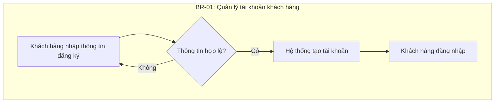

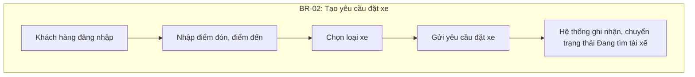

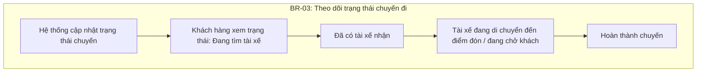

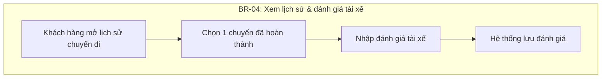

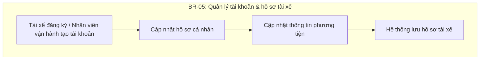

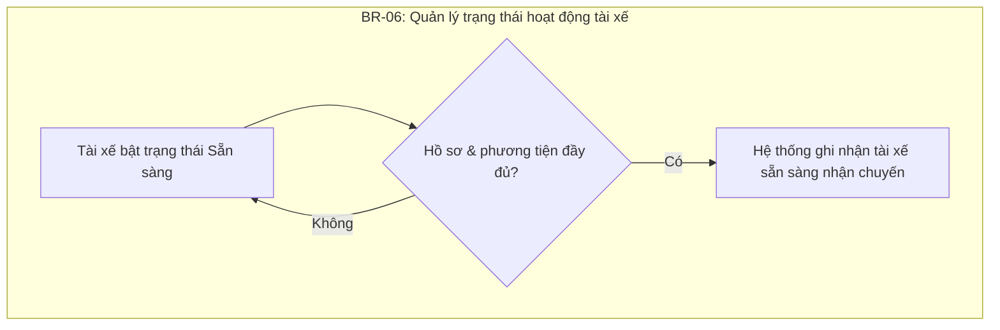

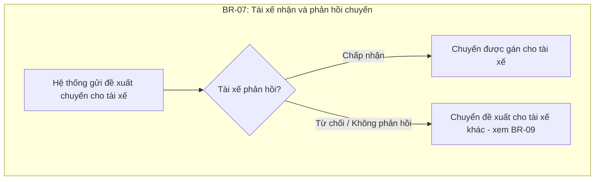

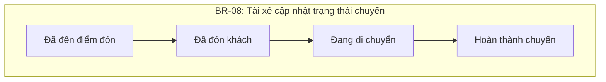

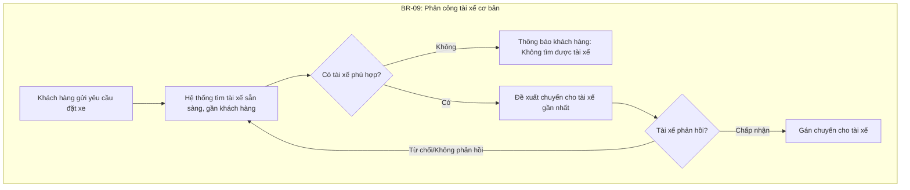

## 7. Functional Requirements (FR)

| Mã | Mô tả | BR liên quan |
|---|---|---|
| FR-01 | Hệ thống cho phép khách hàng đăng ký tài khoản | BR-01 |
| FR-02 | Hệ thống cho phép khách hàng đăng nhập | BR-01 |
| FR-03 | Hệ thống cho phép khách hàng cập nhật thông tin cá nhân | BR-01 |
| FR-04 | Hệ thống cho phép khách hàng nhập điểm đón, điểm đến | BR-02 |
| FR-05 | Hệ thống cho phép khách hàng chọn loại xe | BR-02 |
| FR-06 | Hệ thống cho phép khách hàng gửi yêu cầu đặt xe | BR-02 |
| FR-07 | Hệ thống hiển thị trạng thái chuyến đi theo thời gian thực | BR-03 |
| FR-08 | Hệ thống hiển thị thông tin tài xế đã nhận chuyến | BR-03 |
| FR-09 | Hệ thống cho phép khách hàng xem lịch sử chuyến đi | BR-04 |
| FR-10 | Hệ thống cho phép khách hàng đánh giá tài xế sau chuyến | BR-04 |
| FR-11 | Hệ thống cho phép tài xế đăng ký, hoặc nhân viên vận hành tạo tài khoản tài xế | BR-05 |
| FR-12 | Hệ thống cho phép tài xế cập nhật hồ sơ cá nhân | BR-05 |
| FR-13 | Hệ thống cho phép tài xế cập nhật thông tin phương tiện | BR-05 |
| FR-14 | Hệ thống cho phép tài xế chuyển đổi trạng thái sẵn sàng / không sẵn sàng | BR-06 |
| FR-15 | Hệ thống gửi thông báo chuyến mới phù hợp cho tài xế | BR-07 |
| FR-16 | Hệ thống cho phép tài xế chấp nhận hoặc từ chối chuyến | BR-07 |
| FR-17 | Hệ thống cho phép tài xế cập nhật trạng thái chuyến (đến điểm đón, đã đón khách, đang di chuyển, hoàn thành) | BR-08 |
| FR-18 | Hệ thống lưu vị trí tài xế để phục vụ tìm tài xế gần khách hàng | BR-09 |
| FR-19 | Hệ thống tự động tìm và đề xuất tài xế phù hợp, gần khách hàng khi có yêu cầu đặt xe | BR-09 |
| FR-20 | Hệ thống tự động chuyển đề xuất sang tài xế khác khi tài xế được đề xuất không phản hồi hoặc từ chối, không yêu cầu khách hàng tạo lại yêu cầu | BR-09 |
| FR-21 | Hệ thống thông báo cho khách hàng khi không tìm được tài xế phù hợp | BR-09 |

## 8. Business Rules

| Mã | Quy tắc |
|---|---|
| BRule-01 | Khách hàng phải đăng nhập (xác thực) trước khi gửi yêu cầu đặt xe |
| BRule-02 | Tài xế chỉ nhận được đề xuất chuyến khi đang ở trạng thái "sẵn sàng" |
| BRule-03 | Một chuyến đi tại một thời điểm chỉ được gán cho duy nhất một tài xế |
| BRule-04 | Nếu tài xế không phản hồi trong khoảng thời gian quy định, hệ thống tự động chuyển đề xuất sang tài xế tiếp theo (*thời gian cụ thể chưa chốt — xem mục Open Issues*) |
| BRule-05 | Khách hàng chỉ được đánh giá tài xế sau khi chuyến đi ở trạng thái "Hoàn thành" |
| BRule-06 | Nhân viên vận hành có thể tạo tài khoản tài xế thay tài xế tự đăng ký |
| BRule-07 | Tài xế phải khai báo đầy đủ thông tin phương tiện trước khi được chuyển sang trạng thái "sẵn sàng" |
| BRule-08 | Nếu không tìm được tài xế phù hợp sau khi thử hết danh sách tài xế khả dụng, hệ thống phải thông báo rõ cho khách hàng, không để yêu cầu ở trạng thái treo vô thời hạn |

**Open Issues (chưa chốt, cần BA làm rõ với khách hàng trước khi phát triển):**
- Cách tính cước cụ thể
- Tiêu chí ưu tiên tài xế (ngoài "gần" và "sẵn sàng")
- Thời gian tài xế phải phản hồi khi được đề xuất chuyến
- Chính sách hủy chuyến
- Cách xử lý khi mất kết nối mạng
- Thời gian lưu trữ dữ liệu

## 9. Non-Functional Requirements (NFR)

| Mã | Loại | Mô tả |
|---|---|---|
| NFR-01 | Availability | Hệ thống phải hoạt động ổn định vào các thời điểm nhu cầu tăng cao |
| NFR-02 | Fault Isolation | Lỗi ở một thành phần không được làm toàn bộ hệ thống đặt xe ngừng hoạt động |
| NFR-03 | Scalability | Các thành phần của hệ thống phải có khả năng mở rộng độc lập khi tải tăng |
| NFR-04 | Maintainability | Kiến trúc cho phép triển khai tính năng mới từng phần, hạn chế ảnh hưởng chức năng đang hoạt động |
| NFR-05 | Security - Authentication | Khách hàng và tài xế phải được xác thực trước khi sử dụng chức năng yêu cầu tài khoản |
| NFR-06 | Security - Authorization | Thao tác quản trị (nhân viên vận hành) phải được kiểm soát quyền truy cập |
| NFR-07 | Data Protection | Bảo vệ thông tin cá nhân, thông tin phương tiện, dữ liệu vị trí |
| NFR-08 | Auditability | Lưu vết các thao tác quan trọng để phục vụ kiểm tra khi có sự cố |
| NFR-09 | Usability | Quy trình đặt xe và phân công tài xế đơn giản, ưu tiên "hệ thống hoạt động được" trong giai đoạn MVP |

## 10. Entity Relationship Diagram (ERD)

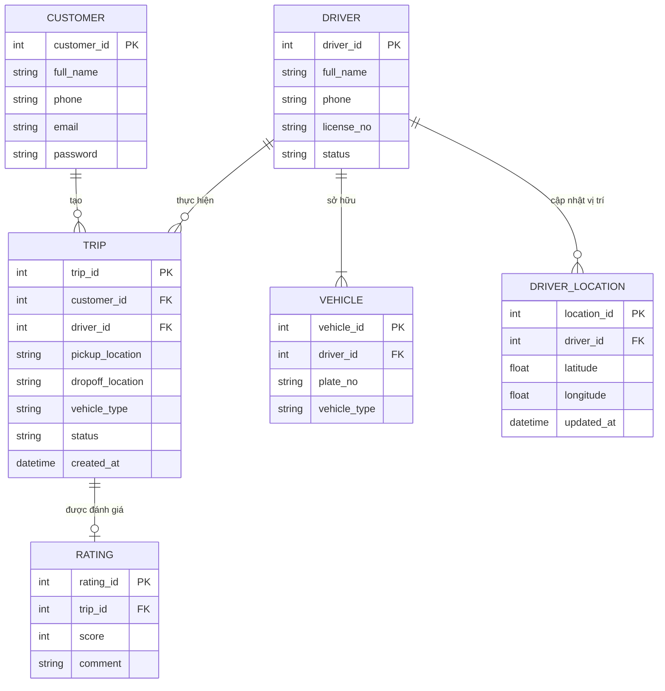

## 11. Use Case Diagram

**Actor:** Khách hàng (Customer), Tài xế (Driver), Nhân viên vận hành (Operations Staff), Hệ thống (System)

| Mã | Use Case | Actor chính |
|---|---|---|
| UC-01 | Đăng ký tài khoản | Khách hàng |
| UC-02 | Đăng nhập | Khách hàng, Tài xế |
| UC-03 | Cập nhật thông tin cá nhân | Khách hàng |
| UC-04 | Tạo yêu cầu đặt xe (bao gồm chọn loại xe) | Khách hàng |
| UC-05 | Theo dõi trạng thái chuyến đi | Khách hàng |
| UC-06 | Xem lịch sử chuyến đi | Khách hàng |
| UC-07 | Đánh giá tài xế | Khách hàng |
| UC-08 | Đăng ký / Tạo tài khoản tài xế | Tài xế, Nhân viên vận hành |
| UC-09 | Cập nhật hồ sơ & phương tiện | Tài xế |
| UC-10 | Chuyển đổi trạng thái sẵn sàng | Tài xế |
| UC-11 | Nhận và phản hồi yêu cầu chuyến | Tài xế |
| UC-12 | Cập nhật trạng thái chuyến đi | Tài xế |
| UC-13 | Tự động tìm và phân công tài xế | Hệ thống (`<<include>>` từ UC-04) |

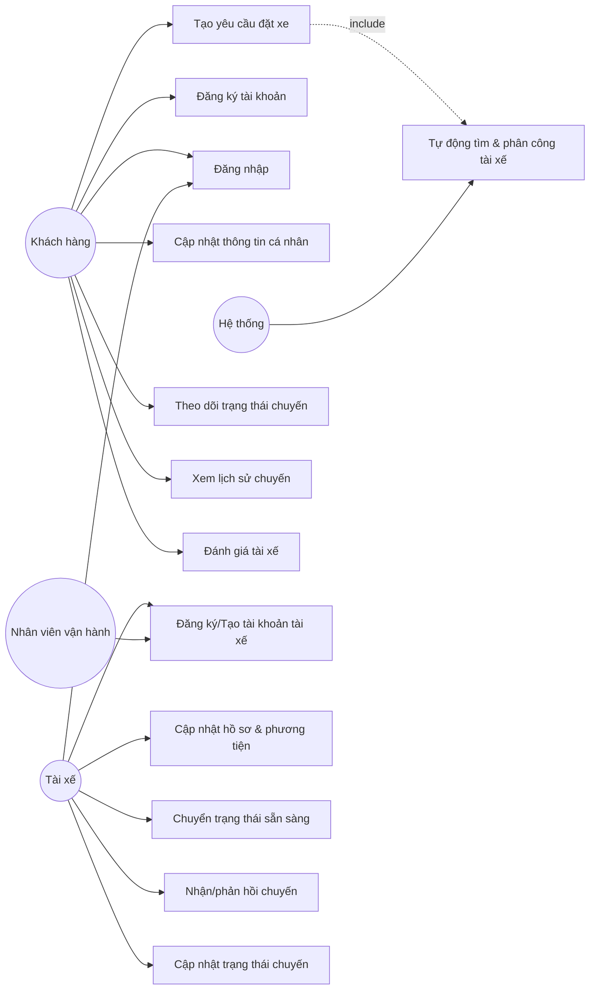

## 12. Acceptance Criteria (AC)

**AC-01 (BR-01):** Given khách hàng nhập đầy đủ và hợp lệ thông tin đăng ký, When gửi form đăng ký, Then hệ thống tạo tài khoản và cho phép đăng nhập.

**AC-02 (BR-02):** Given khách hàng đã đăng nhập, When nhập điểm đón, điểm đến, chọn loại xe và gửi yêu cầu, Then hệ thống tạo yêu cầu đặt xe với trạng thái "Đang tìm tài xế".

**AC-03 (BR-03):** Given yêu cầu đặt xe đã tồn tại, When trạng thái chuyến thay đổi, Then khách hàng phải thấy trạng thái cập nhật tương ứng theo thời gian thực.

**AC-04 (BR-04):** Given chuyến đi ở trạng thái "Hoàn thành", When khách hàng gửi đánh giá, Then hệ thống lưu đánh giá gắn với chuyến; nếu chuyến chưa hoàn thành thì hệ thống từ chối đánh giá.

**AC-05 (BR-05):** Given tài xế đăng ký hoặc được nhân viên vận hành tạo tài khoản với thông tin hợp lệ, When gửi yêu cầu tạo tài khoản, Then hệ thống tạo tài khoản tài xế ở trạng thái "chưa sẵn sàng".

**AC-06 (BR-06):** Given tài xế đã có hồ sơ và phương tiện đầy đủ, When tài xế bật trạng thái "sẵn sàng", Then hệ thống ghi nhận tài xế có thể nhận đề xuất chuyến mới.

**AC-07 (BR-07):** Given tài xế nhận được đề xuất chuyến, When tài xế chấp nhận, Then chuyến được gán cho tài xế; When tài xế từ chối hoặc không phản hồi, Then hệ thống tự động chuyển đề xuất sang tài xế kế tiếp mà không yêu cầu khách hàng tạo lại yêu cầu.

**AC-08 (BR-08):** Given chuyến đã được tài xế nhận, When tài xế cập nhật trạng thái theo đúng thứ tự (đến điểm đón → đã đón khách → đang di chuyển → hoàn thành), Then hệ thống ghi nhận đúng trạng thái tương ứng cho khách hàng theo dõi.

**AC-09 (BR-09):** Given có yêu cầu đặt xe mới, When hệ thống tìm tài xế, Then hệ thống ưu tiên tài xế sẵn sàng và gần khách hàng nhất; nếu tài xế được đề xuất không phản hồi/từ chối thì tự động thử tài xế kế tiếp; nếu đã thử hết danh sách mà không có tài xế nào nhận, Then hệ thống phải thông báo rõ cho khách hàng rằng không tìm được tài xế.

## 13. Traceability Matrix

| BG | BR | FR | UC | AC |
|---|---|---|---|---|
| BG-01, BG-05 | BR-01 | FR-01, FR-02, FR-03 | UC-01, UC-02, UC-03 | AC-01 |
| BG-01, BG-02 | BR-02 | FR-04, FR-05, FR-06 | UC-04 | AC-02 |
| BG-02 | BR-03 | FR-07, FR-08 | UC-05 | AC-03 |
| BG-02 | BR-04 | FR-09, FR-10 | UC-06, UC-07 | AC-04 |
| BG-01, BG-05 | BR-05 | FR-11, FR-12, FR-13 | UC-08, UC-09 | AC-05 |
| BG-01 | BR-06 | FR-14 | UC-10 | AC-06 |
| BG-01 | BR-07 | FR-15, FR-16 | UC-11 | AC-07 |
| BG-02 | BR-08 | FR-17 | UC-12 | AC-08 |
| BG-01 | BR-09 | FR-18, FR-19, FR-20, FR-21 | UC-13 | AC-09 |
