## 1. Stakeholder List & Roles (Danh sách & Vai trò Bên liên quan)

| STT | Tên Stakeholder | Vai trò |
|---|---|---|
| 1 | Ban lãnh đạo / Ban giám đốc | Mong muốn xây dựng nền tảng CAB mới có khả năng phục vụ số lượng lớn khách hàng và tài xế, có thể phát triển thêm tính năng trong tương lai. Kỳ vọng hệ thống hỗ trợ ít nhất ba nhóm người dùng chính gồm khách hàng, tài xế và nhân viên vận hành. Mong muốn có báo cáo về số lượng chuyến, doanh thu, tỷ lệ chuyến hoàn thành, tỷ lệ hủy và hiệu quả hoạt động của tài xế |
| 2 | Khách hàng | Đăng ký tài khoản, đăng nhập, cập nhật thông tin cá nhân. Nhập điểm đón và điểm đến, lựa chọn loại xe, gửi yêu cầu đặt xe và theo dõi chuyến đi. Muốn biết hệ thống đang tìm tài xế, tài xế nào đã nhận chuyến, thời gian dự kiến tài xế đến và trạng thái hiện tại của chuyến đi. Thanh toán bằng tiền mặt hoặc phương thức thanh toán điện tử. Xem lịch sử chuyến đi, số tiền phải trả và đánh giá tài xế sau khi hoàn thành chuyến. |
| 3 | Tài xế | Đăng ký hoặc được nhân viên vận hành tạo tài khoản. Cập nhật hồ sơ, thông tin phương tiện và trạng thái hoạt động; chuyển sang trạng thái sẵn sàng nhận chuyến khi đang làm việc. Nhận thông báo, chấp nhận hoặc từ chối chuyến. Cập nhật trạng thái: đã đến điểm đón, đã đón khách, đang di chuyển và hoàn thành chuyến. |
| 4 | Nhân viên vận hành | Sử dụng giao diện quản trị để quản lý khách hàng, tài xế, phương tiện và chuyến đi. Tạo tài khoản cho tài xế. Xem các chuyến đang diễn ra, kiểm tra trạng thái tài xế, hỗ trợ xử lý các trường hợp chuyến bị lỗi và tra cứu lịch sử giao dịch. Một số chức năng quản trị được phân quyền để nhân viên thông thường không thể thực hiện các thao tác nhạy cảm. |
| 5 | Nhà cung cấp thanh toán bên ngoài | Doanh nghiệp muốn tích hợp với nhà cung cấp thanh toán bên ngoài, nhưng không muốn thông tin nhạy cảm của thẻ hoặc tài khoản thanh toán được lưu trực tiếp trong hệ thống CAB. |
| 6 | Business Analyst | Làm rõ với các bên liên quan về cách tính cước, tiêu chí ưu tiên tài xế, thời gian tài xế phải phản hồi, chính sách hủy chuyến, cách xử lý khi mất kết nối mạng và thời gian lưu trữ dữ liệu. Xác định phạm vi, tác nhân, quy trình nghiệp vụ, yêu cầu chức năng, yêu cầu phi chức năng, quy tắc nghiệp vụ, các trường hợp ngoại lệ và những điểm còn chưa rõ cần xác nhận với khách hàng. |
| 7 | Nhóm phát triển | Xây dựng giải pháp sau khi Business Analyst làm rõ các vấn đề chưa chốt. |

## 2. Stakeholder Matrix (Ma trận Bên liên quan)

| STT | Stakeholder | Ảnh hưởng (Influence) | Quan tâm (Interest) | Nhóm | Căn cứ trong đề |
|---|---|---|---|---|---|
| 1 | Ban lãnh đạo / Ban giám đốc | Cao | Cao | Key Decision Makers | "Ban lãnh đạo mong muốn xây dựng một nền tảng CAB mới…"; "Ban giám đốc kỳ vọng hệ thống mới hỗ trợ ít nhất ba nhóm người dùng chính"; "Ban lãnh đạo cũng mong muốn có báo cáo về số lượng chuyến, doanh thu…" |
| 2 | Khách hàng | Thấp | Cao | Engaged Supporters | Sử dụng trực tiếp hệ thống để đặt xe, theo dõi chuyến, thanh toán; "khách hàng muốn biết hệ thống đang tìm tài xế, tài xế nào đã nhận chuyến…"; không tham gia quyết định yêu cầu |
| 3 | Tài xế | Thấp | Cao | Engaged Supporters | Sử dụng trực tiếp hệ thống để nhận thông báo, chấp nhận hoặc từ chối chuyến, cập nhật trạng thái chuyến; không tham gia quyết định yêu cầu |
| 4 | Nhân viên vận hành | Thấp | Cao | Engaged Supporters | Sử dụng giao diện quản trị để quản lý khách hàng, tài xế, phương tiện, chuyến đi; "bộ phận vận hành gặp khó khăn khi muốn mở rộng hệ thống"; nhân viên thông thường không thể thực hiện thao tác nhạy cảm |
| 5 | Business Analyst | Thấp | Cao | Engaged Supporters | "Khách hàng mong muốn Business Analyst làm rõ các vấn đề này với các bên liên quan", tức BA làm rõ, không phải người chốt yêu cầu; chịu trách nhiệm xác định phạm vi, tác nhân, quy trình, yêu cầu… |
| 6 | Nhóm phát triển | Thấp | Cao | Engaged Supporters | Xây dựng giải pháp sau khi Business Analyst làm rõ các vấn đề chưa chốt; không tham gia quyết định yêu cầu |
| 7 | Nhà cung cấp thanh toán bên ngoài | Cao | Thấp | Potential Influencers | "Doanh nghiệp muốn tích hợp với một nhà cung cấp thanh toán bên ngoài"; thanh toán điện tử phụ thuộc vào nhà cung cấp; "không muốn một lỗi xảy ra ở chức năng thanh toán… làm cho toàn bộ hệ thống đặt xe ngừng hoạt động"; đề không nêu mong muốn nào của nhà cung cấp đối với dự án |

> **Minimal Impact Stakeholders:** không có stakeholder nào trong đề thuộc nhóm này.

### Sơ đồ Stakeholder Matrix

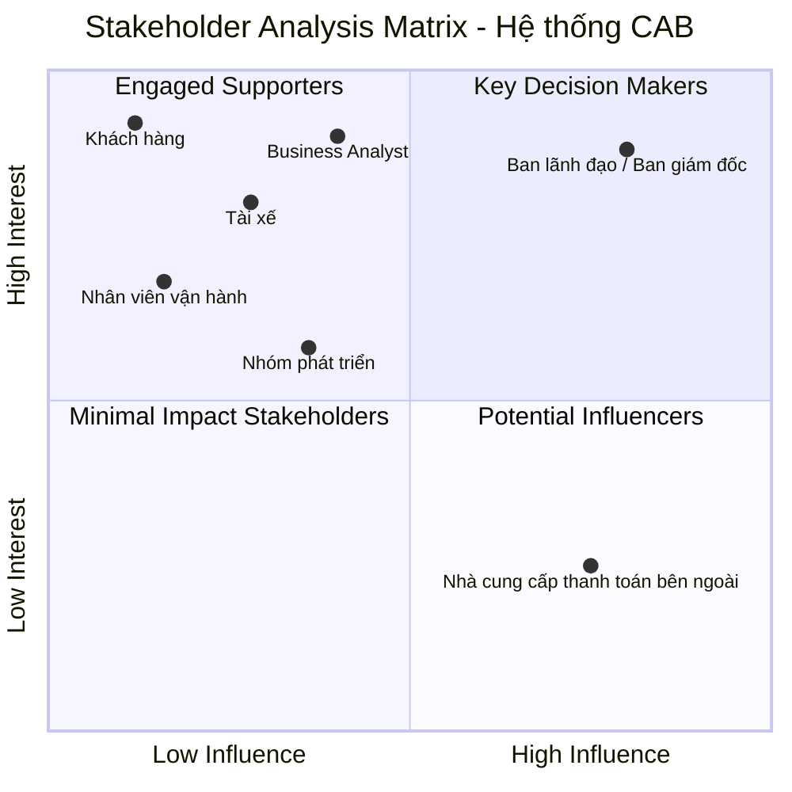
```mermaid
quadrantChart
    title Stakeholder Analysis Matrix - Hệ thống CAB
    x-axis Low Influence --> High Influence
    y-axis Low Interest --> High Interest
    quadrant-1 Key Decision Makers
    quadrant-2 Engaged Supporters
    quadrant-3 Minimal Impact Stakeholders
    quadrant-4 Potential Influencers
    "Ban lãnh đạo / Ban giám đốc": [0.80, 0.88]
    "Khách hàng": [0.12, 0.92]
    "Tài xế": [0.28, 0.80]
    "Nhân viên vận hành": [0.16, 0.68]
    "Business Analyst": [0.40, 0.90]
    "Nhóm phát triển": [0.36, 0.58]
    "Nhà cung cấp thanh toán bên ngoài": [0.75, 0.25]
```
## 3. Business Goals (Mục tiêu kinh doanh/ nghiệp vụ)

| STT | Mã | Business Goal | Mục tiêu |
|---|---|---|---|
| 1 | BG‑01 | Tìm và phân công tài xế | Khi khách hàng tạo một chuyến đi, hệ thống cần xác định các tài xế phù hợp dựa trên vị trí, trạng thái sẵn sàng và một số tiêu chí vận hành khác. Doanh nghiệp mong muốn hệ thống ưu tiên tài xế phù hợp và gần khách hàng. |
| 2 | BG‑02 | Theo dõi chuyến đi và thông báo | Sau khi gửi yêu cầu, khách hàng muốn biết hệ thống đang tìm tài xế, tài xế nào đã nhận chuyến, thời gian dự kiến tài xế đến và trạng thái hiện tại của chuyến đi. Thông báo là một thành phần quan trọng. |
| 3 | BG‑03 | Thanh toán và tính cước | Hệ thống cũng phải hỗ trợ thanh toán và tính cước. |
| 4 | BG‑04 | Phục vụ số lượng lớn, mở rộng khi tải tăng | Ban lãnh đạo mong muốn xây dựng một nền tảng CAB mới có khả năng phục vụ số lượng lớn khách hàng và tài xế. Các thành phần của hệ thống cần có khả năng mở rộng độc lập khi tải tăng. |
| 5 | BG‑05 | Phát triển lâu dài | Khách hàng không chỉ muốn một ứng dụng đặt xe đơn thuần mà muốn một nền tảng CAB có thể phát triển lâu dài, có thể phát triển thêm các tính năng trong tương lai. |
| 6 | BG‑06 | Hỗ trợ ba nhóm người dùng | Ban giám đốc kỳ vọng hệ thống mới hỗ trợ ít nhất ba nhóm người dùng chính gồm khách hàng, tài xế và nhân viên vận hành. |
| 7 | BG‑07 | Đáp ứng quy trình đặt xe | Hệ thống cần đáp ứng tốt quy trình từ khi khách hàng tạo yêu cầu, tìm và phân công tài xế, thực hiện chuyến, tính cước, thanh toán, thông báo đến đánh giá sau chuyến. |
| 8 | BG‑08 | Báo cáo | Ban lãnh đạo cũng mong muốn có báo cáo về số lượng chuyến, doanh thu, tỷ lệ chuyến hoàn thành, tỷ lệ hủy và hiệu quả hoạt động của tài xế. |
| 9 | BG‑09 | Phối hợp giữa các bộ phận | Các bộ phận trong doanh nghiệp phải có thể phối hợp thông qua hệ thống và có đủ dữ liệu để theo dõi hoạt động. |
| 10 | BG‑10 | Hoạt động ổn định | Hệ thống phải hoạt động ổn định vào các thời điểm nhu cầu tăng cao. Doanh nghiệp không muốn một lỗi xảy ra ở chức năng thanh toán hoặc thông báo làm cho toàn bộ hệ thống đặt xe ngừng hoạt động. |
| 11 | BG‑11 | Bảo mật | Thông tin cá nhân, thông tin phương tiện, dữ liệu vị trí và dữ liệu giao dịch phải được bảo vệ. Doanh nghiệp cần lưu vết các thao tác quan trọng để phục vụ kiểm tra khi có sự cố. |

## 4. Minimum Viable Product (MVP) Modules

| STT | Module | Chức năng chính | BR liên quan |
|---|---|---|---|
| 1 | Quản lý tài khoản khách hàng | Đăng ký tài khoản, đăng nhập, cập nhật thông tin cá nhân. Khách hàng phải được xác thực trước khi sử dụng các chức năng yêu cầu tài khoản. | BR-06, BR-11 |
| 2 | Quản lý tài xế và phương tiện | Tài xế đăng ký hoặc được nhân viên vận hành tạo tài khoản; cập nhật hồ sơ, thông tin phương tiện và trạng thái hoạt động; chuyển sang trạng thái sẵn sàng nhận chuyến khi đang làm việc. Lưu thông tin vị trí của tài xế để hỗ trợ việc tìm tài xế gần khách hàng và cải thiện khả năng dự kiến thời gian đến. Tài xế phải được xác thực trước khi sử dụng các chức năng yêu cầu tài khoản. | BR-01, BR-06, BR-11 |
| 3 | Đặt xe và chuyến đi | **Đặt xe:** nhập điểm đón và điểm đến, lựa chọn loại xe, gửi yêu cầu đặt xe. **Tìm và phân công tài xế:** xác định các tài xế phù hợp dựa trên vị trí, trạng thái sẵn sàng và một số tiêu chí vận hành khác; ưu tiên tài xế phù hợp và gần khách hàng; khi có yêu cầu phù hợp, tài xế nhận được thông báo và có thể chấp nhận hoặc từ chối chuyến; nếu tài xế được đề xuất không phản hồi hoặc từ chối, hệ thống tiếp tục tìm tài xế khác mà không yêu cầu khách hàng tạo lại yêu cầu; không tìm được tài xế thì khách hàng phải được thông báo rõ ràng. **Thực hiện và theo dõi chuyến đi:** tài xế cập nhật trạng thái đã đến điểm đón, đã đón khách, đang di chuyển và hoàn thành chuyến; khách hàng theo dõi hệ thống đang tìm tài xế, tài xế nào đã nhận chuyến, thời gian dự kiến tài xế đến và trạng thái hiện tại của chuyến đi; xem lịch sử chuyến đi và số tiền phải trả. **Đánh giá:** khách hàng đánh giá tài xế sau khi hoàn thành chuyến. | BR-01, BR-02, BR-07 |
| 4 | Tính cước và thanh toán | Sau khi chuyến đi hoàn thành, xác định số tiền khách hàng phải trả dựa trên loại dịch vụ và thông tin chuyến đi. Khách hàng thanh toán bằng tiền mặt hoặc phương thức thanh toán điện tử. Tích hợp với nhà cung cấp thanh toán bên ngoài; thông tin nhạy cảm của thẻ hoặc tài khoản thanh toán không được lưu trực tiếp trong hệ thống CAB. Giao dịch thanh toán điện tử thất bại thì thông báo cho khách hàng và cho phép xử lý lại theo chính sách của doanh nghiệp. | BR-03, BR-07, BR-11 |
| 5 | Thông báo | Thông báo cho khách hàng khi yêu cầu đặt xe được tiếp nhận, khi có tài xế nhận chuyến, khi tài xế đến điểm đón, khi chuyến hoàn thành và khi thanh toán có kết quả. Thông báo cho tài xế về các chuyến mới hoặc những thay đổi liên quan đến chuyến đang thực hiện. | BR-02, BR-07 |
| 6 | Quản trị vận hành | Giao diện quản trị để quản lý khách hàng, tài xế, phương tiện và chuyến đi; xem các chuyến đang diễn ra, kiểm tra trạng thái tài xế, hỗ trợ xử lý các trường hợp chuyến bị lỗi và tra cứu lịch sử giao dịch. Một số chức năng quản trị được phân quyền để nhân viên thông thường không thể thực hiện các thao tác nhạy cảm. Các thao tác quản trị phải được kiểm soát quyền truy cập. | BR-06, BR-11 |
| 7 | Báo cáo | Báo cáo về số lượng chuyến, doanh thu, tỷ lệ chuyến hoàn thành, tỷ lệ hủy và hiệu quả hoạt động của tài xế. | BR-08 |

> **Ngoài phạm vi MVP (đề ghi "trong tương lai"):** bổ sung các loại dịch vụ mới, thêm phương thức thanh toán, thêm nhà cung cấp thông báo, mở rộng thêm các kênh thông báo, thay đổi một số thành phần kỹ thuật. *(BR-05)*

## 5. Business Requirements – CAB System MVP (Yêu cầu nghiệp vụ)

| Mã BR | Yêu cầu nghiệp vụ | Module |
|---|---|---|
| BR‑01 | Khách hàng đăng ký tài khoản, đăng nhập, cập nhật thông tin cá nhân. | 1 |
| BR‑02 | Khách hàng và tài xế phải được xác thực trước khi sử dụng các chức năng yêu cầu tài khoản. | 1, 2 |
| BR‑03 | Tài xế đăng ký hoặc được nhân viên vận hành tạo tài khoản; cập nhật hồ sơ, thông tin phương tiện và trạng thái hoạt động. | 2 |
| BR‑04 | Tài xế chuyển sang trạng thái sẵn sàng nhận chuyến khi đang làm việc. | 2 |
| BR‑05 | Hệ thống lưu thông tin vị trí của tài xế để hỗ trợ việc tìm tài xế gần khách hàng và cải thiện khả năng dự kiến thời gian đến. | 2 |
| BR‑06 | Khách hàng nhập điểm đón và điểm đến, lựa chọn loại xe và gửi yêu cầu đặt xe. | 3 |
| BR‑07 | Hệ thống xác định các tài xế phù hợp dựa trên vị trí, trạng thái sẵn sàng và một số tiêu chí vận hành khác; ưu tiên tài xế phù hợp và gần khách hàng. | 3 |
| BR‑08 | Khi có yêu cầu phù hợp, tài xế nhận được thông báo và có thể chấp nhận hoặc từ chối chuyến. | 3, 5 |
| BR‑09 | Nếu tài xế được đề xuất không phản hồi hoặc từ chối, hệ thống tiếp tục tìm tài xế khác mà không yêu cầu khách hàng tạo lại yêu cầu. Không tìm được tài xế thì khách hàng phải được thông báo rõ ràng. | 3, 5 |
| BR‑10 | Tài xế cập nhật trạng thái chuyến đi: đã đến điểm đón, đã đón khách, đang di chuyển và hoàn thành chuyến. | 3 |
| BR‑11 | Khách hàng theo dõi chuyến đi: hệ thống đang tìm tài xế, tài xế nào đã nhận chuyến, thời gian dự kiến tài xế đến và trạng thái hiện tại của chuyến đi. | 3 |
| BR‑12 | Khách hàng xem lịch sử chuyến đi và số tiền phải trả. | 3 |
| BR‑13 | Khách hàng đánh giá tài xế sau khi hoàn thành chuyến. | 3 |
| BR‑14 | Sau khi chuyến đi hoàn thành, hệ thống xác định số tiền khách hàng phải trả dựa trên loại dịch vụ và thông tin chuyến đi. | 4 |
| BR‑15 | Khách hàng thanh toán bằng tiền mặt hoặc phương thức thanh toán điện tử qua nhà cung cấp thanh toán bên ngoài; thông tin nhạy cảm của thẻ hoặc tài khoản thanh toán không được lưu trực tiếp trong hệ thống CAB. | 4 |
| BR‑16 | Giao dịch thanh toán điện tử thất bại thì hệ thống thông báo cho khách hàng và cho phép xử lý lại theo chính sách của doanh nghiệp. | 4, 5 |
| BR‑17 | Khách hàng nhận thông báo khi yêu cầu đặt xe được tiếp nhận, khi có tài xế nhận chuyến, khi tài xế đến điểm đón, khi chuyến hoàn thành và khi thanh toán có kết quả. | 5 |
| BR‑18 | Tài xế nhận thông báo về các chuyến mới hoặc những thay đổi liên quan đến chuyến đang thực hiện. | 5 |
| BR‑19 | Nhân viên vận hành quản lý khách hàng, tài xế, phương tiện và chuyến đi qua giao diện quản trị. | 6 |
| BR‑20 | Nhân viên vận hành xem các chuyến đang diễn ra, kiểm tra trạng thái tài xế, hỗ trợ xử lý các trường hợp chuyến bị lỗi và tra cứu lịch sử giao dịch. | 6 |
| BR‑21 | Một số chức năng quản trị được phân quyền để nhân viên thông thường không thể thực hiện các thao tác nhạy cảm; các thao tác quản trị phải được kiểm soát quyền truy cập. | 6 |
| BR‑22 | Ban lãnh đạo có báo cáo về số lượng chuyến, doanh thu, tỷ lệ chuyến hoàn thành, tỷ lệ hủy và hiệu quả hoạt động của tài xế. | 7 |

## 6. Business Process Modeling (Mô hình hóa Quy trình Nghiệp vụ)

| STT | Mã QT | Quy trình | BR | Tác nhân |
|---|---|---|---|---|
| 1 | QT‑01 | Đăng ký, đăng nhập, cập nhật thông tin cá nhân | BR‑01 | Khách hàng |
| 2 | QT‑02 | Xác thực trước khi sử dụng chức năng yêu cầu tài khoản | BR‑02 | Khách hàng, Tài xế |
| 3 | QT‑03 | Tạo tài khoản và cập nhật hồ sơ tài xế | BR‑03 | Tài xế, Nhân viên vận hành |
| 4 | QT‑04 | Chuyển sang trạng thái sẵn sàng nhận chuyến | BR‑04 | Tài xế |
| 5 | QT‑05 | Lưu thông tin vị trí tài xế | BR‑05 | Tài xế |
| 6 | QT‑06 | Đặt xe | BR‑06 | Khách hàng |
| 7 | QT‑07 | Xác định tài xế phù hợp | BR‑07 | Hệ thống |
| 8 | QT‑08 | Tài xế chấp nhận hoặc từ chối chuyến | BR‑08 | Tài xế |
| 9 | QT‑09 | Xử lý khi tài xế không phản hồi, từ chối hoặc không tìm được tài xế | BR‑09 | Tài xế, Khách hàng |
| 10 | QT‑10 | Cập nhật trạng thái chuyến đi | BR‑10 | Tài xế |
| 11 | QT‑11 | Theo dõi chuyến đi | BR‑11 | Khách hàng |
| 12 | QT‑12 | Xem lịch sử chuyến đi | BR‑12 | Khách hàng |
| 13 | QT‑13 | Đánh giá tài xế | BR‑13 | Khách hàng |
| 14 | QT‑14 | Tính cước | BR‑14 | Hệ thống |
| 15 | QT‑15 | Thanh toán | BR‑15 | Khách hàng, Nhà cung cấp thanh toán bên ngoài |
| 16 | QT‑16 | Xử lý giao dịch thanh toán điện tử thất bại | BR‑16 | Khách hàng, Nhà cung cấp thanh toán bên ngoài |
| 17 | QT‑17 | Thông báo cho khách hàng | BR‑17 | Khách hàng |
| 18 | QT‑18 | Thông báo cho tài xế | BR‑18 | Tài xế |
| 19 | QT‑19 | Quản lý khách hàng, tài xế, phương tiện, chuyến đi | BR‑19 | Nhân viên vận hành |
| 20 | QT‑20 | Giám sát chuyến đi và hỗ trợ xử lý | BR‑20 | Nhân viên vận hành |
| 21 | QT‑21 | Kiểm soát quyền thao tác quản trị | BR‑21 | Nhân viên vận hành |
| 22 | QT‑22 | Báo cáo | BR‑22 | Ban lãnh đạo |

### Quy trình tổng thể đặt xe (BG‑07)

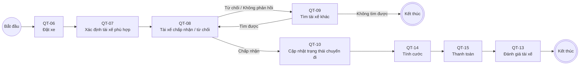
```mermaid
flowchart LR
    S(("Bắt đầu")) --> Q6["QT-06<br/>Đặt xe"] --> Q7["QT-07<br/>Xác định tài xế phù hợp"] --> Q8["QT-08<br/>Tài xế chấp nhận / từ chối"]
    Q8 -->|"Chấp nhận"| Q10["QT-10<br/>Cập nhật trạng thái chuyến đi"]
    Q8 -->|"Từ chối / Không phản hồi"| Q9["QT-09<br/>Tìm tài xế khác"]
    Q9 -->|"Tìm được"| Q8
    Q9 -->|"Không tìm được"| E1((("Kết thúc")))
    Q10 --> Q14["QT-14<br/>Tính cước"] --> Q15["QT-15<br/>Thanh toán"] --> Q13["QT-13<br/>Đánh giá tài xế"] --> E2((("Kết thúc")))
```

### QT‑01: Đăng ký, đăng nhập, cập nhật thông tin cá nhân (BR‑01)

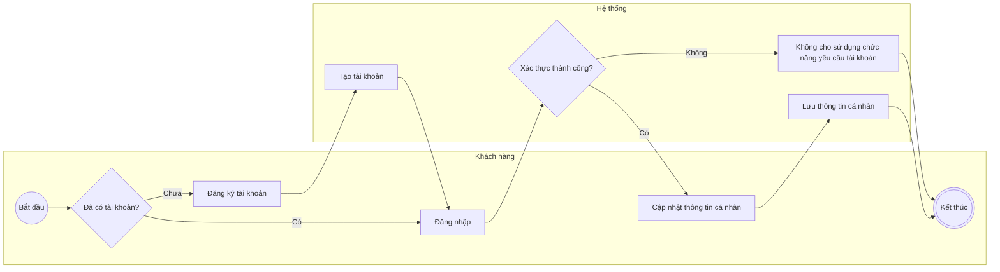
```mermaid
flowchart LR
    subgraph KH["Khách hàng"]
        S(("Bắt đầu")) --> A1{"Đã có tài khoản?"}
        A2["Đăng ký tài khoản"]
        A4["Đăng nhập"]
        A7["Cập nhật thông tin cá nhân"]
        E((("Kết thúc")))
    end
    subgraph HT["Hệ thống"]
        A3["Tạo tài khoản"]
        A5{"Xác thực thành công?"}
        A6["Không cho sử dụng chức năng yêu cầu tài khoản"]
        A8["Lưu thông tin cá nhân"]
    end
    A1 -->|"Chưa"| A2 --> A3 --> A4
    A1 -->|"Có"| A4
    A4 --> A5
    A5 -->|"Không"| A6 --> E
    A5 -->|"Có"| A7 --> A8 --> E
```

### QT‑02: Xác thực trước khi sử dụng chức năng yêu cầu tài khoản (BR‑02)

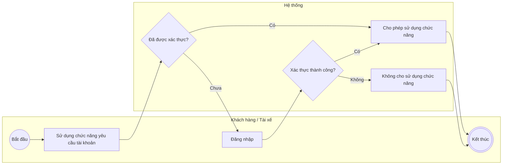
```mermaid
flowchart LR
    subgraph ND["Khách hàng / Tài xế"]
        S(("Bắt đầu")) --> B1["Sử dụng chức năng yêu cầu tài khoản"]
        B3["Đăng nhập"]
        E((("Kết thúc")))
    end
    subgraph HT["Hệ thống"]
        B2{"Đã được xác thực?"}
        B4{"Xác thực thành công?"}
        B5["Cho phép sử dụng chức năng"]
        B6["Không cho sử dụng chức năng"]
    end
    B1 --> B2
    B2 -->|"Có"| B5
    B2 -->|"Chưa"| B3 --> B4
    B4 -->|"Có"| B5 --> E
    B4 -->|"Không"| B6 --> E
```

### QT‑03: Tạo tài khoản và cập nhật hồ sơ tài xế (BR‑03)

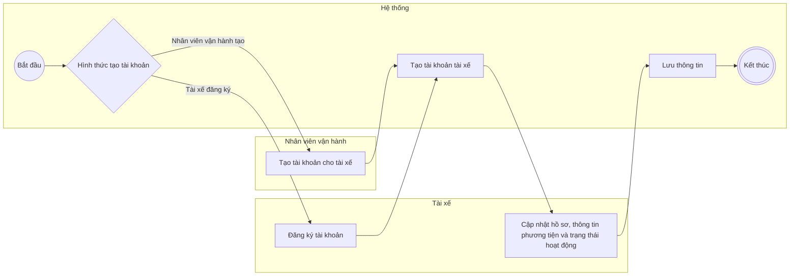
```mermaid
flowchart LR
    subgraph TX["Tài xế"]
        C2["Đăng ký tài khoản"]
        C5["Cập nhật hồ sơ, thông tin phương tiện và trạng thái hoạt động"]
    end
    subgraph NV["Nhân viên vận hành"]
        C3["Tạo tài khoản cho tài xế"]
    end
    subgraph HT["Hệ thống"]
        S(("Bắt đầu")) --> C1{"Hình thức tạo tài khoản"}
        C4["Tạo tài khoản tài xế"]
        C6["Lưu thông tin"]
        E((("Kết thúc")))
    end
    C1 -->|"Tài xế đăng ký"| C2 --> C4
    C1 -->|"Nhân viên vận hành tạo"| C3 --> C4
    C4 --> C5 --> C6 --> E
```

### QT‑04: Chuyển sang trạng thái sẵn sàng nhận chuyến (BR‑04)

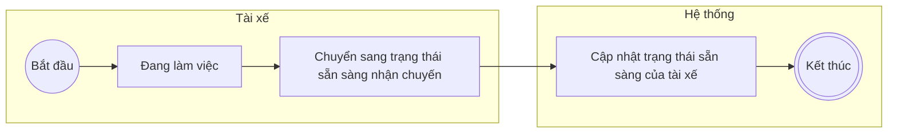
```mermaid
flowchart LR
    subgraph TX["Tài xế"]
        S(("Bắt đầu")) --> D1["Đang làm việc"] --> D2["Chuyển sang trạng thái sẵn sàng nhận chuyến"]
    end
    subgraph HT["Hệ thống"]
        D3["Cập nhật trạng thái sẵn sàng của tài xế"]
        E((("Kết thúc")))
    end
    D2 --> D3 --> E
```

### QT‑05: Lưu thông tin vị trí tài xế (BR‑05)

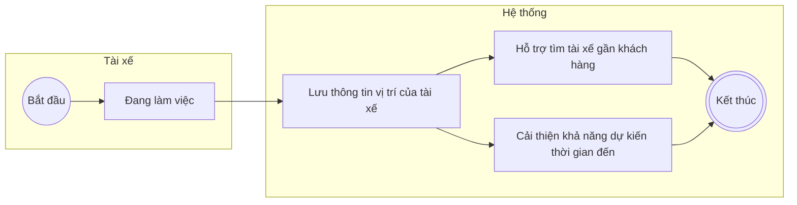
```mermaid
flowchart LR
    subgraph TX["Tài xế"]
        S(("Bắt đầu")) --> F1["Đang làm việc"]
    end
    subgraph HT["Hệ thống"]
        F2["Lưu thông tin vị trí của tài xế"]
        F3["Hỗ trợ tìm tài xế gần khách hàng"]
        F4["Cải thiện khả năng dự kiến thời gian đến"]
        E((("Kết thúc")))
    end
    F1 --> F2
    F2 --> F3 --> E
    F2 --> F4 --> E
```

### QT‑06: Đặt xe (BR‑06)

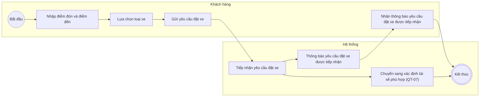
```mermaid
flowchart LR
    subgraph KH["Khách hàng"]
        S(("Bắt đầu")) --> G1["Nhập điểm đón và điểm đến"] --> G2["Lựa chọn loại xe"] --> G3["Gửi yêu cầu đặt xe"]
        G6["Nhận thông báo yêu cầu đặt xe được tiếp nhận"]
    end
    subgraph HT["Hệ thống"]
        G4["Tiếp nhận yêu cầu đặt xe"]
        G5["Thông báo yêu cầu đặt xe được tiếp nhận"]
        G7["Chuyển sang xác định tài xế phù hợp (QT-07)"]
        E((("Kết thúc")))
    end
    G3 --> G4
    G4 --> G5 --> G6 --> E
    G4 --> G7 --> E
```

### QT‑07: Xác định tài xế phù hợp (BR‑07)

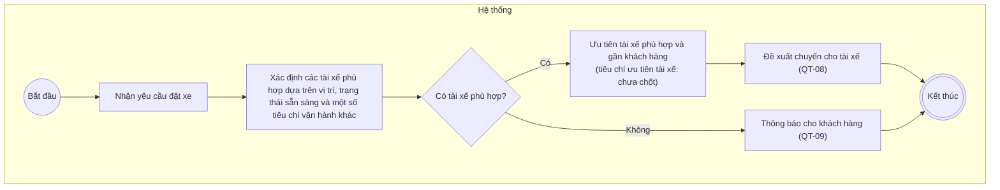
```mermaid
flowchart TB
    subgraph HT["Hệ thống"]
        S(("Bắt đầu")) --> H1["Nhận yêu cầu đặt xe"]
        H1 --> H2["Xác định các tài xế phù hợp dựa trên vị trí, trạng thái sẵn sàng và một số tiêu chí vận hành khác"]
        H2 --> H3{"Có tài xế phù hợp?"}
        H3 -->|"Có"| H4["Ưu tiên tài xế phù hợp và gần khách hàng<br/>(tiêu chí ưu tiên tài xế: chưa chốt)"]
        H4 --> H5["Đề xuất chuyến cho tài xế (QT-08)"] --> E((("Kết thúc")))
        H3 -->|"Không"| H6["Thông báo cho khách hàng (QT-09)"] --> E
    end
```

### QT‑08: Tài xế chấp nhận hoặc từ chối chuyến (BR‑08)

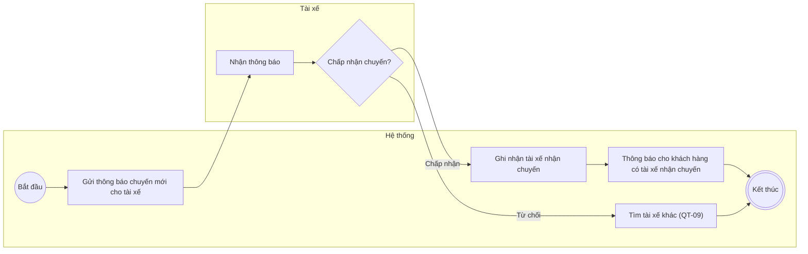
```mermaid
flowchart LR
    subgraph HT["Hệ thống"]
        S(("Bắt đầu")) --> I1["Gửi thông báo chuyến mới cho tài xế"]
        I4["Ghi nhận tài xế nhận chuyến"]
        I5["Thông báo cho khách hàng có tài xế nhận chuyến"]
        I6["Tìm tài xế khác (QT-09)"]
        E((("Kết thúc")))
    end
    subgraph TX["Tài xế"]
        I2["Nhận thông báo"] --> I3{"Chấp nhận chuyến?"}
    end
    I1 --> I2
    I3 -->|"Chấp nhận"| I4 --> I5 --> E
    I3 -->|"Từ chối"| I6 --> E
```

### QT‑09: Xử lý khi tài xế không phản hồi, từ chối hoặc không tìm được tài xế (BR‑09)

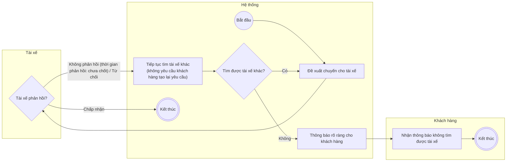
```mermaid
flowchart LR
    subgraph TX["Tài xế"]
        J2{"Tài xế phản hồi?"}
    end
    subgraph HT["Hệ thống"]
        S(("Bắt đầu")) --> J1["Đề xuất chuyến cho tài xế"]
        J3["Tiếp tục tìm tài xế khác<br/>(không yêu cầu khách hàng tạo lại yêu cầu)"]
        J4{"Tìm được tài xế khác?"}
        J5["Thông báo rõ ràng cho khách hàng"]
        E1((("Kết thúc")))
    end
    subgraph KH["Khách hàng"]
        J6["Nhận thông báo không tìm được tài xế"]
        E2((("Kết thúc")))
    end
    J1 --> J2
    J2 -->|"Không phản hồi (thời gian phản hồi: chưa chốt) / Từ chối"| J3 --> J4
    J2 -->|"Chấp nhận"| E1
    J4 -->|"Có"| J1
    J4 -->|"Không"| J5 --> J6 --> E2
```

### QT‑10: Cập nhật trạng thái chuyến đi (BR‑10)

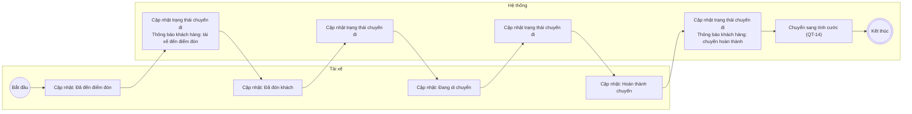
```mermaid
flowchart LR
    subgraph TX["Tài xế"]
        S(("Bắt đầu")) --> K1["Cập nhật: Đã đến điểm đón"]
        K3["Cập nhật: Đã đón khách"]
        K5["Cập nhật: Đang di chuyển"]
        K7["Cập nhật: Hoàn thành chuyến"]
    end
    subgraph HT["Hệ thống"]
        K2["Cập nhật trạng thái chuyến đi<br/>Thông báo khách hàng: tài xế đến điểm đón"]
        K4["Cập nhật trạng thái chuyến đi"]
        K6["Cập nhật trạng thái chuyến đi"]
        K8["Cập nhật trạng thái chuyến đi<br/>Thông báo khách hàng: chuyến hoàn thành"]
        K9["Chuyển sang tính cước (QT-14)"]
        E((("Kết thúc")))
    end
    K1 --> K2 --> K3 --> K4 --> K5 --> K6 --> K7 --> K8 --> K9 --> E
```

### QT‑11: Theo dõi chuyến đi (BR‑11)

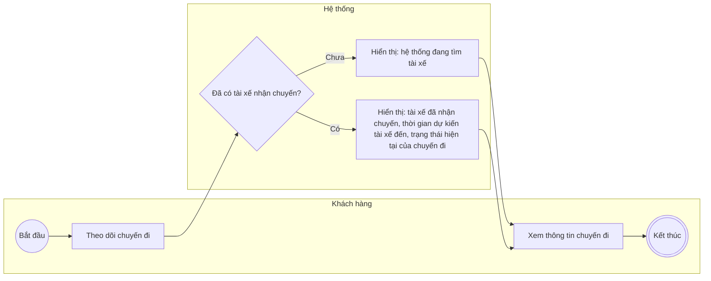
```mermaid
flowchart LR
    subgraph KH["Khách hàng"]
        S(("Bắt đầu")) --> L1["Theo dõi chuyến đi"]
        L5["Xem thông tin chuyến đi"]
        E((("Kết thúc")))
    end
    subgraph HT["Hệ thống"]
        L2{"Đã có tài xế nhận chuyến?"}
        L3["Hiển thị: hệ thống đang tìm tài xế"]
        L4["Hiển thị: tài xế đã nhận chuyến, thời gian dự kiến tài xế đến, trạng thái hiện tại của chuyến đi"]
    end
    L1 --> L2
    L2 -->|"Chưa"| L3 --> L5
    L2 -->|"Có"| L4 --> L5
    L5 --> E
```

### QT‑12: Xem lịch sử chuyến đi (BR‑12)

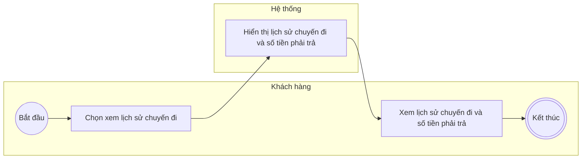
```mermaid
flowchart LR
    subgraph KH["Khách hàng"]
        S(("Bắt đầu")) --> M1["Chọn xem lịch sử chuyến đi"]
        M3["Xem lịch sử chuyến đi và số tiền phải trả"]
        E((("Kết thúc")))
    end
    subgraph HT["Hệ thống"]
        M2["Hiển thị lịch sử chuyến đi và số tiền phải trả"]
    end
    M1 --> M2 --> M3 --> E
```

### QT‑13: Đánh giá tài xế (BR‑13)

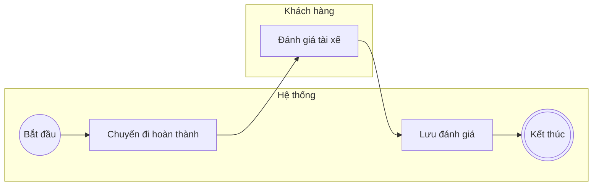
```mermaid
flowchart LR
    subgraph HT["Hệ thống"]
        S(("Bắt đầu")) --> N1["Chuyến đi hoàn thành"]
        N3["Lưu đánh giá"]
        E((("Kết thúc")))
    end
    subgraph KH["Khách hàng"]
        N2["Đánh giá tài xế"]
    end
    N1 --> N2 --> N3 --> E
```

### QT‑14: Tính cước (BR‑14)

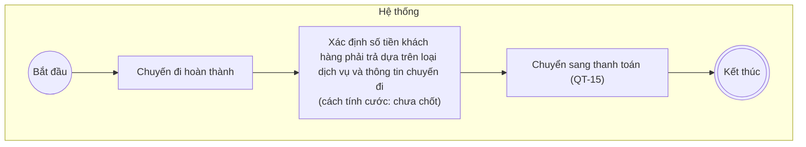
```mermaid
flowchart TB
    subgraph HT["Hệ thống"]
        S(("Bắt đầu")) --> O1["Chuyến đi hoàn thành"]
        O1 --> O2["Xác định số tiền khách hàng phải trả dựa trên loại dịch vụ và thông tin chuyến đi<br/>(cách tính cước: chưa chốt)"]
        O2 --> O3["Chuyển sang thanh toán (QT-15)"] --> E((("Kết thúc")))
    end
```

### QT‑15: Thanh toán (BR‑15)

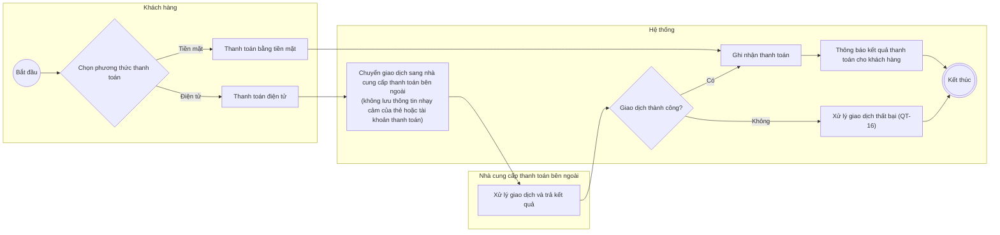
```mermaid
flowchart LR
    subgraph KH["Khách hàng"]
        S(("Bắt đầu")) --> P1{"Chọn phương thức thanh toán"}
        P2["Thanh toán bằng tiền mặt"]
        P3["Thanh toán điện tử"]
    end
    subgraph HT["Hệ thống"]
        P4["Chuyển giao dịch sang nhà cung cấp thanh toán bên ngoài<br/>(không lưu thông tin nhạy cảm của thẻ hoặc tài khoản thanh toán)"]
        P6{"Giao dịch thành công?"}
        P7["Ghi nhận thanh toán"]
        P8["Thông báo kết quả thanh toán cho khách hàng"]
        P9["Xử lý giao dịch thất bại (QT-16)"]
        E((("Kết thúc")))
    end
    subgraph NCC["Nhà cung cấp thanh toán bên ngoài"]
        P5["Xử lý giao dịch và trả kết quả"]
    end
    P1 -->|"Tiền mặt"| P2 --> P7
    P1 -->|"Điện tử"| P3 --> P4 --> P5 --> P6
    P6 -->|"Có"| P7 --> P8 --> E
    P6 -->|"Không"| P9 --> E
```

### QT‑16: Xử lý giao dịch thanh toán điện tử thất bại (BR‑16)

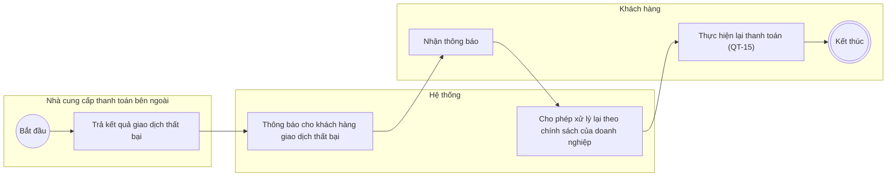
```mermaid
flowchart LR
    subgraph NCC["Nhà cung cấp thanh toán bên ngoài"]
        S(("Bắt đầu")) --> Q1["Trả kết quả giao dịch thất bại"]
    end
    subgraph HT["Hệ thống"]
        Q2["Thông báo cho khách hàng giao dịch thất bại"]
        Q4["Cho phép xử lý lại theo chính sách của doanh nghiệp"]
    end
    subgraph KH["Khách hàng"]
        Q3["Nhận thông báo"]
        Q5["Thực hiện lại thanh toán (QT-15)"]
        E((("Kết thúc")))
    end
    Q1 --> Q2 --> Q3 --> Q4 --> Q5 --> E
```

### QT‑17: Thông báo cho khách hàng (BR‑17)

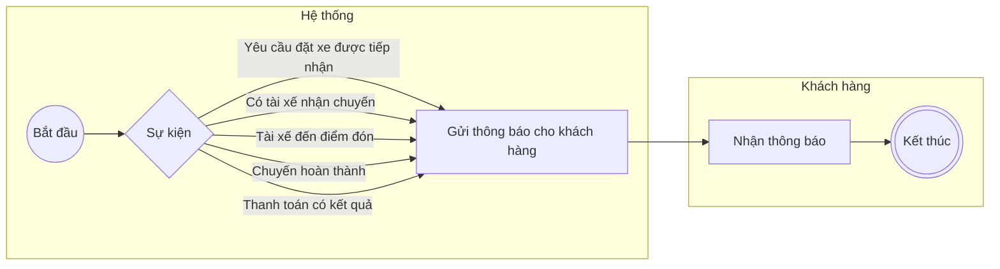
```mermaid
flowchart LR
    subgraph HT["Hệ thống"]
        S(("Bắt đầu")) --> R0{"Sự kiện"}
        R1["Gửi thông báo cho khách hàng"]
    end
    subgraph KH["Khách hàng"]
        R2["Nhận thông báo"] --> E((("Kết thúc")))
    end
    R0 -->|"Yêu cầu đặt xe được tiếp nhận"| R1
    R0 -->|"Có tài xế nhận chuyến"| R1
    R0 -->|"Tài xế đến điểm đón"| R1
    R0 -->|"Chuyến hoàn thành"| R1
    R0 -->|"Thanh toán có kết quả"| R1
    R1 --> R2
```

### QT‑18: Thông báo cho tài xế (BR‑18)

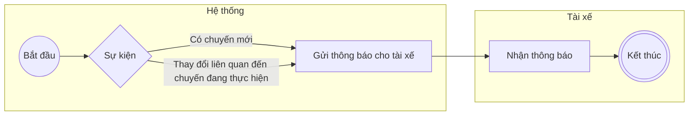
```mermaid
flowchart LR
    subgraph HT["Hệ thống"]
        S(("Bắt đầu")) --> T0{"Sự kiện"}
        T1["Gửi thông báo cho tài xế"]
    end
    subgraph TX["Tài xế"]
        T2["Nhận thông báo"] --> E((("Kết thúc")))
    end
    T0 -->|"Có chuyến mới"| T1
    T0 -->|"Thay đổi liên quan đến chuyến đang thực hiện"| T1
    T1 --> T2
```

### QT‑19: Quản lý khách hàng, tài xế, phương tiện, chuyến đi (BR‑19)

```mermaid
flowchart LR
    subgraph NV["Nhân viên vận hành"]
        S(("Bắt đầu")) --> U1["Truy cập giao diện quản trị"] --> U2{"Chọn đối tượng quản lý"}
        E((("Kết thúc")))
    end
    subgraph HT["Hệ thống"]
        U3["Hiển thị và cập nhật thông tin"]
    end
    U2 -->|"Khách hàng"| U3
    U2 -->|"Tài xế"| U3
    U2 -->|"Phương tiện"| U3
    U2 -->|"Chuyến đi"| U3
    U3 --> E
```

### QT‑20: Giám sát chuyến đi và hỗ trợ xử lý (BR‑20)

```mermaid
flowchart LR
    subgraph NV["Nhân viên vận hành"]
        S(("Bắt đầu")) --> V1{"Chọn tác vụ"}
        V4["Hỗ trợ xử lý chuyến bị lỗi"]
        E((("Kết thúc")))
    end
    subgraph HT["Hệ thống"]
        V2["Hiển thị các chuyến đang diễn ra"]
        V3["Hiển thị trạng thái tài xế"]
        V5["Hiển thị lịch sử giao dịch"]
    end
    V1 -->|"Xem chuyến đang diễn ra"| V2 --> E
    V1 -->|"Kiểm tra trạng thái tài xế"| V3 --> E
    V1 -->|"Chuyến bị lỗi"| V4 --> E
    V1 -->|"Tra cứu lịch sử giao dịch"| V5 --> E
```

### QT‑21: Kiểm soát quyền thao tác quản trị (BR‑21)

```mermaid
flowchart LR
    subgraph NV["Nhân viên vận hành"]
        S(("Bắt đầu")) --> W1["Thực hiện thao tác quản trị"]
        E((("Kết thúc")))
    end
    subgraph HT["Hệ thống"]
        W2["Kiểm soát quyền truy cập"] --> W3{"Có quyền thực hiện thao tác?"}
        W4["Cho phép thực hiện thao tác"]
        W5["Không cho thực hiện<br/>(nhân viên thông thường không thể thực hiện thao tác nhạy cảm)"]
    end
    W1 --> W2
    W3 -->|"Có"| W4 --> E
    W3 -->|"Không"| W5 --> E
```

### QT‑22: Báo cáo (BR‑22)

```mermaid
flowchart LR
    subgraph BLD["Ban lãnh đạo"]
        S(("Bắt đầu")) --> X1["Yêu cầu báo cáo"]
        X3["Xem báo cáo"]
        E((("Kết thúc")))
    end
    subgraph HT["Hệ thống"]
        X2["Tổng hợp báo cáo: số lượng chuyến, doanh thu, tỷ lệ chuyến hoàn thành, tỷ lệ hủy, hiệu quả hoạt động của tài xế"]
    end
    X1 --> X2 --> X3 --> E
```
