## 1. Stakeholder List & Roles (Danh sách & Vai trò Bên liên quan) 

| STT | Tên Stakeholder | Vai trò |
|---|---|---|
| 1 | Ban lãnh đạo / Ban giám đốc | Mong muốn xây dựng nền tảng CAB mới có khả năng phục vụ số lượng lớn khách hàng và tài xế, có thể phát triển thêm tính năng trong tương lai. Kỳ vọng hệ thống hỗ trợ ít nhất ba nhóm người dùng chính gồm khách hàng, tài xế và nhân viên vận hành. Mong muốn có báo cáo về số lượng chuyến, doanh thu, tỷ lệ chuyến hoàn thành, tỷ lệ hủy và hiệu quả hoạt động của tài xế |
| 2 | Khách hàng | Đăng ký tài khoản, đăng nhập, cập nhật thông tin cá nhân. Nhập điểm đón và điểm đến, lựa chọn loại xe, gửi yêu cầu đặt xe và theo dõi chuyến đi. Muốn biết hệ thống đang tìm tài xế, tài xế nào đã nhận chuyến, thời gian dự kiến tài xế đến và trạng thái hiện tại của chuyến đi. Thanh toán bằng tiền mặt hoặc phương thức thanh toán điện tử. Xem lịch sử chuyến đi, số tiền phải trả và đánh giá tài xế sau khi hoàn thành chuyến. |
| 3 | Tài xế | Đăng ký hoặc được nhân viên vận hành tạo tài khoản. Cập nhật hồ sơ, thông tin phương tiện và trạng thái hoạt động; chuyển sang trạng thái sẵn sàng nhận chuyến khi đang làm việc. Nhận thông báo, chấp nhận hoặc từ chối chuyến. Cập nhật trạng thái: đã đến điểm đón, đã đón khách, đang di chuyển và hoàn thành chuyến. |
| 4 | Nhân viên vận hành | Sử dụng giao diện quản trị để quản lý khách hàng, tài xế, phương tiện và chuyến đi. Tạo tài khoản cho tài xế. Xem các chuyến đang diễn ra, kiểm tra trạng thái tài xế, hỗ trợ xử lý các trường hợp chuyến bị lỗi và tra cứu lịch sử giao dịch. Một số chức năng quản trị được phân quyền để nhân viên thông thường không thể thực hiện các thao tác nhạy cảm. |
| 5 | Nhà cung cấp thanh toán bên ngoài | Doanh nghiệp muốn tích hợp với nhà cung cấp thanh toán bên ngoài, nhưng không muốn thông tin nhạy cảm của thẻ hoặc tài khoản thanh toán được lưu trực tiếp trong hệ thống CAB. |
| 6 | Business Analyst | Làm rõ với các bên liên quan về cách tính cước, tiêu chí ưu tiên tài xế, thời gian tài xế phải phản hồi, chính sách hủy chuyến, cách xử lý khi mất kết nối mạng và thời gian lưu trữ dữ liệu. Xác định phạm vi, tác nhân, quy trình nghiệp vụ, yêu cầu chức năng, yêu cầu phi chức năng, quy tắc nghiệp vụ, các trường hợp ngoại lệ và những điểm còn chưa rõ cần xác nhận với khách hàng. |
| 7 | Nhóm phát triển | Xây dựng giải pháp sau khi Business Analyst làm rõ các vấn đề chưa chốt. |

## 2. Stakeholder Matrix (Ma trận Bên liên quan)

| STT | Stakeholder | Ảnh hưởng (Influence) | Quan tâm (Interest) | Nhóm | Căn cứ trong đề |
|---|---|---|---|---|---|
| 1 | Ban lãnh đạo / Ban giám đốc | Cao | Cao | Key Decision Makers | "Ban lãnh đạo mong muốn xây dựng một nền tảng CAB mới…"; "Ban giám đốc kỳ vọng hệ thống mới hỗ trợ ít nhất ba nhóm người dùng chính"; "Ban lãnh đạo cũng mong muốn có báo cáo về số lượng chuyến, doanh thu…" |
| 2 | Khách hàng | Thấp | Cao | Engaged Supporters | Sử dụng trực tiếp hệ thống để đặt xe, theo dõi chuyến, thanh toán; "khách hàng muốn biết hệ thống đang tìm tài xế, tài xế nào đã nhận chuyến…"; không tham gia quyết định yêu cầu |
| 3 | Tài xế | Thấp | Cao | Engaged Supporters | Sử dụng trực tiếp hệ thống để nhận thông báo, chấp nhận hoặc từ chối chuyến, cập nhật trạng thái chuyến; không tham gia quyết định yêu cầu |
| 4 | Nhân viên vận hành | Thấp | Cao | Engaged Supporters | Sử dụng giao diện quản trị để quản lý khách hàng, tài xế, phương tiện, chuyến đi; "bộ phận vận hành gặp khó khăn khi muốn mở rộng hệ thống"; nhân viên thông thường không thể thực hiện thao tác nhạy cảm |
| 5 | Business Analyst | Thấp | Cao | Engaged Supporters | "Khách hàng mong muốn Business Analyst làm rõ các vấn đề này với các bên liên quan", tức BA làm rõ, không phải người chốt yêu cầu; chịu trách nhiệm xác định phạm vi, tác nhân, quy trình, yêu cầu… |
| 6 | Nhóm phát triển | Thấp | Cao | Engaged Supporters | Xây dựng giải pháp sau khi Business Analyst làm rõ các vấn đề chưa chốt; không tham gia quyết định yêu cầu |
| 7 | Nhà cung cấp thanh toán bên ngoài | Cao | Thấp | Potential Influencers | "Doanh nghiệp muốn tích hợp với một nhà cung cấp thanh toán bên ngoài"; thanh toán điện tử phụ thuộc vào nhà cung cấp; "không muốn một lỗi xảy ra ở chức năng thanh toán… làm cho toàn bộ hệ thống đặt xe ngừng hoạt động"; đề không nêu mong muốn nào của nhà cung cấp đối với dự án |

> **Minimal Impact Stakeholders:** không có stakeholder nào trong đề thuộc nhóm này.

### Sơ đồ Stakeholder Matrix

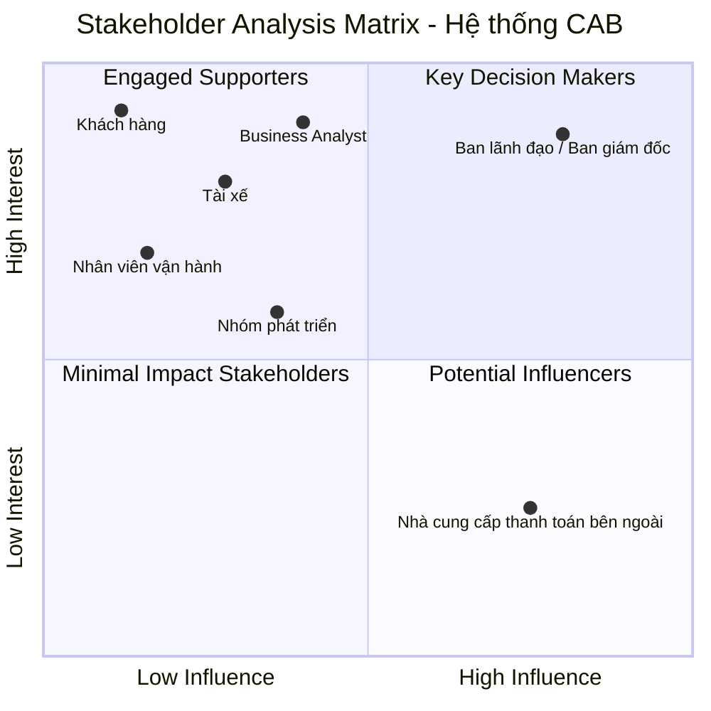
```mermaid
quadrantChart
    title Stakeholder Analysis Matrix - Hệ thống CAB
    x-axis Low Influence --> High Influence
    y-axis Low Interest --> High Interest
    quadrant-1 Key Decision Makers
    quadrant-2 Engaged Supporters
    quadrant-3 Minimal Impact Stakeholders
    quadrant-4 Potential Influencers
    "Ban lãnh đạo / Ban giám đốc": [0.80, 0.88]
    "Khách hàng": [0.12, 0.92]
    "Tài xế": [0.28, 0.80]
    "Nhân viên vận hành": [0.16, 0.68]
    "Business Analyst": [0.40, 0.90]
    "Nhóm phát triển": [0.36, 0.58]
    "Nhà cung cấp thanh toán bên ngoài": [0.75, 0.25]
```
## 3. Business Goals (Mục tiêu kinh doanh/ nghiệp vụ)

| STT | Mã | Business Goal | Mục tiêu |
|---|---|---|---|
| 1 | BG‑01 | Tìm và phân công tài xế | Khi khách hàng tạo một chuyến đi, hệ thống cần xác định các tài xế phù hợp dựa trên vị trí, trạng thái sẵn sàng và một số tiêu chí vận hành khác. Doanh nghiệp mong muốn hệ thống ưu tiên tài xế phù hợp và gần khách hàng. |
| 2 | BG‑02 | Theo dõi chuyến đi và thông báo | Sau khi gửi yêu cầu, khách hàng muốn biết hệ thống đang tìm tài xế, tài xế nào đã nhận chuyến, thời gian dự kiến tài xế đến và trạng thái hiện tại của chuyến đi. Thông báo là một thành phần quan trọng. |
| 3 | BG‑03 | Thanh toán và tính cước | Hệ thống cũng phải hỗ trợ thanh toán và tính cước. |
| 4 | BG‑04 | Phục vụ số lượng lớn, mở rộng khi tải tăng | Ban lãnh đạo mong muốn xây dựng một nền tảng CAB mới có khả năng phục vụ số lượng lớn khách hàng và tài xế. Các thành phần của hệ thống cần có khả năng mở rộng độc lập khi tải tăng. |
| 5 | BG‑05 | Phát triển lâu dài | Khách hàng không chỉ muốn một ứng dụng đặt xe đơn thuần mà muốn một nền tảng CAB có thể phát triển lâu dài, có thể phát triển thêm các tính năng trong tương lai. |
| 6 | BG‑06 | Hỗ trợ ba nhóm người dùng | Ban giám đốc kỳ vọng hệ thống mới hỗ trợ ít nhất ba nhóm người dùng chính gồm khách hàng, tài xế và nhân viên vận hành. |
| 7 | BG‑07 | Đáp ứng quy trình đặt xe | Hệ thống cần đáp ứng tốt quy trình từ khi khách hàng tạo yêu cầu, tìm và phân công tài xế, thực hiện chuyến, tính cước, thanh toán, thông báo đến đánh giá sau chuyến. |
| 8 | BG‑08 | Báo cáo | Ban lãnh đạo cũng mong muốn có báo cáo về số lượng chuyến, doanh thu, tỷ lệ chuyến hoàn thành, tỷ lệ hủy và hiệu quả hoạt động của tài xế. |
| 9 | BG‑09 | Phối hợp giữa các bộ phận | Các bộ phận trong doanh nghiệp phải có thể phối hợp thông qua hệ thống và có đủ dữ liệu để theo dõi hoạt động. |
| 10 | BG‑10 | Hoạt động ổn định | Hệ thống phải hoạt động ổn định vào các thời điểm nhu cầu tăng cao. Doanh nghiệp không muốn một lỗi xảy ra ở chức năng thanh toán hoặc thông báo làm cho toàn bộ hệ thống đặt xe ngừng hoạt động. |
| 11 | BG‑11 | Bảo mật | Thông tin cá nhân, thông tin phương tiện, dữ liệu vị trí và dữ liệu giao dịch phải được bảo vệ. Doanh nghiệp cần lưu vết các thao tác quan trọng để phục vụ kiểm tra khi có sự cố. |

## 4. Minimum Viable Product (MVP) Modules

| STT | Module | Chức năng chính | BR liên quan |
|---|---|---|---|
| 1 | Quản lý tài khoản khách hàng | Đăng ký tài khoản, đăng nhập, cập nhật thông tin cá nhân. Khách hàng phải được xác thực trước khi sử dụng các chức năng yêu cầu tài khoản. | BR-06, BR-11 |
| 2 | Quản lý tài xế và phương tiện | Tài xế đăng ký hoặc được nhân viên vận hành tạo tài khoản; cập nhật hồ sơ, thông tin phương tiện và trạng thái hoạt động; chuyển sang trạng thái sẵn sàng nhận chuyến khi đang làm việc. Lưu thông tin vị trí của tài xế để hỗ trợ việc tìm tài xế gần khách hàng và cải thiện khả năng dự kiến thời gian đến. Tài xế phải được xác thực trước khi sử dụng các chức năng yêu cầu tài khoản. | BR-01, BR-06, BR-11 |
| 3 | Đặt xe và chuyến đi | **Đặt xe:** nhập điểm đón và điểm đến, lựa chọn loại xe, gửi yêu cầu đặt xe. **Tìm và phân công tài xế:** xác định các tài xế phù hợp dựa trên vị trí, trạng thái sẵn sàng và một số tiêu chí vận hành khác; ưu tiên tài xế phù hợp và gần khách hàng; khi có yêu cầu phù hợp, tài xế nhận được thông báo và có thể chấp nhận hoặc từ chối chuyến; nếu tài xế được đề xuất không phản hồi hoặc từ chối, hệ thống tiếp tục tìm tài xế khác mà không yêu cầu khách hàng tạo lại yêu cầu; không tìm được tài xế thì khách hàng phải được thông báo rõ ràng. **Thực hiện và theo dõi chuyến đi:** tài xế cập nhật trạng thái đã đến điểm đón, đã đón khách, đang di chuyển và hoàn thành chuyến; khách hàng theo dõi hệ thống đang tìm tài xế, tài xế nào đã nhận chuyến, thời gian dự kiến tài xế đến và trạng thái hiện tại của chuyến đi; xem lịch sử chuyến đi và số tiền phải trả. **Đánh giá:** khách hàng đánh giá tài xế sau khi hoàn thành chuyến. | BR-01, BR-02, BR-07 |
| 4 | Tính cước và thanh toán | Sau khi chuyến đi hoàn thành, xác định số tiền khách hàng phải trả dựa trên loại dịch vụ và thông tin chuyến đi. Khách hàng thanh toán bằng tiền mặt hoặc phương thức thanh toán điện tử. Tích hợp với nhà cung cấp thanh toán bên ngoài; thông tin nhạy cảm của thẻ hoặc tài khoản thanh toán không được lưu trực tiếp trong hệ thống CAB. Giao dịch thanh toán điện tử thất bại thì thông báo cho khách hàng và cho phép xử lý lại theo chính sách của doanh nghiệp. | BR-03, BR-07, BR-11 |
| 5 | Thông báo | Thông báo cho khách hàng khi yêu cầu đặt xe được tiếp nhận, khi có tài xế nhận chuyến, khi tài xế đến điểm đón, khi chuyến hoàn thành và khi thanh toán có kết quả. Thông báo cho tài xế về các chuyến mới hoặc những thay đổi liên quan đến chuyến đang thực hiện. | BR-02, BR-07 |
| 6 | Quản trị vận hành | Giao diện quản trị để quản lý khách hàng, tài xế, phương tiện và chuyến đi; xem các chuyến đang diễn ra, kiểm tra trạng thái tài xế, hỗ trợ xử lý các trường hợp chuyến bị lỗi và tra cứu lịch sử giao dịch. Một số chức năng quản trị được phân quyền để nhân viên thông thường không thể thực hiện các thao tác nhạy cảm. Các thao tác quản trị phải được kiểm soát quyền truy cập. | BR-06, BR-11 |
| 7 | Báo cáo | Báo cáo về số lượng chuyến, doanh thu, tỷ lệ chuyến hoàn thành, tỷ lệ hủy và hiệu quả hoạt động của tài xế. | BR-08 |

> **Ngoài phạm vi MVP (đề ghi "trong tương lai"):** bổ sung các loại dịch vụ mới, thêm phương thức thanh toán, thêm nhà cung cấp thông báo, mở rộng thêm các kênh thông báo, thay đổi một số thành phần kỹ thuật. *(BR-05)*

## 5. Business Requirements – CAB System MVP (Yêu cầu nghiệp vụ)

| Mã BR | Yêu cầu nghiệp vụ | Module |
|---|---|---|
| BR‑01 | Khách hàng đăng ký tài khoản, đăng nhập, cập nhật thông tin cá nhân. | 1 |
| BR‑02 | Khách hàng và tài xế phải được xác thực trước khi sử dụng các chức năng yêu cầu tài khoản. | 1, 2 |
| BR‑03 | Tài xế đăng ký hoặc được nhân viên vận hành tạo tài khoản; cập nhật hồ sơ, thông tin phương tiện và trạng thái hoạt động. | 2 |
| BR‑04 | Tài xế chuyển sang trạng thái sẵn sàng nhận chuyến khi đang làm việc. | 2 |
| BR‑05 | Hệ thống lưu thông tin vị trí của tài xế để hỗ trợ việc tìm tài xế gần khách hàng và cải thiện khả năng dự kiến thời gian đến. | 2 |
| BR‑06 | Khách hàng nhập điểm đón và điểm đến, lựa chọn loại xe và gửi yêu cầu đặt xe. | 3 |
| BR‑07 | Hệ thống xác định các tài xế phù hợp dựa trên vị trí, trạng thái sẵn sàng và một số tiêu chí vận hành khác; ưu tiên tài xế phù hợp và gần khách hàng. | 3 |
| BR‑08 | Khi có yêu cầu phù hợp, tài xế nhận được thông báo và có thể chấp nhận hoặc từ chối chuyến. | 3, 5 |
| BR‑09 | Nếu tài xế được đề xuất không phản hồi hoặc từ chối, hệ thống tiếp tục tìm tài xế khác mà không yêu cầu khách hàng tạo lại yêu cầu. Không tìm được tài xế thì khách hàng phải được thông báo rõ ràng. | 3, 5 |
| BR‑10 | Tài xế cập nhật trạng thái chuyến đi: đã đến điểm đón, đã đón khách, đang di chuyển và hoàn thành chuyến. | 3 |
| BR‑11 | Khách hàng theo dõi chuyến đi: hệ thống đang tìm tài xế, tài xế nào đã nhận chuyến, thời gian dự kiến tài xế đến và trạng thái hiện tại của chuyến đi. | 3 |
| BR‑12 | Khách hàng xem lịch sử chuyến đi và số tiền phải trả. | 3 |
| BR‑13 | Khách hàng đánh giá tài xế sau khi hoàn thành chuyến. | 3 |
| BR‑14 | Sau khi chuyến đi hoàn thành, hệ thống xác định số tiền khách hàng phải trả dựa trên loại dịch vụ và thông tin chuyến đi. | 4 |
| BR‑15 | Khách hàng thanh toán bằng tiền mặt hoặc phương thức thanh toán điện tử qua nhà cung cấp thanh toán bên ngoài; thông tin nhạy cảm của thẻ hoặc tài khoản thanh toán không được lưu trực tiếp trong hệ thống CAB. | 4 |
| BR‑16 | Giao dịch thanh toán điện tử thất bại thì hệ thống thông báo cho khách hàng và cho phép xử lý lại theo chính sách của doanh nghiệp. | 4, 5 |
| BR‑17 | Khách hàng nhận thông báo khi yêu cầu đặt xe được tiếp nhận, khi có tài xế nhận chuyến, khi tài xế đến điểm đón, khi chuyến hoàn thành và khi thanh toán có kết quả. | 5 |
| BR‑18 | Tài xế nhận thông báo về các chuyến mới hoặc những thay đổi liên quan đến chuyến đang thực hiện. | 5 |
| BR‑19 | Nhân viên vận hành quản lý khách hàng, tài xế, phương tiện và chuyến đi qua giao diện quản trị. | 6 |
| BR‑20 | Nhân viên vận hành xem các chuyến đang diễn ra, kiểm tra trạng thái tài xế, hỗ trợ xử lý các trường hợp chuyến bị lỗi và tra cứu lịch sử giao dịch. | 6 |
| BR‑21 | Một số chức năng quản trị được phân quyền để nhân viên thông thường không thể thực hiện các thao tác nhạy cảm; các thao tác quản trị phải được kiểm soát quyền truy cập. | 6 |
| BR‑22 | Ban lãnh đạo có báo cáo về số lượng chuyến, doanh thu, tỷ lệ chuyến hoàn thành, tỷ lệ hủy và hiệu quả hoạt động của tài xế. | 7 |

## 6. Business Process Modeling (Mô hình hóa Quy trình Nghiệp vụ)

| STT | Mã QT | Quy trình | BR | Tác nhân |
|---|---|---|---|---|
| 1 | QT‑01 | Đăng ký, đăng nhập, cập nhật thông tin cá nhân | BR‑01 | Khách hàng |
| 2 | QT‑02 | Xác thực trước khi sử dụng chức năng yêu cầu tài khoản | BR‑02 | Khách hàng, Tài xế |
| 3 | QT‑03 | Tạo tài khoản và cập nhật hồ sơ tài xế | BR‑03 | Tài xế, Nhân viên vận hành |
| 4 | QT‑04 | Chuyển sang trạng thái sẵn sàng nhận chuyến | BR‑04 | Tài xế |
| 5 | QT‑05 | Lưu thông tin vị trí tài xế | BR‑05 | Tài xế |
| 6 | QT‑06 | Đặt xe | BR‑06 | Khách hàng |
| 7 | QT‑07 | Xác định tài xế phù hợp | BR‑07 | Hệ thống |
| 8 | QT‑08 | Tài xế chấp nhận hoặc từ chối chuyến | BR‑08 | Tài xế |
| 9 | QT‑09 | Xử lý khi tài xế không phản hồi, từ chối hoặc không tìm được tài xế | BR‑09 | Tài xế, Khách hàng |
| 10 | QT‑10 | Cập nhật trạng thái chuyến đi | BR‑10 | Tài xế |
| 11 | QT‑11 | Theo dõi chuyến đi | BR‑11 | Khách hàng |
| 12 | QT‑12 | Xem lịch sử chuyến đi | BR‑12 | Khách hàng |
| 13 | QT‑13 | Đánh giá tài xế | BR‑13 | Khách hàng |
| 14 | QT‑14 | Tính cước | BR‑14 | Hệ thống |
| 15 | QT‑15 | Thanh toán | BR‑15 | Khách hàng, Nhà cung cấp thanh toán bên ngoài |
| 16 | QT‑16 | Xử lý giao dịch thanh toán điện tử thất bại | BR‑16 | Khách hàng, Nhà cung cấp thanh toán bên ngoài |
| 17 | QT‑17 | Thông báo cho khách hàng | BR‑17 | Khách hàng |
| 18 | QT‑18 | Thông báo cho tài xế | BR‑18 | Tài xế |
| 19 | QT‑19 | Quản lý khách hàng, tài xế, phương tiện, chuyến đi | BR‑19 | Nhân viên vận hành |
| 20 | QT‑20 | Giám sát chuyến đi và hỗ trợ xử lý | BR‑20 | Nhân viên vận hành |
| 21 | QT‑21 | Kiểm soát quyền thao tác quản trị | BR‑21 | Nhân viên vận hành |
| 22 | QT‑22 | Báo cáo | BR‑22 | Ban lãnh đạo |

### Quy trình tổng thể đặt xe (BG‑07)

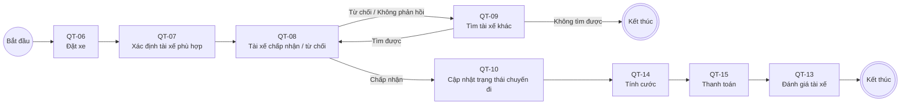
```mermaid
flowchart LR
    S(("Bắt đầu")) --> Q6["QT-06<br/>Đặt xe"] --> Q7["QT-07<br/>Xác định tài xế phù hợp"] --> Q8["QT-08<br/>Tài xế chấp nhận / từ chối"]
    Q8 -->|"Chấp nhận"| Q10["QT-10<br/>Cập nhật trạng thái chuyến đi"]
    Q8 -->|"Từ chối / Không phản hồi"| Q9["QT-09<br/>Tìm tài xế khác"]
    Q9 -->|"Tìm được"| Q8
    Q9 -->|"Không tìm được"| E1((("Kết thúc")))
    Q10 --> Q14["QT-14<br/>Tính cước"] --> Q15["QT-15<br/>Thanh toán"] --> Q13["QT-13<br/>Đánh giá tài xế"] --> E2((("Kết thúc")))
```

### QT‑01: Đăng ký, đăng nhập, cập nhật thông tin cá nhân (BR‑01)

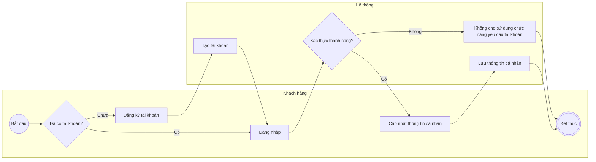
```mermaid
flowchart LR
    subgraph KH["Khách hàng"]
        S(("Bắt đầu")) --> A1{"Đã có tài khoản?"}
        A2["Đăng ký tài khoản"]
        A4["Đăng nhập"]
        A7["Cập nhật thông tin cá nhân"]
        E((("Kết thúc")))
    end
    subgraph HT["Hệ thống"]
        A3["Tạo tài khoản"]
        A5{"Xác thực thành công?"}
        A6["Không cho sử dụng chức năng yêu cầu tài khoản"]
        A8["Lưu thông tin cá nhân"]
    end
    A1 -->|"Chưa"| A2 --> A3 --> A4
    A1 -->|"Có"| A4
    A4 --> A5
    A5 -->|"Không"| A6 --> E
    A5 -->|"Có"| A7 --> A8 --> E
```

### QT‑02: Xác thực trước khi sử dụng chức năng yêu cầu tài khoản (BR‑02)

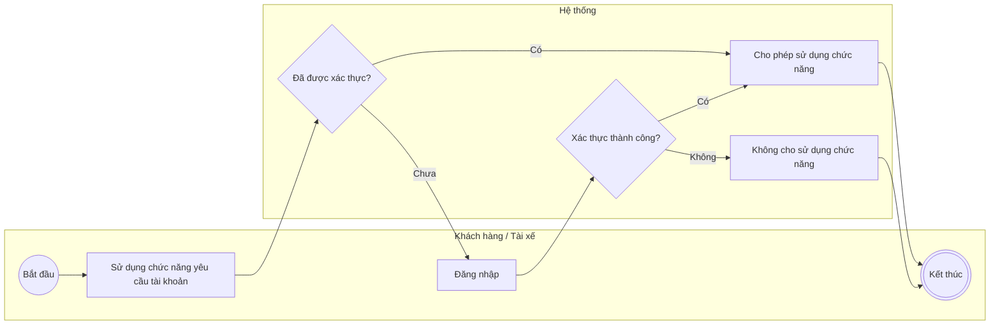
```mermaid
flowchart LR
    subgraph ND["Khách hàng / Tài xế"]
        S(("Bắt đầu")) --> B1["Sử dụng chức năng yêu cầu tài khoản"]
        B3["Đăng nhập"]
        E((("Kết thúc")))
    end
    subgraph HT["Hệ thống"]
        B2{"Đã được xác thực?"}
        B4{"Xác thực thành công?"}
        B5["Cho phép sử dụng chức năng"]
        B6["Không cho sử dụng chức năng"]
    end
    B1 --> B2
    B2 -->|"Có"| B5
    B2 -->|"Chưa"| B3 --> B4
    B4 -->|"Có"| B5 --> E
    B4 -->|"Không"| B6 --> E
```

### QT‑03: Tạo tài khoản và cập nhật hồ sơ tài xế (BR‑03)

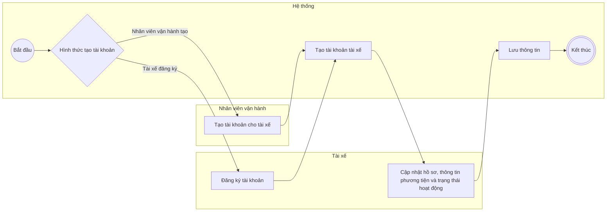
```mermaid
flowchart LR
    subgraph TX["Tài xế"]
        C2["Đăng ký tài khoản"]
        C5["Cập nhật hồ sơ, thông tin phương tiện và trạng thái hoạt động"]
    end
    subgraph NV["Nhân viên vận hành"]
        C3["Tạo tài khoản cho tài xế"]
    end
    subgraph HT["Hệ thống"]
        S(("Bắt đầu")) --> C1{"Hình thức tạo tài khoản"}
        C4["Tạo tài khoản tài xế"]
        C6["Lưu thông tin"]
        E((("Kết thúc")))
    end
    C1 -->|"Tài xế đăng ký"| C2 --> C4
    C1 -->|"Nhân viên vận hành tạo"| C3 --> C4
    C4 --> C5 --> C6 --> E
```

### QT‑04: Chuyển sang trạng thái sẵn sàng nhận chuyến (BR‑04)

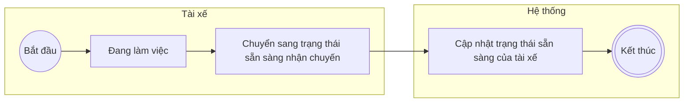
```mermaid
flowchart LR
    subgraph TX["Tài xế"]
        S(("Bắt đầu")) --> D1["Đang làm việc"] --> D2["Chuyển sang trạng thái sẵn sàng nhận chuyến"]
    end
    subgraph HT["Hệ thống"]
        D3["Cập nhật trạng thái sẵn sàng của tài xế"]
        E((("Kết thúc")))
    end
    D2 --> D3 --> E
```

### QT‑05: Lưu thông tin vị trí tài xế (BR‑05)

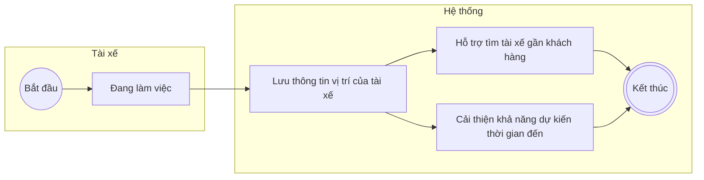
```mermaid
flowchart LR
    subgraph TX["Tài xế"]
        S(("Bắt đầu")) --> F1["Đang làm việc"]
    end
    subgraph HT["Hệ thống"]
        F2["Lưu thông tin vị trí của tài xế"]
        F3["Hỗ trợ tìm tài xế gần khách hàng"]
        F4["Cải thiện khả năng dự kiến thời gian đến"]
        E((("Kết thúc")))
    end
    F1 --> F2
    F2 --> F3 --> E
    F2 --> F4 --> E
```

### QT‑06: Đặt xe (BR‑06)

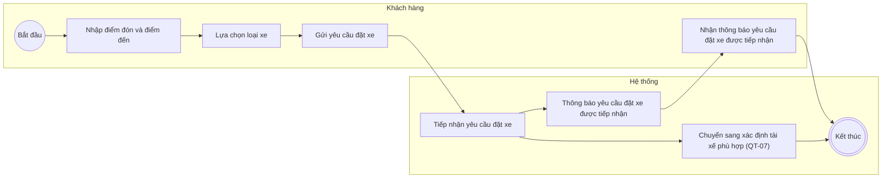
```mermaid
flowchart LR
    subgraph KH["Khách hàng"]
        S(("Bắt đầu")) --> G1["Nhập điểm đón và điểm đến"] --> G2["Lựa chọn loại xe"] --> G3["Gửi yêu cầu đặt xe"]
        G6["Nhận thông báo yêu cầu đặt xe được tiếp nhận"]
    end
    subgraph HT["Hệ thống"]
        G4["Tiếp nhận yêu cầu đặt xe"]
        G5["Thông báo yêu cầu đặt xe được tiếp nhận"]
        G7["Chuyển sang xác định tài xế phù hợp (QT-07)"]
        E((("Kết thúc")))
    end
    G3 --> G4
    G4 --> G5 --> G6 --> E
    G4 --> G7 --> E
```

### QT‑07: Xác định tài xế phù hợp (BR‑07)

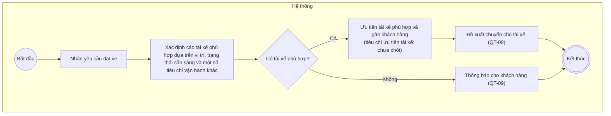
```mermaid
flowchart TB
    subgraph HT["Hệ thống"]
        S(("Bắt đầu")) --> H1["Nhận yêu cầu đặt xe"]
        H1 --> H2["Xác định các tài xế phù hợp dựa trên vị trí, trạng thái sẵn sàng và một số tiêu chí vận hành khác"]
        H2 --> H3{"Có tài xế phù hợp?"}
        H3 -->|"Có"| H4["Ưu tiên tài xế phù hợp và gần khách hàng<br/>(tiêu chí ưu tiên tài xế: chưa chốt)"]
        H4 --> H5["Đề xuất chuyến cho tài xế (QT-08)"] --> E((("Kết thúc")))
        H3 -->|"Không"| H6["Thông báo cho khách hàng (QT-09)"] --> E
    end
```

### QT‑08: Tài xế chấp nhận hoặc từ chối chuyến (BR‑08)

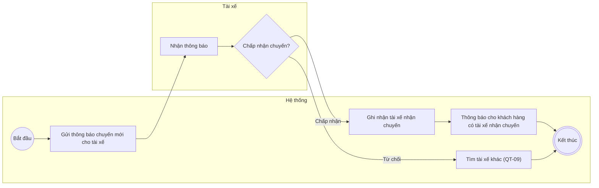
```mermaid
flowchart LR
    subgraph HT["Hệ thống"]
        S(("Bắt đầu")) --> I1["Gửi thông báo chuyến mới cho tài xế"]
        I4["Ghi nhận tài xế nhận chuyến"]
        I5["Thông báo cho khách hàng có tài xế nhận chuyến"]
        I6["Tìm tài xế khác (QT-09)"]
        E((("Kết thúc")))
    end
    subgraph TX["Tài xế"]
        I2["Nhận thông báo"] --> I3{"Chấp nhận chuyến?"}
    end
    I1 --> I2
    I3 -->|"Chấp nhận"| I4 --> I5 --> E
    I3 -->|"Từ chối"| I6 --> E
```

### QT‑09: Xử lý khi tài xế không phản hồi, từ chối hoặc không tìm được tài xế (BR‑09)

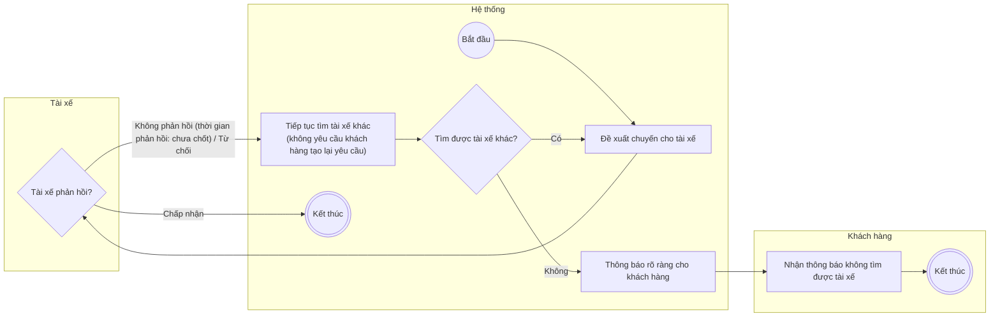
```mermaid
flowchart LR
    subgraph TX["Tài xế"]
        J2{"Tài xế phản hồi?"}
    end
    subgraph HT["Hệ thống"]
        S(("Bắt đầu")) --> J1["Đề xuất chuyến cho tài xế"]
        J3["Tiếp tục tìm tài xế khác<br/>(không yêu cầu khách hàng tạo lại yêu cầu)"]
        J4{"Tìm được tài xế khác?"}
        J5["Thông báo rõ ràng cho khách hàng"]
        E1((("Kết thúc")))
    end
    subgraph KH["Khách hàng"]
        J6["Nhận thông báo không tìm được tài xế"]
        E2((("Kết thúc")))
    end
    J1 --> J2
    J2 -->|"Không phản hồi (thời gian phản hồi: chưa chốt) / Từ chối"| J3 --> J4
    J2 -->|"Chấp nhận"| E1
    J4 -->|"Có"| J1
    J4 -->|"Không"| J5 --> J6 --> E2
```

### QT‑10: Cập nhật trạng thái chuyến đi (BR‑10)

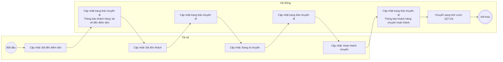
```mermaid
flowchart LR
    subgraph TX["Tài xế"]
        S(("Bắt đầu")) --> K1["Cập nhật: Đã đến điểm đón"]
        K3["Cập nhật: Đã đón khách"]
        K5["Cập nhật: Đang di chuyển"]
        K7["Cập nhật: Hoàn thành chuyến"]
    end
    subgraph HT["Hệ thống"]
        K2["Cập nhật trạng thái chuyến đi<br/>Thông báo khách hàng: tài xế đến điểm đón"]
        K4["Cập nhật trạng thái chuyến đi"]
        K6["Cập nhật trạng thái chuyến đi"]
        K8["Cập nhật trạng thái chuyến đi<br/>Thông báo khách hàng: chuyến hoàn thành"]
        K9["Chuyển sang tính cước (QT-14)"]
        E((("Kết thúc")))
    end
    K1 --> K2 --> K3 --> K4 --> K5 --> K6 --> K7 --> K8 --> K9 --> E
```

### QT‑11: Theo dõi chuyến đi (BR‑11)

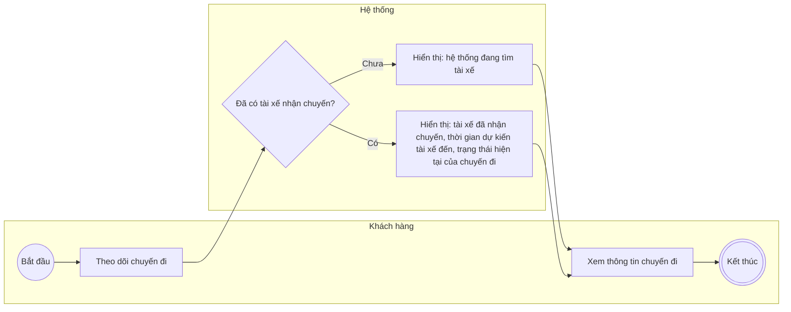
```mermaid
flowchart LR
    subgraph KH["Khách hàng"]
        S(("Bắt đầu")) --> L1["Theo dõi chuyến đi"]
        L5["Xem thông tin chuyến đi"]
        E((("Kết thúc")))
    end
    subgraph HT["Hệ thống"]
        L2{"Đã có tài xế nhận chuyến?"}
        L3["Hiển thị: hệ thống đang tìm tài xế"]
        L4["Hiển thị: tài xế đã nhận chuyến, thời gian dự kiến tài xế đến, trạng thái hiện tại của chuyến đi"]
    end
    L1 --> L2
    L2 -->|"Chưa"| L3 --> L5
    L2 -->|"Có"| L4 --> L5
    L5 --> E
```

### QT‑12: Xem lịch sử chuyến đi (BR‑12)

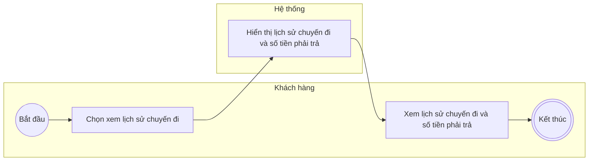
```mermaid
flowchart LR
    subgraph KH["Khách hàng"]
        S(("Bắt đầu")) --> M1["Chọn xem lịch sử chuyến đi"]
        M3["Xem lịch sử chuyến đi và số tiền phải trả"]
        E((("Kết thúc")))
    end
    subgraph HT["Hệ thống"]
        M2["Hiển thị lịch sử chuyến đi và số tiền phải trả"]
    end
    M1 --> M2 --> M3 --> E
```

### QT‑13: Đánh giá tài xế (BR‑13)

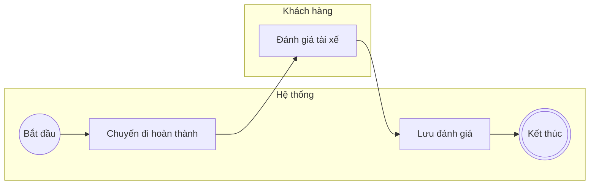
```mermaid
flowchart LR
    subgraph HT["Hệ thống"]
        S(("Bắt đầu")) --> N1["Chuyến đi hoàn thành"]
        N3["Lưu đánh giá"]
        E((("Kết thúc")))
    end
    subgraph KH["Khách hàng"]
        N2["Đánh giá tài xế"]
    end
    N1 --> N2 --> N3 --> E
```

### QT‑14: Tính cước (BR‑14)

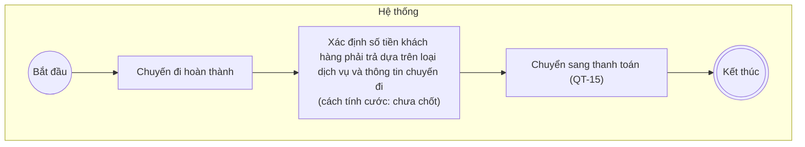
```mermaid
flowchart TB
    subgraph HT["Hệ thống"]
        S(("Bắt đầu")) --> O1["Chuyến đi hoàn thành"]
        O1 --> O2["Xác định số tiền khách hàng phải trả dựa trên loại dịch vụ và thông tin chuyến đi<br/>(cách tính cước: chưa chốt)"]
        O2 --> O3["Chuyển sang thanh toán (QT-15)"] --> E((("Kết thúc")))
    end
```

### QT‑15: Thanh toán (BR‑15)

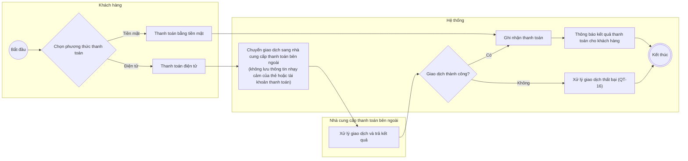
```mermaid
flowchart LR
    subgraph KH["Khách hàng"]
        S(("Bắt đầu")) --> P1{"Chọn phương thức thanh toán"}
        P2["Thanh toán bằng tiền mặt"]
        P3["Thanh toán điện tử"]
    end
    subgraph HT["Hệ thống"]
        P4["Chuyển giao dịch sang nhà cung cấp thanh toán bên ngoài<br/>(không lưu thông tin nhạy cảm của thẻ hoặc tài khoản thanh toán)"]
        P6{"Giao dịch thành công?"}
        P7["Ghi nhận thanh toán"]
        P8["Thông báo kết quả thanh toán cho khách hàng"]
        P9["Xử lý giao dịch thất bại (QT-16)"]
        E((("Kết thúc")))
    end
    subgraph NCC["Nhà cung cấp thanh toán bên ngoài"]
        P5["Xử lý giao dịch và trả kết quả"]
    end
    P1 -->|"Tiền mặt"| P2 --> P7
    P1 -->|"Điện tử"| P3 --> P4 --> P5 --> P6
    P6 -->|"Có"| P7 --> P8 --> E
    P6 -->|"Không"| P9 --> E
```

### QT‑16: Xử lý giao dịch thanh toán điện tử thất bại (BR‑16)

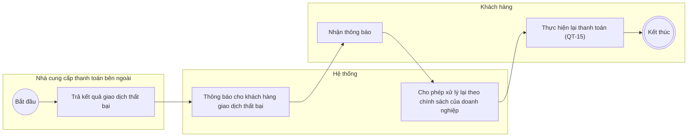
```mermaid
flowchart LR
    subgraph NCC["Nhà cung cấp thanh toán bên ngoài"]
        S(("Bắt đầu")) --> Q1["Trả kết quả giao dịch thất bại"]
    end
    subgraph HT["Hệ thống"]
        Q2["Thông báo cho khách hàng giao dịch thất bại"]
        Q4["Cho phép xử lý lại theo chính sách của doanh nghiệp"]
    end
    subgraph KH["Khách hàng"]
        Q3["Nhận thông báo"]
        Q5["Thực hiện lại thanh toán (QT-15)"]
        E((("Kết thúc")))
    end
    Q1 --> Q2 --> Q3 --> Q4 --> Q5 --> E
```

### QT‑17: Thông báo cho khách hàng (BR‑17)

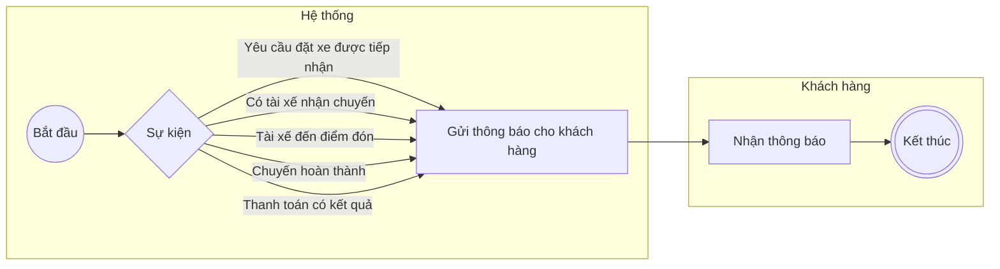
```mermaid
flowchart LR
    subgraph HT["Hệ thống"]
        S(("Bắt đầu")) --> R0{"Sự kiện"}
        R1["Gửi thông báo cho khách hàng"]
    end
    subgraph KH["Khách hàng"]
        R2["Nhận thông báo"] --> E((("Kết thúc")))
    end
    R0 -->|"Yêu cầu đặt xe được tiếp nhận"| R1
    R0 -->|"Có tài xế nhận chuyến"| R1
    R0 -->|"Tài xế đến điểm đón"| R1
    R0 -->|"Chuyến hoàn thành"| R1
    R0 -->|"Thanh toán có kết quả"| R1
    R1 --> R2
```

### QT‑18: Thông báo cho tài xế (BR‑18)

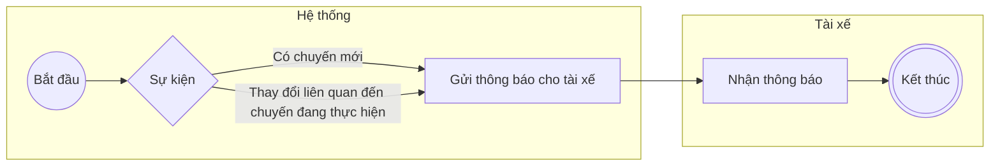
```mermaid
flowchart LR
    subgraph HT["Hệ thống"]
        S(("Bắt đầu")) --> T0{"Sự kiện"}
        T1["Gửi thông báo cho tài xế"]
    end
    subgraph TX["Tài xế"]
        T2["Nhận thông báo"] --> E((("Kết thúc")))
    end
    T0 -->|"Có chuyến mới"| T1
    T0 -->|"Thay đổi liên quan đến chuyến đang thực hiện"| T1
    T1 --> T2
```

### QT‑19: Quản lý khách hàng, tài xế, phương tiện, chuyến đi (BR‑19)

```mermaid
flowchart LR
    subgraph NV["Nhân viên vận hành"]
        S(("Bắt đầu")) --> U1["Truy cập giao diện quản trị"] --> U2{"Chọn đối tượng quản lý"}
        E((("Kết thúc")))
    end
    subgraph HT["Hệ thống"]
        U3["Hiển thị và cập nhật thông tin"]
    end
    U2 -->|"Khách hàng"| U3
    U2 -->|"Tài xế"| U3
    U2 -->|"Phương tiện"| U3
    U2 -->|"Chuyến đi"| U3
    U3 --> E
```

### QT‑20: Giám sát chuyến đi và hỗ trợ xử lý (BR‑20)

```mermaid
flowchart LR
    subgraph NV["Nhân viên vận hành"]
        S(("Bắt đầu")) --> V1{"Chọn tác vụ"}
        V4["Hỗ trợ xử lý chuyến bị lỗi"]
        E((("Kết thúc")))
    end
    subgraph HT["Hệ thống"]
        V2["Hiển thị các chuyến đang diễn ra"]
        V3["Hiển thị trạng thái tài xế"]
        V5["Hiển thị lịch sử giao dịch"]
    end
    V1 -->|"Xem chuyến đang diễn ra"| V2 --> E
    V1 -->|"Kiểm tra trạng thái tài xế"| V3 --> E
    V1 -->|"Chuyến bị lỗi"| V4 --> E
    V1 -->|"Tra cứu lịch sử giao dịch"| V5 --> E
```

### QT‑21: Kiểm soát quyền thao tác quản trị (BR‑21)

```mermaid
flowchart LR
    subgraph NV["Nhân viên vận hành"]
        S(("Bắt đầu")) --> W1["Thực hiện thao tác quản trị"]
        E((("Kết thúc")))
    end
    subgraph HT["Hệ thống"]
        W2["Kiểm soát quyền truy cập"] --> W3{"Có quyền thực hiện thao tác?"}
        W4["Cho phép thực hiện thao tác"]
        W5["Không cho thực hiện<br/>(nhân viên thông thường không thể thực hiện thao tác nhạy cảm)"]
    end
    W1 --> W2
    W3 -->|"Có"| W4 --> E
    W3 -->|"Không"| W5 --> E
```

### QT‑22: Báo cáo (BR‑22)

```mermaid
flowchart LR
    subgraph BLD["Ban lãnh đạo"]
        S(("Bắt đầu")) --> X1["Yêu cầu báo cáo"]
        X3["Xem báo cáo"]
        E((("Kết thúc")))
    end
    subgraph HT["Hệ thống"]
        X2["Tổng hợp báo cáo: số lượng chuyến, doanh thu, tỷ lệ chuyến hoàn thành, tỷ lệ hủy, hiệu quả hoạt động của tài xế"]
    end
    X1 --> X2 --> X3 --> E
```
## 7. Functional Requirements (Yêu cầu Chức năng)

| STT | Mã FR | Yêu cầu chức năng | BR liên quan |
|---|---|---|---|
| 1 | FR‑01 | Hệ thống phải cho phép khách hàng đăng ký tài khoản. | BR‑01 |
| 2 | FR‑02 | Hệ thống phải cho phép khách hàng đăng nhập. | BR‑01 |
| 3 | FR‑03 | Hệ thống phải cho phép khách hàng cập nhật thông tin cá nhân. | BR‑01 |
| 4 | FR‑04 | Hệ thống phải xác thực khách hàng và tài xế trước khi cho sử dụng các chức năng yêu cầu tài khoản. | BR‑02 |
| 5 | FR‑05 | Hệ thống phải cho phép tài xế đăng ký tài khoản. | BR‑03 |
| 6 | FR‑06 | Hệ thống phải cho phép nhân viên vận hành tạo tài khoản cho tài xế. | BR‑03 |
| 7 | FR‑07 | Hệ thống phải cho phép tài xế cập nhật hồ sơ, thông tin phương tiện và trạng thái hoạt động. | BR‑03 |
| 8 | FR‑08 | Hệ thống phải cho phép tài xế chuyển sang trạng thái sẵn sàng nhận chuyến khi đang làm việc. | BR‑04 |
| 9 | FR‑09 | Hệ thống phải lưu thông tin vị trí của tài xế để hỗ trợ việc tìm tài xế gần khách hàng và cải thiện khả năng dự kiến thời gian đến. | BR‑05 |
| 10 | FR‑10 | Hệ thống phải cho phép khách hàng nhập điểm đón và điểm đến. | BR‑06 |
| 11 | FR‑11 | Hệ thống phải cho phép khách hàng lựa chọn loại xe. | BR‑06 |
| 12 | FR‑12 | Hệ thống phải cho phép khách hàng gửi yêu cầu đặt xe. | BR‑06 |
| 13 | FR‑13 | Khi khách hàng tạo một chuyến đi, hệ thống phải xác định các tài xế phù hợp dựa trên vị trí, trạng thái sẵn sàng và một số tiêu chí vận hành khác. | BR‑07 |
| 14 | FR‑14 | Hệ thống phải ưu tiên tài xế phù hợp và gần khách hàng. | BR‑07 |
| 15 | FR‑15 | Hệ thống phải gửi thông báo cho tài xế khi có yêu cầu phù hợp (chuyến mới). | BR‑08, BR‑18 |
| 16 | FR‑16 | Hệ thống phải cho phép tài xế chấp nhận hoặc từ chối chuyến. | BR‑08 |
| 17 | FR‑17 | Nếu tài xế được đề xuất không phản hồi hoặc từ chối, hệ thống phải tiếp tục tìm tài xế khác mà không yêu cầu khách hàng tạo lại yêu cầu. | BR‑09 |
| 18 | FR‑18 | Hệ thống phải thông báo rõ ràng cho khách hàng khi không tìm được tài xế. | BR‑09 |
| 19 | FR‑19 | Hệ thống phải cho phép tài xế cập nhật trạng thái chuyến đi: đã đến điểm đón, đã đón khách, đang di chuyển và hoàn thành chuyến. | BR‑10 |
| 20 | FR‑20 | Hệ thống phải cho phép khách hàng theo dõi chuyến đi: hệ thống đang tìm tài xế, tài xế nào đã nhận chuyến, thời gian dự kiến tài xế đến và trạng thái hiện tại của chuyến đi. | BR‑11 |
| 21 | FR‑21 | Hệ thống phải cho phép khách hàng xem lịch sử chuyến đi và số tiền phải trả. | BR‑12 |
| 22 | FR‑22 | Hệ thống phải cho phép khách hàng đánh giá tài xế sau khi hoàn thành chuyến. | BR‑13 |
| 23 | FR‑23 | Sau khi chuyến đi hoàn thành, hệ thống phải xác định số tiền khách hàng phải trả dựa trên loại dịch vụ và thông tin chuyến đi. | BR‑14 |
| 24 | FR‑24 | Hệ thống phải cho phép khách hàng thanh toán bằng tiền mặt. | BR‑15 |
| 25 | FR‑25 | Hệ thống phải cho phép khách hàng thanh toán điện tử qua nhà cung cấp thanh toán bên ngoài; thông tin nhạy cảm của thẻ hoặc tài khoản thanh toán không được lưu trực tiếp trong hệ thống CAB. | BR‑15 |
| 26 | FR‑26 | Hệ thống phải thông báo cho khách hàng khi giao dịch thanh toán điện tử thất bại. | BR‑16 |
| 27 | FR‑27 | Hệ thống phải cho phép xử lý lại giao dịch thanh toán điện tử thất bại theo chính sách của doanh nghiệp. | BR‑16 |
| 28 | FR‑28 | Hệ thống phải gửi thông báo cho khách hàng khi yêu cầu đặt xe được tiếp nhận, khi có tài xế nhận chuyến, khi tài xế đến điểm đón, khi chuyến hoàn thành và khi thanh toán có kết quả. | BR‑17 |
| 29 | FR‑29 | Hệ thống phải gửi thông báo cho tài xế về những thay đổi liên quan đến chuyến đang thực hiện. | BR‑18 |
| 30 | FR‑30 | Hệ thống phải cung cấp giao diện quản trị để nhân viên vận hành quản lý khách hàng, tài xế, phương tiện và chuyến đi. | BR‑19 |
| 31 | FR‑31 | Hệ thống phải cho phép nhân viên vận hành xem các chuyến đang diễn ra. | BR‑20 |
| 32 | FR‑32 | Hệ thống phải cho phép nhân viên vận hành kiểm tra trạng thái tài xế. | BR‑20 |
| 33 | FR‑33 | Hệ thống phải cho phép nhân viên vận hành hỗ trợ xử lý các trường hợp chuyến bị lỗi. | BR‑20 |
| 34 | FR‑34 | Hệ thống phải cho phép nhân viên vận hành tra cứu lịch sử giao dịch. | BR‑20 |
| 35 | FR‑35 | Hệ thống phải phân quyền một số chức năng quản trị để nhân viên thông thường không thể thực hiện các thao tác nhạy cảm. | BR‑21 |
| 36 | FR‑36 | Hệ thống phải kiểm soát quyền truy cập đối với các thao tác quản trị. | BR‑21 |
| 37 | FR‑37 | Hệ thống phải cung cấp báo cáo cho ban lãnh đạo về số lượng chuyến, doanh thu, tỷ lệ chuyến hoàn thành, tỷ lệ hủy và hiệu quả hoạt động của tài xế. | BR‑22 |

> Đề ghi doanh nghiệp **chưa chốt**: tiêu chí ưu tiên tài xế (FR‑14), thời gian tài xế phải phản hồi (FR‑17), cách tính cước (FR‑23).

## 8. Business Rules (Quy tắc Nghiệp vụ)

| Mã Rule | Business Rule |
|---|---|
| RULE‑01 | Khách hàng và tài xế phải được xác thực trước khi sử dụng các chức năng yêu cầu tài khoản. |
| RULE‑02 | Tài khoản tài xế do tài xế đăng ký hoặc do nhân viên vận hành tạo. |
| RULE‑03 | Tài xế chuyển sang trạng thái sẵn sàng nhận chuyến khi đang làm việc. |
| RULE‑04 | Khi khách hàng tạo một chuyến đi, hệ thống xác định các tài xế phù hợp dựa trên vị trí, trạng thái sẵn sàng và một số tiêu chí vận hành khác. |
| RULE‑05 | Hệ thống ưu tiên tài xế phù hợp và gần khách hàng. |
| RULE‑06 | Nếu tài xế được đề xuất không phản hồi hoặc từ chối, hệ thống tiếp tục tìm tài xế khác mà không yêu cầu khách hàng tạo lại yêu cầu. |
| RULE‑07 | Trong trường hợp không tìm được tài xế, khách hàng phải được thông báo rõ ràng. |
| RULE‑08 | Khách hàng đánh giá tài xế sau khi hoàn thành chuyến. |
| RULE‑09 | Sau khi chuyến đi hoàn thành, số tiền khách hàng phải trả được xác định dựa trên loại dịch vụ và thông tin chuyến đi. |
| RULE‑10 | Khách hàng có thể thanh toán bằng tiền mặt hoặc phương thức thanh toán điện tử. |
| RULE‑11 | Thanh toán điện tử thực hiện qua nhà cung cấp thanh toán bên ngoài; thông tin nhạy cảm của thẻ hoặc tài khoản thanh toán không được lưu trực tiếp trong hệ thống CAB. |
| RULE‑12 | Nếu giao dịch thanh toán điện tử thất bại, hệ thống thông báo cho khách hàng và cho phép xử lý lại theo chính sách của doanh nghiệp. |
| RULE‑13 | Khách hàng nhận thông báo khi yêu cầu đặt xe được tiếp nhận, khi có tài xế nhận chuyến, khi tài xế đến điểm đón, khi chuyến hoàn thành và khi thanh toán có kết quả. |
| RULE‑14 | Tài xế nhận thông báo khi có yêu cầu phù hợp (chuyến mới) và khi có thay đổi liên quan đến chuyến đang thực hiện. |
| RULE‑15 | Một số chức năng quản trị được phân quyền để nhân viên thông thường không thể thực hiện các thao tác nhạy cảm. |
| RULE‑16 | Các thao tác quản trị phải được kiểm soát quyền truy cập. |

> Đề ghi doanh nghiệp **chưa chốt** (BA cần làm rõ với các bên liên quan): tiêu chí ưu tiên tài xế (RULE‑05), thời gian tài xế phải phản hồi (RULE‑06), cách tính cước (RULE‑09), chính sách hủy chuyến, cách xử lý khi mất kết nối mạng, thời gian lưu trữ dữ liệu.
## 9. Non-Functional Requirements (Yêu cầu Phi chức năng)

| STT | Mã NFR | Loại | Yêu cầu phi chức năng | BG liên quan |
|---|---|---|---|---|
| 1 | NFR‑01 | Hiệu năng (Performance) | Hệ thống có khả năng phục vụ số lượng lớn khách hàng và tài xế. | BG‑04 |
| 2 | NFR‑02 | Tính sẵn sàng (Availability) | Hệ thống phải hoạt động ổn định vào các thời điểm nhu cầu tăng cao. | BG‑10 |
| 3 | NFR‑03 | Độ tin cậy (Reliability) | Một lỗi xảy ra ở chức năng thanh toán hoặc thông báo không được làm cho toàn bộ hệ thống đặt xe ngừng hoạt động. | BG‑10 |
| 4 | NFR‑04 | Khả năng mở rộng (Scalability) | Các thành phần của hệ thống cần có khả năng mở rộng độc lập khi tải tăng. | BG‑04 |
| 5 | NFR‑05 | Khả năng bảo trì (Maintainability) | Các chức năng mới có thể được triển khai từng phần mà hạn chế ảnh hưởng đến các chức năng đang hoạt động. | BG‑05 |
| 6 | NFR‑06 | Tính linh hoạt (Flexibility) | Kiến trúc đủ linh hoạt để trong tương lai có thể bổ sung các loại dịch vụ mới, thêm phương thức thanh toán, thêm nhà cung cấp thông báo, mở rộng thêm các kênh thông báo hoặc thay đổi một số thành phần kỹ thuật mà không phải xây dựng lại toàn bộ ứng dụng. | BG‑05 |
| 7 | NFR‑07 | Bảo mật (Security) | Khách hàng và tài xế phải được xác thực trước khi sử dụng các chức năng yêu cầu tài khoản. | BG‑11 |
| 8 | NFR‑08 | Bảo mật (Security) | Các thao tác quản trị phải được kiểm soát quyền truy cập. | BG‑11 |
| 9 | NFR‑09 | Bảo mật (Security) | Thông tin cá nhân, thông tin phương tiện, dữ liệu vị trí và dữ liệu giao dịch phải được bảo vệ. | BG‑11 |
| 10 | NFR‑10 | Bảo mật (Security) | Thông tin nhạy cảm của thẻ hoặc tài khoản thanh toán không được lưu trực tiếp trong hệ thống CAB. | BG‑11 |
| 11 | NFR‑11 | Bảo mật (Security) | Lưu vết các thao tác quan trọng để phục vụ kiểm tra khi có sự cố. | BG‑11 |

> Đề chưa nêu con số cụ thể (số lượng người dùng đồng thời, thời gian phản hồi…), cần BA làm rõ để NFR đo được. Đề cũng ghi doanh nghiệp **chưa chốt**: cách xử lý khi mất kết nối mạng, thời gian lưu trữ dữ liệu.

## 10. Entity Relationship Diagram (Mô hình Dữ liệu ERD)

### 10.1. Xác định thực thể (Entity)

| STT | Entity | Thực thể | Căn cứ trong đề | BR liên quan |
|---|---|---|---|---|
| 1 | KHACH_HANG | Khách hàng | Khách hàng cần đăng ký tài khoản, đăng nhập, cập nhật thông tin cá nhân. | BR‑01, BR‑02 |
| 2 | TAI_XE | Tài xế | Tài xế đăng ký hoặc được nhân viên vận hành tạo tài khoản, cập nhật hồ sơ, trạng thái hoạt động; chuyển sang trạng thái sẵn sàng nhận chuyến. | BR‑02, BR‑03, BR‑04 |
| 3 | PHUONG_TIEN | Phương tiện | Thông tin phương tiện; nhân viên vận hành quản lý phương tiện. | BR‑03, BR‑19 |
| 4 | LOAI_XE | Loại xe (loại dịch vụ) | Khách hàng lựa chọn loại xe; số tiền dựa trên loại dịch vụ. | BR‑06, BR‑14 |
| 5 | VI_TRI_TAI_XE | Vị trí tài xế | Lưu thông tin vị trí của tài xế. | BR‑05 |
| 6 | NHAN_VIEN_VAN_HANH | Nhân viên vận hành | Nhân viên vận hành tạo tài khoản tài xế, quản lý qua giao diện quản trị; chức năng quản trị được phân quyền. | BR‑03, BR‑19, BR‑20, BR‑21 |
| 7 | CHUYEN_DI | Chuyến đi (yêu cầu đặt xe) | Nhập điểm đón, điểm đến, lựa chọn loại xe, gửi yêu cầu đặt xe; trạng thái chuyến đi; số tiền phải trả; lịch sử chuyến đi. | BR‑06, BR‑10, BR‑11, BR‑12, BR‑14 |
| 8 | PHAN_CONG | Phân công tài xế (lượt đề xuất) | Tài xế được đề xuất chấp nhận, từ chối hoặc không phản hồi; hệ thống tiếp tục tìm tài xế khác. | BR‑07, BR‑08, BR‑09 |
| 9 | DANH_GIA | Đánh giá | Khách hàng đánh giá tài xế sau khi hoàn thành chuyến. | BR‑13 |
| 10 | GIAO_DICH_THANH_TOAN | Giao dịch thanh toán | Thanh toán tiền mặt hoặc điện tử; giao dịch thất bại được xử lý lại; tra cứu lịch sử giao dịch. | BR‑15, BR‑16, BR‑20 |
| 11 | THONG_BAO | Thông báo | Khách hàng và tài xế nhận thông báo liên quan đến chuyến đi. | BR‑17, BR‑18 |
| 12 | NHAT_KY_THAO_TAC | Nhật ký thao tác | Lưu vết các thao tác quan trọng. | NFR‑11 |

> Không lập thực thể: **Nhà cung cấp thanh toán bên ngoài** (tác nhân ngoài hệ thống, chỉ lưu mã giao dịch; không lưu thông tin thẻ), **Ban lãnh đạo** (chỉ xem báo cáo), **Báo cáo** (tổng hợp từ CHUYEN_DI, GIAO_DICH_THANH_TOAN, PHAN_CONG, DANH_GIA – BR‑22).

### 10.2. Mối kết hợp (Relationship)

| STT | Mối kết hợp | Bản&nbsp;số | Căn cứ trong đề |
|---|---|---|---|
| 1 | KHACH_HANG – tạo yêu cầu – CHUYEN_DI | 1:n | Khách hàng gửi yêu cầu đặt xe, xem lịch sử chuyến đi. |
| 2 | LOAI_XE – được chọn – CHUYEN_DI | 1:n | Khách hàng lựa chọn loại xe khi đặt xe. |
| 3 | TAI_XE – nhận chuyến – CHUYEN_DI | 0..1:n | Chuyến đang tìm tài xế chưa có tài xế; tài xế nhận nhiều chuyến. |
| 4 | CHUYEN_DI – có – PHAN_CONG | 1:n | Tài xế không phản hồi hoặc từ chối thì tìm tài xế khác → một chuyến có nhiều lượt đề xuất. |
| 5 | TAI_XE – được đề xuất – PHAN_CONG | 1:n | Tài xế nhận thông báo và chấp nhận hoặc từ chối chuyến. |
| 6 | CHUYEN_DI – được đánh giá – DANH_GIA | 1:0..1 | Đánh giá tài xế sau khi hoàn thành chuyến. |
| 7 | CHUYEN_DI – được thanh toán – GIAO_DICH_THANH_TOAN | 1:n | Giao dịch điện tử thất bại được xử lý lại → một chuyến có thể có nhiều giao dịch. |
| 8 | CHUYEN_DI – phát sinh – THONG_BAO | 1:n | Thông báo khi yêu cầu được tiếp nhận, có tài xế nhận, tài xế đến, hoàn thành, thanh toán có kết quả. |
| 9 | KHACH_HANG / TAI_XE – nhận – THONG_BAO | 0..1:n | Người nhận thông báo là khách hàng hoặc tài xế. |
| 10 | TAI_XE – có – PHUONG_TIEN | 1:n | Tài xế cập nhật thông tin phương tiện. |
| 11 | LOAI_XE – phân loại – PHUONG_TIEN | 1:n | Phương tiện thuộc một loại xe. |
| 12 | TAI_XE – có – VI_TRI_TAI_XE | 1:n | Lưu thông tin vị trí của tài xế. |
| 13 | NHAN_VIEN_VAN_HANH – tạo tài khoản – TAI_XE | 0..1:n | Tài xế đăng ký hoặc được nhân viên vận hành tạo tài khoản. |

### 10.3. Sơ đồ ERD

```mermaid
erDiagram
    KHACH_HANG ||--o{ CHUYEN_DI : "tạo yêu cầu"
    LOAI_XE ||--o{ CHUYEN_DI : "được chọn"
    TAI_XE |o--o{ CHUYEN_DI : "nhận chuyến"
    CHUYEN_DI ||--o{ PHAN_CONG : "có"
    TAI_XE ||--o{ PHAN_CONG : "được đề xuất"
    CHUYEN_DI ||--o| DANH_GIA : "được đánh giá"
    CHUYEN_DI ||--o{ GIAO_DICH_THANH_TOAN : "được thanh toán"
    CHUYEN_DI ||--o{ THONG_BAO : "phát sinh"
    KHACH_HANG |o--o{ THONG_BAO : "nhận"
    TAI_XE |o--o{ THONG_BAO : "nhận"
    TAI_XE ||--o{ PHUONG_TIEN : "có"
    LOAI_XE ||--o{ PHUONG_TIEN : "phân loại"
    TAI_XE ||--o{ VI_TRI_TAI_XE : "có"
    NHAN_VIEN_VAN_HANH |o--o{ TAI_XE : "tạo tài khoản"

    KHACH_HANG {
        string ma_kh PK
        string ho_ten
        string so_dien_thoai
        string mat_khau
    }
    TAI_XE {
        string ma_tx PK
        string ma_nv FK "NV tạo tài khoản (nếu có)"
        string ho_ten
        string so_dien_thoai
        string mat_khau
        string trang_thai_hoat_dong
        boolean san_sang_nhan_chuyen
    }
    PHUONG_TIEN {
        string ma_pt PK
        string ma_tx FK
        string ma_loai_xe FK
        string bien_so
    }
    LOAI_XE {
        string ma_loai_xe PK
        string ten_loai_xe
    }
    VI_TRI_TAI_XE {
        string ma_vi_tri PK
        string ma_tx FK
        float vi_do
        float kinh_do
        datetime thoi_diem
    }
    NHAN_VIEN_VAN_HANH {
        string ma_nv PK
        string ho_ten
        string mat_khau
        string vai_tro "phân quyền"
    }
    CHUYEN_DI {
        string ma_chuyen PK
        string ma_kh FK
        string ma_tx FK "tài xế nhận chuyến"
        string ma_loai_xe FK
        string diem_don
        string diem_den
        string trang_thai
        decimal so_tien "số tiền phải trả"
        datetime thoi_gian_tao
    }
    PHAN_CONG {
        string ma_phan_cong PK
        string ma_chuyen FK
        string ma_tx FK
        string ket_qua "chấp nhận / từ chối / không phản hồi"
        datetime thoi_diem
    }
    DANH_GIA {
        string ma_danh_gia PK
        string ma_chuyen FK
        int diem
        string nhan_xet
    }
    GIAO_DICH_THANH_TOAN {
        string ma_gd PK
        string ma_chuyen FK
        string phuong_thuc "tiền mặt / điện tử"
        decimal so_tien
        string ket_qua "thành công / thất bại"
        string ma_gd_ncc "mã giao dịch từ NCC, không lưu thông tin thẻ"
        datetime thoi_diem
    }
    THONG_BAO {
        string ma_tb PK
        string ma_chuyen FK
        string ma_kh FK "người nhận là KH"
        string ma_tx FK "người nhận là TX"
        string noi_dung
        datetime thoi_diem
    }
    NHAT_KY_THAO_TAC {
        string ma_nk PK
        string nguoi_thuc_hien
        string thao_tac
        datetime thoi_diem
    }
```

> Đề không nêu chi tiết thuộc tính; các thuộc tính trên (họ tên, số điện thoại, biển số, vĩ độ/kinh độ, điểm/nhận xét…) là tối thiểu, cần xác nhận với khách hàng. Đề dùng cả "loại xe" và "loại dịch vụ" – cần xác nhận có phải là một hay không.

## 11. Use Case Diagram (Mô hình Use Case)

### 11.1. Xác định tác nhân (Actor)

| STT | Tác nhân | Loại | Căn cứ trong đề |
|---|---|---|---|
| 1 | Khách hàng | Tác nhân chính | Đăng ký, đăng nhập, đặt xe, theo dõi chuyến đi, thanh toán, đánh giá tài xế. |
| 2 | Tài xế | Tác nhân chính | Đăng ký tài khoản, cập nhật hồ sơ, trạng thái; chấp nhận hoặc từ chối chuyến; cập nhật trạng thái chuyến đi. |
| 3 | Nhân viên vận hành | Tác nhân chính | Tạo tài khoản tài xế; quản lý khách hàng, tài xế, phương tiện, chuyến đi qua giao diện quản trị. |
| 4 | Ban lãnh đạo | Tác nhân chính | Mong muốn có báo cáo về số lượng chuyến, doanh thu, tỷ lệ hoàn thành, tỷ lệ hủy, hiệu quả tài xế. |
| 5 | Nhà cung cấp thanh toán bên ngoài | Tác nhân phụ (hệ thống ngoài) | Doanh nghiệp muốn tích hợp với một nhà cung cấp thanh toán bên ngoài. |

### 11.2. Danh sách Use Case

| STT | Mã UC | Use case | Tác nhân | FR liên quan | Module |
|---|---|---|---|---|---|
| 1 | UC‑01 | Đăng ký tài khoản | Khách hàng, Tài xế | FR‑01, FR‑05 | 1, 2 |
| 2 | UC‑02 | Đăng nhập | Khách hàng, Tài xế, Nhân viên vận hành | FR‑02, FR‑04 | 1, 2, 6 |
| 3 | UC‑03 | Cập nhật thông tin cá nhân | Khách hàng | FR‑03 | 1 |
| 4 | UC‑04 | Tạo tài khoản tài xế | Nhân viên vận hành | FR‑06 | 2 |
| 5 | UC‑05 | Cập nhật hồ sơ và phương tiện | Tài xế | FR‑07 | 2 |
| 6 | UC‑06 | Chuyển trạng thái sẵn sàng nhận chuyến | Tài xế | FR‑08 | 2 |
| 7 | UC‑07 | Cập nhật vị trí | Tài xế | FR‑09 | 2 |
| 8 | UC‑08 | Đặt xe | Khách hàng | FR‑10, FR‑11, FR‑12 | 3 |
| 9 | UC‑09 | Tìm tài xế phù hợp | («include» từ UC‑08) | FR‑13, FR‑14, FR‑15, FR‑17, FR‑18 | 3 |
| 10 | UC‑10 | Chấp nhận / từ chối chuyến | Tài xế | FR‑16 | 3 |
| 11 | UC‑11 | Cập nhật trạng thái chuyến đi | Tài xế | FR‑19 | 3 |
| 12 | UC‑12 | Theo dõi chuyến đi | Khách hàng | FR‑20 | 3 |
| 13 | UC‑13 | Xem lịch sử chuyến đi | Khách hàng | FR‑21 | 3 |
| 14 | UC‑14 | Đánh giá tài xế | Khách hàng | FR‑22 | 3 |
| 15 | UC‑15 | Thanh toán | Khách hàng | FR‑24, FR‑25 | 4 |
| 16 | UC‑16 | Thanh toán tiền mặt | Khách hàng | FR‑24 | 4 |
| 17 | UC‑17 | Thanh toán điện tử | Khách hàng, Nhà cung cấp thanh toán bên ngoài | FR‑25 | 4 |
| 18 | UC‑18 | Tính cước | («include» từ UC‑15) | FR‑23 | 4 |
| 19 | UC‑19 | Xử lý lại giao dịch thất bại | («extend» UC‑17) | FR‑26, FR‑27 | 4 |
| 20 | UC‑20 | Nhận thông báo | Khách hàng, Tài xế | FR‑28, FR‑29 | 5 |
| 21 | UC‑21 | Quản lý khách hàng | Nhân viên vận hành | FR‑30 | 6 |
| 22 | UC‑22 | Quản lý tài xế | Nhân viên vận hành | FR‑30 | 6 |
| 23 | UC‑23 | Quản lý phương tiện | Nhân viên vận hành | FR‑30 | 6 |
| 24 | UC‑24 | Quản lý chuyến đi | Nhân viên vận hành | FR‑30 | 6 |
| 25 | UC‑25 | Xem chuyến đang diễn ra | Nhân viên vận hành | FR‑31 | 6 |
| 26 | UC‑26 | Kiểm tra trạng thái tài xế | Nhân viên vận hành | FR‑32 | 6 |
| 27 | UC‑27 | Hỗ trợ xử lý chuyến bị lỗi | Nhân viên vận hành | FR‑33 | 6 |
| 28 | UC‑28 | Tra cứu lịch sử giao dịch | Nhân viên vận hành | FR‑34 | 6 |
| 29 | UC‑29 | Xem báo cáo | Ban lãnh đạo | FR‑37 | 7 |

> FR‑35, FR‑36 (phân quyền, kiểm soát quyền truy cập) không tách thành use case riêng mà là ràng buộc áp lên UC‑04, UC‑21 → UC‑28. Các use case (trừ UC‑01) yêu cầu đăng nhập trước (FR‑04).

### 11.3. Quan hệ giữa các Use Case

| STT | Quan hệ | Loại | Căn cứ trong đề |
|---|---|---|---|
| 1 | UC‑08 Đặt xe → UC‑09 Tìm tài xế phù hợp | «include» | Khi khách hàng tạo một chuyến đi, hệ thống cần xác định các tài xế phù hợp. |
| 2 | UC‑15 Thanh toán → UC‑18 Tính cước | «include» | Sau khi chuyến đi hoàn thành, hệ thống cần xác định số tiền khách hàng phải trả. |
| 3 | UC‑19 Xử lý lại giao dịch thất bại → UC‑17 Thanh toán điện tử | «extend» | Nếu giao dịch thanh toán điện tử thất bại, hệ thống cho phép xử lý lại theo chính sách của doanh nghiệp. |
| 4 | UC‑16 Thanh toán tiền mặt, UC‑17 Thanh toán điện tử → UC‑15 Thanh toán | Tổng quát hóa (Generalization) | Khách hàng có thể thanh toán bằng tiền mặt hoặc phương thức thanh toán điện tử. |

### 11.4. Sơ đồ Use Case

**Hình 11.1 – Sơ đồ Use Case tổng quát**

```mermaid
flowchart LR
    KH["«actor»<br/>Khách hàng"]
    TX["«actor»<br/>Tài xế"]
    subgraph SYS["CAB System"]
        direction TB
        M1(["Module 1: Quản lý tài khoản khách hàng"])
        M2(["Module 2: Quản lý tài xế và phương tiện"])
        M3(["Module 3: Đặt xe và chuyến đi"])
        M4(["Module 4: Tính cước và thanh toán"])
        M5(["Module 5: Thông báo"])
        M6(["Module 6: Quản trị vận hành"])
        M7(["Module 7: Báo cáo"])
    end
    NV["«actor»<br/>Nhân viên vận hành"]
    BLD["«actor»<br/>Ban lãnh đạo"]
    NCC["«hệ thống ngoài»<br/>Nhà cung cấp thanh toán bên ngoài"]
    KH --- M1
    KH --- M3
    KH --- M4
    KH --- M5
    TX --- M2
    TX --- M3
    TX --- M5
    M2 --- NV
    M6 --- NV
    M4 --- NCC
    M7 --- BLD
    style SYS fill:#FFFFFF,stroke:#334155,stroke-width:2px
    classDef actor fill:#DBEAFE,stroke:#1E3A8A,color:#1E3A8A,font-weight:bold
    classDef uc fill:#FFF7ED,stroke:#EA580C,color:#0F172A
    class KH,TX,NV,BLD,NCC actor
    class M1,M2,M3,M4,M5,M6,M7 uc
```

**Hình 11.2 – Use Case của Khách hàng**

```mermaid
flowchart LR
    KH["«actor»<br/>Khách hàng"]
    subgraph SYS["CAB System"]
        UC01(["UC‑01: Đăng ký tài khoản"])
        UC02(["UC‑02: Đăng nhập"])
        UC03(["UC‑03: Cập nhật thông tin cá nhân"])
        UC08(["UC‑08: Đặt xe"])
        UC09(["UC‑09: Tìm tài xế phù hợp"])
        UC12(["UC‑12: Theo dõi chuyến đi"])
        UC13(["UC‑13: Xem lịch sử chuyến đi"])
        UC14(["UC‑14: Đánh giá tài xế"])
        UC15(["UC‑15: Thanh toán"])
        UC16(["UC‑16: Thanh toán tiền mặt"])
        UC17(["UC‑17: Thanh toán điện tử"])
        UC18(["UC‑18: Tính cước"])
        UC19(["UC‑19: Xử lý lại giao dịch thất bại"])
        UC20(["UC‑20: Nhận thông báo"])
    end
    NCC["«hệ thống ngoài»<br/>Nhà cung cấp thanh toán bên ngoài"]
    KH --- UC01
    KH --- UC02
    KH --- UC03
    KH --- UC08
    KH --- UC12
    KH --- UC13
    KH --- UC14
    KH --- UC15
    KH --- UC20
    UC08 -. "«include»" .-> UC09
    UC15 -. "«include»" .-> UC18
    UC16 -- "«generalization»" --> UC15
    UC17 -- "«generalization»" --> UC15
    UC19 -. "«extend»" .-> UC17
    UC17 --- NCC
    style SYS fill:#FFFFFF,stroke:#334155,stroke-width:2px
    classDef actor fill:#DBEAFE,stroke:#1E3A8A,color:#1E3A8A,font-weight:bold
    classDef uc fill:#FFF7ED,stroke:#EA580C,color:#0F172A
    class KH,NCC actor
    class UC01,UC02,UC03,UC08,UC09,UC12,UC13,UC14,UC15,UC16,UC17,UC18,UC19,UC20 uc
```

**Hình 11.3 – Use Case của Tài xế**

```mermaid
flowchart LR
    TX["«actor»<br/>Tài xế"]
    subgraph SYS["CAB System"]
        UC01(["UC‑01: Đăng ký tài khoản"])
        UC02(["UC‑02: Đăng nhập"])
        UC05(["UC‑05: Cập nhật hồ sơ và phương tiện"])
        UC06(["UC‑06: Chuyển trạng thái sẵn sàng nhận chuyến"])
        UC07(["UC‑07: Cập nhật vị trí"])
        UC10(["UC‑10: Chấp nhận / từ chối chuyến"])
        UC11(["UC‑11: Cập nhật trạng thái chuyến đi"])
        UC20(["UC‑20: Nhận thông báo"])
    end
    TX --- UC01
    TX --- UC02
    TX --- UC05
    TX --- UC06
    TX --- UC07
    TX --- UC10
    TX --- UC11
    TX --- UC20
    style SYS fill:#FFFFFF,stroke:#334155,stroke-width:2px
    classDef actor fill:#DBEAFE,stroke:#1E3A8A,color:#1E3A8A,font-weight:bold
    classDef uc fill:#FFF7ED,stroke:#EA580C,color:#0F172A
    class TX actor
    class UC01,UC02,UC05,UC06,UC07,UC10,UC11,UC20 uc
```

**Hình 11.4 – Use Case của Nhân viên vận hành và Ban lãnh đạo**

```mermaid
flowchart LR
    NV["«actor»<br/>Nhân viên vận hành"]
    BLD["«actor»<br/>Ban lãnh đạo"]
    subgraph SYS["CAB System"]
        UC02(["UC‑02: Đăng nhập"])
        UC04(["UC‑04: Tạo tài khoản tài xế"])
        UC21(["UC‑21: Quản lý khách hàng"])
        UC22(["UC‑22: Quản lý tài xế"])
        UC23(["UC‑23: Quản lý phương tiện"])
        UC24(["UC‑24: Quản lý chuyến đi"])
        UC25(["UC‑25: Xem chuyến đang diễn ra"])
        UC26(["UC‑26: Kiểm tra trạng thái tài xế"])
        UC27(["UC‑27: Hỗ trợ xử lý chuyến bị lỗi"])
        UC28(["UC‑28: Tra cứu lịch sử giao dịch"])
        UC29(["UC‑29: Xem báo cáo"])
    end
    NV --- UC02
    NV --- UC04
    NV --- UC21
    NV --- UC22
    NV --- UC23
    NV --- UC24
    NV --- UC25
    NV --- UC26
    NV --- UC27
    NV --- UC28
    BLD --- UC29
    style SYS fill:#FFFFFF,stroke:#334155,stroke-width:2px
    classDef actor fill:#DBEAFE,stroke:#1E3A8A,color:#1E3A8A,font-weight:bold
    classDef uc fill:#FFF7ED,stroke:#EA580C,color:#0F172A
    class NV,BLD actor
    class UC02,UC04,UC21,UC22,UC23,UC24,UC25,UC26,UC27,UC28,UC29 uc
```

## 12. Acceptance Criteria (Tiêu chí Chấp nhận)

### 12.1. Tiêu chí chấp nhận cho yêu cầu chức năng (FR)

| STT | Mã AC | FR liên quan | Điều kiện / Hành động | Kết quả mong đợi |
|---|---|---|---|---|
| 1 | AC‑01 | FR‑01 | Khách hàng chưa có tài khoản thực hiện đăng ký. | Tài khoản khách hàng được tạo; khách hàng đăng nhập được bằng tài khoản vừa tạo. |
| 2 | AC‑02 | FR‑02 | Khách hàng nhập thông tin đăng nhập. | Đúng thông tin: đăng nhập thành công. Sai thông tin: không đăng nhập được và có thông báo. |
| 3 | AC‑03 | FR‑03 | Khách hàng đã đăng nhập cập nhật thông tin cá nhân và lưu. | Thông tin mới được lưu và hiển thị khi xem lại. |
| 4 | AC‑04 | FR‑04 | Khách hàng hoặc tài xế chưa đăng nhập truy cập chức năng yêu cầu tài khoản. | Hệ thống không cho sử dụng chức năng và yêu cầu đăng nhập. |
| 5 | AC‑05 | FR‑05 | Tài xế tự đăng ký tài khoản. | Tài khoản tài xế được tạo; tài xế đăng nhập được. |
| 6 | AC‑06 | FR‑06 | Nhân viên vận hành tạo tài khoản cho tài xế. | Tài khoản tài xế được tạo; tài xế đăng nhập được bằng tài khoản đó. |
| 7 | AC‑07 | FR‑07 | Tài xế cập nhật hồ sơ, thông tin phương tiện, trạng thái hoạt động. | Thông tin mới được lưu và hiển thị đúng khi xem lại. |
| 8 | AC‑08 | FR‑08 | Tài xế đang làm việc chuyển sang trạng thái sẵn sàng nhận chuyến. | Trạng thái được cập nhật; tài xế được xét khi hệ thống tìm tài xế. |
| 9 | AC‑09 | FR‑09 | Tài xế đang làm việc thay đổi vị trí. | Hệ thống lưu vị trí mới của tài xế và dùng vị trí này khi tìm tài xế gần khách hàng, dự kiến thời gian đến. |
| 10 | AC‑10 | FR‑10 | Khách hàng nhập điểm đón và điểm đến. | Điểm đón và điểm đến được ghi nhận vào yêu cầu đặt xe. |
| 11 | AC‑11 | FR‑11 | Khách hàng lựa chọn loại xe. | Loại xe được ghi nhận vào yêu cầu đặt xe. |
| 12 | AC‑12 | FR‑12 | Khách hàng gửi yêu cầu đặt xe. | Yêu cầu đặt xe được tạo với trạng thái đang tìm tài xế. |
| 13 | AC‑13 | FR‑13 | Có yêu cầu đặt xe mới. | Hệ thống xác định tài xế phù hợp dựa trên vị trí, trạng thái sẵn sàng và tiêu chí vận hành; tài xế không sẵn sàng không được đề xuất. |
| 14 | AC‑14 | FR‑14 | Có nhiều tài xế phù hợp ở các khoảng cách khác nhau. | Tài xế phù hợp và gần khách hàng hơn được ưu tiên đề xuất trước. |
| 15 | AC‑15 | FR‑15 | Hệ thống đề xuất một tài xế cho yêu cầu đặt xe. | Tài xế được đề xuất nhận được thông báo có yêu cầu phù hợp. |
| 16 | AC‑16 | FR‑16 | Tài xế nhận được thông báo có yêu cầu phù hợp. | Chấp nhận: chuyến được gán cho tài xế. Từ chối: chuyến không được gán cho tài xế đó. |
| 17 | AC‑17 | FR‑17 | Tài xế được đề xuất từ chối hoặc không phản hồi. | Hệ thống tự động đề xuất tài xế khác; khách hàng không phải tạo lại yêu cầu. |
| 18 | AC‑18 | FR‑18 | Không tìm được tài xế phù hợp. | Khách hàng nhận thông báo rõ ràng là không tìm được tài xế. |
| 19 | AC‑19 | FR‑19 | Tài xế cập nhật lần lượt: đã đến điểm đón, đã đón khách, đang di chuyển, hoàn thành chuyến. | Trạng thái chuyến đi được cập nhật đúng theo từng bước. |
| 20 | AC‑20 | FR‑20 | Khách hàng theo dõi chuyến đi đã gửi. | Hiển thị: hệ thống đang tìm tài xế hoặc tài xế nào đã nhận chuyến, thời gian dự kiến tài xế đến, trạng thái hiện tại của chuyến đi. |
| 21 | AC‑21 | FR‑21 | Khách hàng xem lịch sử chuyến đi. | Hiển thị các chuyến đã đi và số tiền phải trả của từng chuyến. |
| 22 | AC‑22 | FR‑22 | Khách hàng đánh giá tài xế. | Chuyến đã hoàn thành: đánh giá được lưu. Chuyến chưa hoàn thành: không đánh giá được. |
| 23 | AC‑23 | FR‑23 | Chuyến đi chuyển sang trạng thái hoàn thành. | Hệ thống xác định số tiền khách hàng phải trả dựa trên loại dịch vụ và thông tin chuyến đi. |
| 24 | AC‑24 | FR‑24 | Khách hàng chọn thanh toán bằng tiền mặt. | Giao dịch được ghi nhận với phương thức tiền mặt. |
| 25 | AC‑25 | FR‑25 | Khách hàng thanh toán điện tử. | Giao dịch được xử lý qua nhà cung cấp thanh toán bên ngoài; hệ thống CAB không lưu thông tin nhạy cảm của thẻ hoặc tài khoản thanh toán. |
| 26 | AC‑26 | FR‑26 | Giao dịch thanh toán điện tử thất bại. | Khách hàng nhận thông báo giao dịch thất bại. |
| 27 | AC‑27 | FR‑27 | Giao dịch thanh toán điện tử thất bại. | Giao dịch được xử lý lại theo chính sách của doanh nghiệp. |
| 28 | AC‑28 | FR‑28 | Lần lượt: yêu cầu đặt xe được tiếp nhận, có tài xế nhận chuyến, tài xế đến điểm đón, chuyến hoàn thành, thanh toán có kết quả. | Khách hàng nhận thông báo tại mỗi thời điểm. |
| 29 | AC‑29 | FR‑29 | Chuyến đang thực hiện có thay đổi. | Tài xế nhận thông báo về thay đổi đó. |
| 30 | AC‑30 | FR‑30 | Nhân viên vận hành sử dụng giao diện quản trị. | Quản lý được khách hàng, tài xế, phương tiện và chuyến đi. |
| 31 | AC‑31 | FR‑31 | Nhân viên vận hành xem các chuyến đang diễn ra. | Hiển thị đúng các chuyến đang diễn ra. |
| 32 | AC‑32 | FR‑32 | Nhân viên vận hành kiểm tra trạng thái tài xế. | Hiển thị đúng trạng thái hiện tại của tài xế. |
| 33 | AC‑33 | FR‑33 | Có chuyến đi bị lỗi. | Nhân viên vận hành hỗ trợ xử lý được chuyến đó. |
| 34 | AC‑34 | FR‑34 | Nhân viên vận hành tra cứu lịch sử giao dịch. | Hiển thị đúng lịch sử giao dịch. |
| 35 | AC‑35 | FR‑35 | Nhân viên thông thường thực hiện thao tác nhạy cảm. | Hệ thống từ chối thao tác. |
| 36 | AC‑36 | FR‑36 | Người dùng thực hiện thao tác quản trị. | Có quyền: thực hiện được. Không có quyền: hệ thống từ chối. |
| 37 | AC‑37 | FR‑37 | Ban lãnh đạo xem báo cáo. | Báo cáo có số lượng chuyến, doanh thu, tỷ lệ chuyến hoàn thành, tỷ lệ hủy, hiệu quả hoạt động của tài xế; số liệu khớp với dữ liệu chuyến đi và giao dịch. |

> AC‑14, AC‑17, AC‑23 phụ thuộc các điểm đề ghi **chưa chốt** (tiêu chí ưu tiên tài xế, thời gian tài xế phải phản hồi, cách tính cước); AC‑27 phụ thuộc chính sách xử lý lại của doanh nghiệp (đề chưa nêu chi tiết) – cần bổ sung khi doanh nghiệp chốt.

### 12.2. Tiêu chí chấp nhận cho yêu cầu phi chức năng (NFR)

| STT | Mã AC | NFR liên quan | Điều kiện / Hành động | Kết quả mong đợi |
|---|---|---|---|---|
| 1 | AC‑38 | NFR‑03 | Chức năng thanh toán hoặc thông báo bị lỗi. | Khách hàng vẫn đặt xe, tài xế vẫn nhận chuyến bình thường. |
| 2 | AC‑39 | NFR‑05 | Triển khai thêm hoặc cập nhật một chức năng. | Các chức năng đang hoạt động vẫn sử dụng được. |
| 3 | AC‑40 | NFR‑09 | Người không có quyền truy cập thông tin cá nhân, thông tin phương tiện, dữ liệu vị trí, dữ liệu giao dịch. | Hệ thống từ chối truy cập. |
| 4 | AC‑41 | NFR‑11 | Thực hiện một thao tác quan trọng. | Hệ thống lưu vết thao tác: người thực hiện, thao tác, thời điểm. |

> NFR‑07, NFR‑08, NFR‑10 được kiểm tra qua AC‑04, AC‑36, AC‑25. NFR‑01, NFR‑02, NFR‑04, NFR‑06 đề chưa nêu con số đo được – cần làm rõ với khách hàng trước khi lập tiêu chí. Kết quả nghiệm thu mỗi tiêu chí chỉ ghi **Pass / Fail**.

## 13. Traceability Matrix (Bảng Truy vết Nghiệp vụ & Kỹ thuật)

### 13.1. Truy vết nghiệp vụ (BG → Module → BR → QT → FR)

| STT | Mã BR | BG | Module | QT | FR |
|---|---|---|---|---|---|
| 1 | BR‑01 | BG‑06 | 1 | QT‑01 | FR‑01, FR‑02, FR‑03 |
| 2 | BR‑02 | BG‑11 | 1, 2 | QT‑02 | FR‑04 |
| 3 | BR‑03 | BG‑06 | 2 | QT‑03 | FR‑05, FR‑06, FR‑07 |
| 4 | BR‑04 | BG‑01 | 2 | QT‑04 | FR‑08 |
| 5 | BR‑05 | BG‑01 | 2 | QT‑05 | FR‑09 |
| 6 | BR‑06 | BG‑07 | 3 | QT‑06 | FR‑10, FR‑11, FR‑12 |
| 7 | BR‑07 | BG‑01 | 3 | QT‑07 | FR‑13, FR‑14 |
| 8 | BR‑08 | BG‑01 | 3, 5 | QT‑08 | FR‑15, FR‑16 |
| 9 | BR‑09 | BG‑01 | 3, 5 | QT‑09 | FR‑17, FR‑18 |
| 10 | BR‑10 | BG‑02, BG‑07 | 3 | QT‑10 | FR‑19 |
| 11 | BR‑11 | BG‑02 | 3 | QT‑11 | FR‑20 |
| 12 | BR‑12 | BG‑07 | 3 | QT‑12 | FR‑21 |
| 13 | BR‑13 | BG‑07 | 3 | QT‑13 | FR‑22 |
| 14 | BR‑14 | BG‑03 | 4 | QT‑14 | FR‑23 |
| 15 | BR‑15 | BG‑03, BG‑11 | 4 | QT‑15 | FR‑24, FR‑25 |
| 16 | BR‑16 | BG‑03 | 4, 5 | QT‑16 | FR‑26, FR‑27 |
| 17 | BR‑17 | BG‑02 | 5 | QT‑17 | FR‑28 |
| 18 | BR‑18 | BG‑02 | 5 | QT‑18 | FR‑15, FR‑29 |
| 19 | BR‑19 | BG‑06 | 6 | QT‑19 | FR‑30 |
| 20 | BR‑20 | BG‑06, BG‑09 | 6 | QT‑20 | FR‑31, FR‑32, FR‑33, FR‑34 |
| 21 | BR‑21 | BG‑11 | 6 | QT‑21 | FR‑35, FR‑36 |
| 22 | BR‑22 | BG‑08 | 7 | QT‑22 | FR‑37 |

### 13.2. Truy vết kỹ thuật (FR → UC → RULE → Entity → AC)

| STT | Mã FR | UC | RULE | Entity (ERD) | AC |
|---|---|---|---|---|---|
| 1 | FR‑01 | UC‑01 | – | KHACH_HANG | AC‑01 |
| 2 | FR‑02 | UC‑02 | – | KHACH_HANG | AC‑02 |
| 3 | FR‑03 | UC‑03 | – | KHACH_HANG | AC‑03 |
| 4 | FR‑04 | UC‑02 | RULE‑01 | KHACH_HANG, TAI_XE | AC‑04 |
| 5 | FR‑05 | UC‑01 | RULE‑02 | TAI_XE | AC‑05 |
| 6 | FR‑06 | UC‑04 | RULE‑02 | TAI_XE, NHAN_VIEN_VAN_HANH | AC‑06 |
| 7 | FR‑07 | UC‑05 | – | TAI_XE, PHUONG_TIEN | AC‑07 |
| 8 | FR‑08 | UC‑06 | RULE‑03 | TAI_XE | AC‑08 |
| 9 | FR‑09 | UC‑07 | – | VI_TRI_TAI_XE | AC‑09 |
| 10 | FR‑10 | UC‑08 | – | CHUYEN_DI | AC‑10 |
| 11 | FR‑11 | UC‑08 | – | CHUYEN_DI, LOAI_XE | AC‑11 |
| 12 | FR‑12 | UC‑08 | – | CHUYEN_DI | AC‑12 |
| 13 | FR‑13 | UC‑09 | RULE‑04 | TAI_XE, VI_TRI_TAI_XE, PHAN_CONG | AC‑13 |
| 14 | FR‑14 | UC‑09 | RULE‑05 | VI_TRI_TAI_XE, PHAN_CONG | AC‑14 |
| 15 | FR‑15 | UC‑09 | RULE‑14 | PHAN_CONG, THONG_BAO | AC‑15 |
| 16 | FR‑16 | UC‑10 | – | PHAN_CONG, CHUYEN_DI | AC‑16 |
| 17 | FR‑17 | UC‑09 | RULE‑06 | PHAN_CONG | AC‑17 |
| 18 | FR‑18 | UC‑09 | RULE‑07 | THONG_BAO | AC‑18 |
| 19 | FR‑19 | UC‑11 | – | CHUYEN_DI | AC‑19 |
| 20 | FR‑20 | UC‑12 | – | CHUYEN_DI, TAI_XE | AC‑20 |
| 21 | FR‑21 | UC‑13 | – | CHUYEN_DI | AC‑21 |
| 22 | FR‑22 | UC‑14 | RULE‑08 | DANH_GIA | AC‑22 |
| 23 | FR‑23 | UC‑18 | RULE‑09 | CHUYEN_DI, LOAI_XE | AC‑23 |
| 24 | FR‑24 | UC‑15, UC‑16 | RULE‑10 | GIAO_DICH_THANH_TOAN | AC‑24 |
| 25 | FR‑25 | UC‑15, UC‑17 | RULE‑10, RULE‑11 | GIAO_DICH_THANH_TOAN | AC‑25 |
| 26 | FR‑26 | UC‑19 | RULE‑12 | GIAO_DICH_THANH_TOAN, THONG_BAO | AC‑26 |
| 27 | FR‑27 | UC‑19 | RULE‑12 | GIAO_DICH_THANH_TOAN | AC‑27 |
| 28 | FR‑28 | UC‑20 | RULE‑13 | THONG_BAO | AC‑28 |
| 29 | FR‑29 | UC‑20 | RULE‑14 | THONG_BAO | AC‑29 |
| 30 | FR‑30 | UC‑21 → UC‑24 | – | KHACH_HANG, TAI_XE, PHUONG_TIEN, CHUYEN_DI | AC‑30 |
| 31 | FR‑31 | UC‑25 | – | CHUYEN_DI | AC‑31 |
| 32 | FR‑32 | UC‑26 | – | TAI_XE | AC‑32 |
| 33 | FR‑33 | UC‑27 | – | CHUYEN_DI | AC‑33 |
| 34 | FR‑34 | UC‑28 | – | GIAO_DICH_THANH_TOAN | AC‑34 |
| 35 | FR‑35 | (ràng buộc UC‑04, UC‑21 → UC‑28) | RULE‑15 | NHAN_VIEN_VAN_HANH | AC‑35 |
| 36 | FR‑36 | (ràng buộc UC‑04, UC‑21 → UC‑28) | RULE‑16 | NHAN_VIEN_VAN_HANH | AC‑36 |
| 37 | FR‑37 | UC‑29 | – | CHUYEN_DI, GIAO_DICH_THANH_TOAN, PHAN_CONG, DANH_GIA | AC‑37 |

### 13.3. Truy vết yêu cầu phi chức năng (NFR → BG → AC)

| STT | Mã NFR | BG | AC | Liên quan |
|---|---|---|---|---|
| 1 | NFR‑01 | BG‑04 | (chưa định lượng) | – |
| 2 | NFR‑02 | BG‑10 | (chưa định lượng) | – |
| 3 | NFR‑03 | BG‑10 | AC‑38 | – |
| 4 | NFR‑04 | BG‑04 | (chưa định lượng) | – |
| 5 | NFR‑05 | BG‑05 | AC‑39 | – |
| 6 | NFR‑06 | BG‑05 | (chưa định lượng) | – |
| 7 | NFR‑07 | BG‑11 | AC‑04 | FR‑04 |
| 8 | NFR‑08 | BG‑11 | AC‑36 | FR‑36 |
| 9 | NFR‑09 | BG‑11 | AC‑40 | – |
| 10 | NFR‑10 | BG‑11 | AC‑25 | FR‑25 |
| 11 | NFR‑11 | BG‑11 | AC‑41 | NHAT_KY_THAO_TAC |
| 12 | NFR‑12 | – | – | Ràng buộc tiến độ dự án (7 tuần) |

### 13.4. Kiểm tra độ phủ (Forward / Backward trace)

| STT | Kiểm tra | Kết quả |
|---|---|---|
| 1 | Mỗi BG có BR hoặc NFR đáp ứng (forward) | Đạt: BG‑01 → BG‑03, BG‑06 → BG‑09, BG‑11 qua BR; BG‑04, BG‑05, BG‑10, BG‑11 qua NFR. |
| 2 | Mỗi BR có QT và FR (forward) | Đạt: 22/22 BR. |
| 3 | Mỗi FR truy ngược về BR (backward) | Đạt: 37/37 FR. |
| 4 | Mỗi FR có use case | 35/37 FR; FR‑35, FR‑36 là ràng buộc áp lên UC‑04, UC‑21 → UC‑28. |
| 5 | Mỗi FR có tiêu chí chấp nhận | Đạt: 37/37 FR (AC‑01 → AC‑37). |
| 6 | Mỗi RULE được áp vào FR | Đạt: 16/16 RULE. |
| 7 | Mỗi Entity được FR/NFR sử dụng | Đạt: 12/12 Entity. |

> BG‑09 (phối hợp giữa các bộ phận, đủ dữ liệu theo dõi hoạt động) truy được qua BR‑20 (Module 6) → mục 4, dòng Module 6 bổ sung BG‑09 vào cột BG liên quan.
